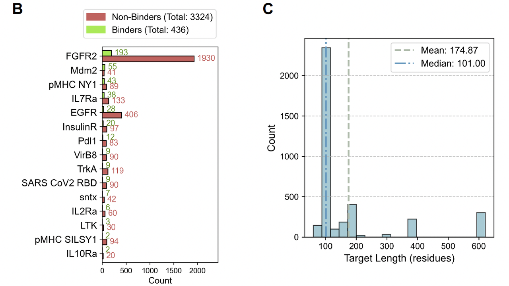
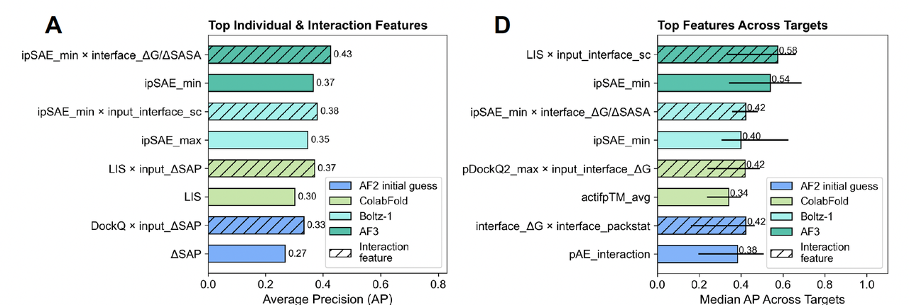
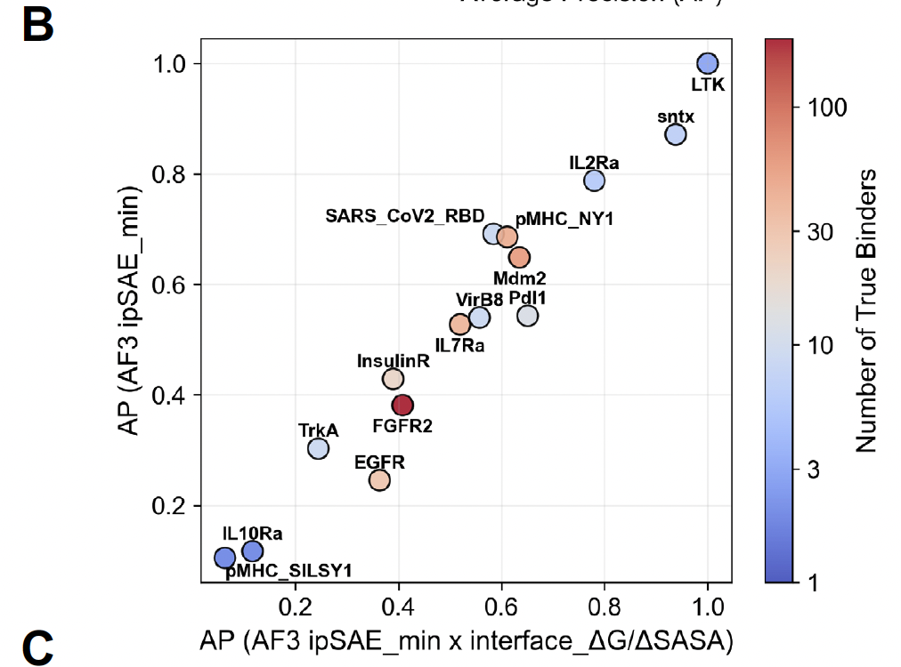
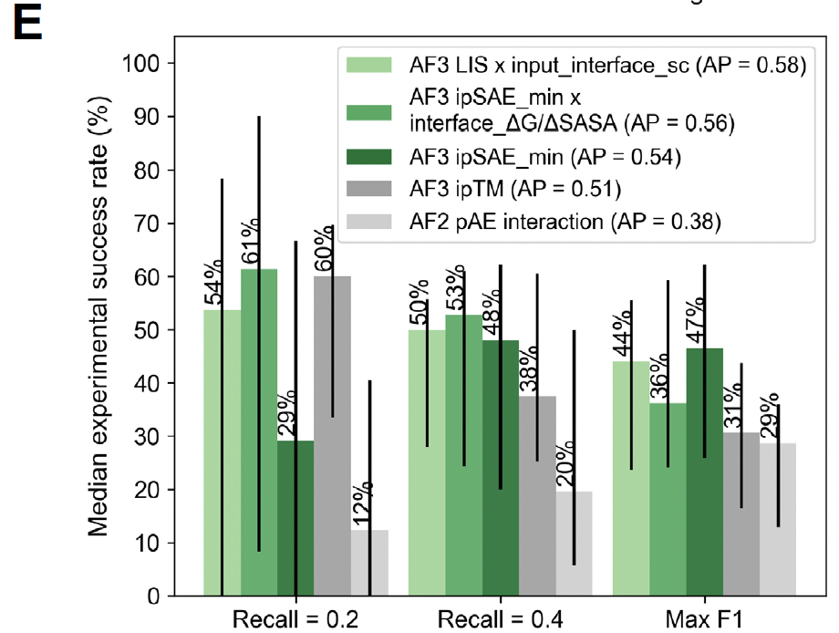
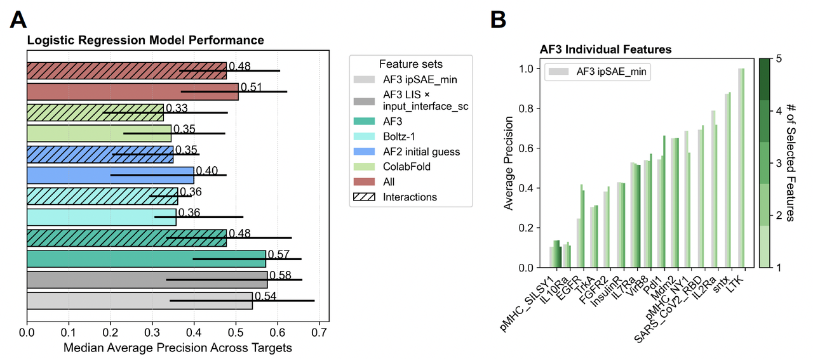
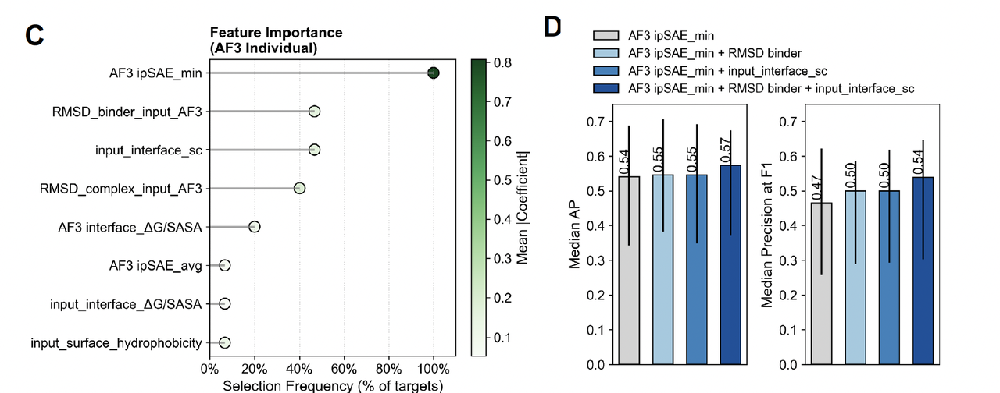

今天要和大家分享一篇刚刚上线的 **bioRxiv 预印本** ——

**《Predicting Experimental Success in De Novo Binder Design: A Meta-Analysis of 3,766 Experimentally Characterised Binders》**（2025.08.14 发布）。

为什么值得聊这篇文章？有三个原因：

1. **规模前所未有**：它汇总了 **3,766 个经过实验验证的 de novo binder 设计**，涵盖 15 个多样化的靶点，是目前最大规模的数据集。

2. **方法学突破**：作者不仅比较了 AF2、AF3、Boltz-1 等预测工具，还提出了一个新的关键指标 —— **AF3 ipSAE\_min**，在 binder 筛选上远胜现有方法。

3. **实用价值高**：文章最后给出了**可直接落地的筛选规则**，对所有做 binder 设计的人都有立刻能用的指导意义。

## **一、开篇引入**

在过去几年里，**de novo 蛋白质 binder 设计**（从零开始设计与目标蛋白结合的小分子蛋白）逐渐成为结构生物学和合成生物学的热门方向。随着 **RFdiffusion、BindCraft、AlphaProteo** 等方法的出现，我们已经能在计算机上快速生成成千上万的候选设计。

然而，真正能在实验中“成功结合”的比例却依旧很低。原因很简单：**实验验证昂贵、耗时，而 in silico 过滤手段还不够精准**。大家常用的 AlphaFold2 (AF2) 预测信心指标（比如 ipAE、ipTM）确实能在一定程度上提升命中率，但远远谈不上“稳定可靠”。

于是，一个关键问题摆在研究者面前：

👉 **我们能否找到更稳健、跨靶点通用的预测指标，用来提前筛掉失败设计？**

这正是本文《Predicting Experimental Success in De Novo Binder Design》试图回答的问题。作者们不仅汇总了一个 **3,766 个设计、15 个靶点**的前所未有的大数据集，还系统性比较了 AF2、AF3、Boltz-1 等结构预测工具输出的各种特征。最后，他们提出了一套简单、可解释、但十分有效的 binder 过滤策略。

这篇文章的最大价值在于：**它让 binder 设计的“成功率预测”第一次有了大规模的系统 benchmark**，并且给出了能直接应用在实际工作中的筛选规则。

***

## **二、数据与研究设计**

要想真正回答“哪些 binder 会在实验里成功”这个问题，**必须有足够大、足够多样化的数据**。

作者们这次汇总了一个前所未有的 dataset：**3,766 个经过实验验证的 binder 设计**，涵盖了 **15 个结构和功能各异的靶点**。其中不仅有经典的受体酪氨酸激酶（EGFR、FGFR2、TrkA 等），也包括免疫相关分子（IL2Ra、PDL1）、病毒抗原（SARS-CoV-2 RBD），甚至还有蛇毒神经毒素和 pMHC 复合物。

这一大杂烩式的 dataset，有几个值得注意的特点：

* **Binder 成功率很低**：3766 个设计里，只有 436 个（11.6%）在实验中被验证为有效。

* **数据严重不平衡**：有的靶点几乎全是失败设计，有的则 binder 相对较多。

* **靶点差异极大**：从 60 个氨基酸的小毒素，到 600 多个氨基酸的受体，跨度很大。

这些特征在 **Figure 1** 里被清晰地可视化：

* **Figure 1A** 展示了所有 binder 的结合位点分布，可以看出不同靶点上的真实 binder 都倾向于结合在一些高度保守的界面区域。

* **Figure 1B** 是一个直观的统计：不同靶点的正负样本差异悬殊，比如 FGFR2 有大量设计和验证，而像 LTK 这样的靶点几乎没几个成功案例。

* **Figure 1C** 则画出了靶点长度的分布，说明数据集覆盖了广泛的结构空间。

📌 **这一部分的意义在于：**

1. 数据规模足够大，保证了结果的统计学可靠性；

2. 数据的多样性和不平衡性，也让预测问题更具挑战性，更接近真实科研环境。

换句话说，这个 dataset 本身就已经是一个**领域级的资源**，不仅能用来做本文的分析，还可以成为未来 benchmark 的基础。

***

## **三、计算 Pipeline 的优化**

在拥有了一个覆盖 3,700 多个 binder 的大数据集后，下一个问题是：**如何高效地对这些设计进行结构预测和特征提取？**

要知道，常规的 AlphaFold 或 Boltz-1 预测，一个复合物可能要跑几十分钟甚至更久。对于几千个设计，这几乎是不可完成的任务。

作者的解决方案是——**开发一个统一的自动化 pipeline**，能够把所有候选 binder–target 复合物，依次送入不同的预测工具（AF2 初始 guess、ColabFold、Boltz-1、AF3），并在输出结构的基础上提取超过 **200 种特征**（包括结构、能量、置信度和序列信息）。

### **关键优化点：**

他们特别测试了不同运行配置（最大化配置 / 中间配置 / 极简配置）的速度和准确性差别。

* **速度提升**：

  * 在“极简配置”下，平均预测时间从 **1800 秒降到 230 秒**，提升了 **87% 的效率**。

  * AF3 的加速尤为明显，从 1441 秒缩短到 29 秒！

* **准确性保持**：

  * **Figure 2C/D** 展示了不同配置下的模型信心指标（ipAE）和与真实结构的 DockQ 对比。

  * 结果表明，即便是最轻量级的配置，预测质量几乎没有下降。

📌 **Figure 2 的逻辑**：

* **Figure 2A**：pipeline 的整体架构 → 统一输入、统一输出、全自动化。

* **Figure 2B**：不同配置下的耗时比较 → 极简配置最快。

* **Figure 2C/D**：质量评估 → 即便是极简配置，预测结果依旧可靠。

### **意义**

这一部分告诉我们：

* 作者不仅仅是做了个 meta-analysis，而是**真正解决了规模化预测的计算难题**；

* 得益于 pipeline 的优化，他们才能在后续系统性比较不同指标的预测能力；

* 对社区而言，这个 pipeline 也将成为一个可复用的 **标准化工具**。

***

## **四、哪些特征真正预测结合？**

在建立了统一 pipeline 后，作者开始回答最关键的问题：**哪些指标能区分成功的 binder 和失败的 binder？**

1. **单一特征的比较**

* 结果非常明确：

  * **AF3 的 ipSAE\_min** 是最强的单一指标。

  * 它在平均精度（AP）上，比传统常用的 AF2 ipAE 提升了 **1.4 倍**。

* 为什么 ipSAE\_min 更好？

  * 它只关注 **高置信度的结合界面残基对**，并取两条链预测误差中的“最小值”，更严格地捕捉了“最薄弱的一环”。

  * 这种界面导向的评分方法，比全局性指标（如 ipTM 或 ipAE）更能反映真实的结合。

* **特征组合的优势**

- 作者进一步测试了**交互特征**（把两个指标相乘）。

- 结果发现，最优组合往往是：

  * **ipSAE\_min × 界面 ΔG/ΔSASA**（界面能量/界面面积比）

  * **ipSAE\_min × shape complementarity**（界面互补性）

* 这些组合反映了一个直观逻辑：**结构预测的置信度** + **物理化学界面特征** → 更接近实验真相。

* **靶点依赖性**

- 不同靶点上的表现差异很大。

- 比如有的靶点上，ipSAE\_min 的 precision 接近 1；但在另一些靶点上则只有 0.1。

- 这说明：**binder 的可预测性是靶点相关的**，有些靶点天生更“难搞”。

* **阈值与筛选策略**

- 作者测试了几种实际可用的筛选阈值：

  * 固定 recall (0.2 / 0.4)

  * F1 最大化的阈值

- 在几乎所有情况下，**AF3 ipSAE\_min 及其组合指标**都优于 AF2 ipAE 和 AF3 ipTM。

- Precision-recall 曲线（Figure 3F）清楚展示了这种优势。

📌 **Figure 3 的逻辑线**：

* **Figure 3A**：不同单一指标 & 组合指标的 AP 比较，突出 ipSAE\_min 最强。

* **Figure 3B–D**：不同靶点上的表现差异，强调预测难度不均。

* **Figure 3E/F**：实际筛选时不同指标的 precision–recall 表现。

***

### **总结这一部分**

作者得出了一个非常实用的结论：

* **如果你只能用一个指标，那就选 AF3 的 ipSAE\_min。**

* **如果你可以用两个指标，那就加上界面 ΔG/ΔSASA 或 shape complementarity。**

换句话说，他们用数据证明了：**界面导向 + 物理化学特征的组合，是最稳健的预测方案。**

***

## **五、特征组合与模型选择**

前一部分的分析告诉我们，单一指标（尤其是 AF3 ipSAE\_min）已经很强，而与物理化学特征结合后还能更进一步。但在实际应用中，很多人会想：是不是应该用更多特征，甚至上复杂模型（比如深度学习、XGBoost），才能更好？

作者专门做了一个系统比较，答案令人意外却很有价值：

👉 **少量特征 + 简单线性模型，其实就够了。**

***

1. **Greedy 特征选择**

作者采用了 **greedy feature selection + logistic regression** 的方法：

* 在 15 个靶点中，逐个留一（Leave-One-Group-Out），保证评估的普适性。

* 在每一轮里，只保留真正能提升平均精度（AP）的特征。

结果：

* 平均下来，每个模型只会增加 **2–5 个特征**，就达到性能上限。

* 当特征加得更多时，反而因为过拟合而失效。

***

* **哪些特征最常被选中？**

在 AF3 派生的特征中，有几个指标反复被选中：

1. **AF3 ipSAE\_min**（几乎每次都被选中 → “核心指标”）

2. **RMSD\_binder**（binder 输入结构与 AF3 预测结构的差异）

3. **input\_interface\_shape\_complementarity**（界面互补性）

这三者的组合，几乎已经能捕捉到预测的全部信息。

***

* **实际应用：Top-K 筛选**

作者还测试了一个贴近现实的场景：

* 假设你每个靶点只能测试 10–20 个候选 binder，能不能用这套指标挑中至少一个真正的 binder？

结果（Figure 4E/F）：

* **只用 AF3 ipSAE\_min 排序，就能在前 10 个候选里，几乎保证每个靶点至少有一个真实 binder。**

* 加上界面互补性筛选，precision 在小样本 (K=1–20) 的情况下还能进一步提升。

***

📌 **Figure 4 的逻辑线**：

* **Figure 4A**：不同模型的总体表现 → 简单 logistic regression 已经很好。

* **Figure 4C**：哪些特征最常被选中 → ipSAE\_min、RMSD\_binder、shape complementarity。

* **Figure 4D**：三特征组合的效果最佳。

* **Figure 4E/F**：Top-K 筛选的实际 precision 提升。

***

### **总结这一部分**

作者给出了一个非常接地气的结论：

* **binder 成败预测，不需要几十个复杂特征，更不需要黑箱模型。**

* **只要结合 2–3 个关键指标（ipSAE\_min + RMSD\_binder + shape complementarity），用最简单的线性模型，就能稳定筛出成功率最高的候选。**

这意味着，今后的 binder 设计者可以直接把这套“组合规则”嵌入自己的筛选 pipeline，而不用依赖黑箱式的 AI 模型。

## **六、讨论与应用价值**

通过前面的大规模比较和系统分析，作者提出了几条非常有实践意义的结论。

1. **AF3 指标的优势**

* **AF3 的 ipSAE\_min** 是目前最稳健、跨靶点最通用的预测指标。

* 它比 AF2 的 ipAE 提升了 **1.4 倍的平均精度**，在 binder 设计筛选里完全可以作为**新的一代标准指标**。

* **简单比复杂更可靠**

* 复杂模型（比如 XGBoost、多特征堆叠）并没有带来更好的效果，反而容易过拟合。

* 只需 **2–3 个关键特征**（ipSAE\_min + RMSD\_binder + shape complementarity），用线性模型就能实现稳定预测。

* 这意味着未来的筛选 pipeline 可以 **更轻量、更可解释**。

* **应用场景**

* 在实际设计中，研究者往往只能测试少量候选（10–20 个）。

* 本文证明：**只要用 ipSAE\_min 排序，就几乎能保证命中一个真实 binder**；再加上界面互补性筛选，precision 会进一步提升。

* 这为实验设计者提供了一个“高性价比”的策略：**在有限的实验资源下，提高成功率。**

* **对领域的意义**

* 这不仅仅是一篇算法论文，而是一次**方法学标准化的推动**。

* 作者开放了完整 dataset 和 pipeline，未来研究者可以在同一个 benchmark 上比较不同方法，减少“各玩各的”的割裂。

* 从长远看，这种标准化会显著加速 **de novo binder 设计**走向成熟应用（如药物研发、诊断工具开发）。

***

📌 **一句话总结本文价值**：

> 这篇工作告诉我们，预测 binder 成败的关键并不在于复杂模型，而在于找到少量真正稳健的指标 —— 其中 AF3 ipSAE\_min 是核心，结合界面结构特征即可显著提升实验命中率。

## **七、结尾：给蛋白质设计者的启发**

这篇文章的意义不仅在于提出了新的预测指标，更在于它传递出一个重要信号：

**在 de novo binder 设计的赛道上，数据规模化与方法学标准化，正在逐渐取代经验主义。**

未来，binder 设计可能会出现几个趋势：

1. **“小而精”的筛选策略** —— 不再依赖海量实验，而是通过 2–3 个关键指标精准命中。

2. **开放数据与社区共享** —— 本文的数据集和 pipeline 将成为公共基准，推动不同方法的公平比较。

3. **跨学科融合** —— 结构预测（AI）、物理化学特征（计算化学）、实验验证（生物学）将进一步整合，形成闭环。

对于正在做 binder 设计的研究者来说，最直接的 takeaway 是：

👉 **如果你明天就要筛选新一批 binder，请优先考虑 AF3 ipSAE\_min，并结合界面互补性或 RMSD 来过滤。**

这套规则简单、可解释，而且已经在 3,766 个设计的实验数据上得到了验证。

或许在不久的将来，我们会看到 binder 设计从“碰运气”走向“可预期”，而这篇文章正是一个里程碑。

