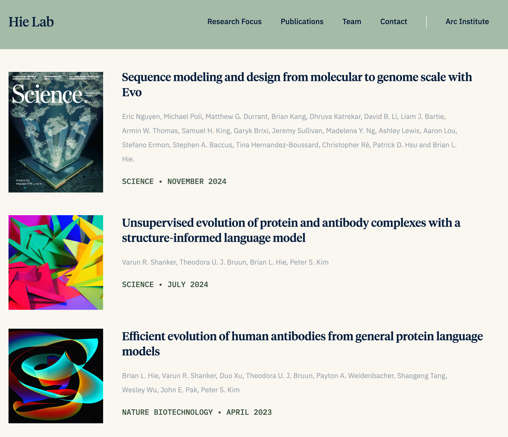
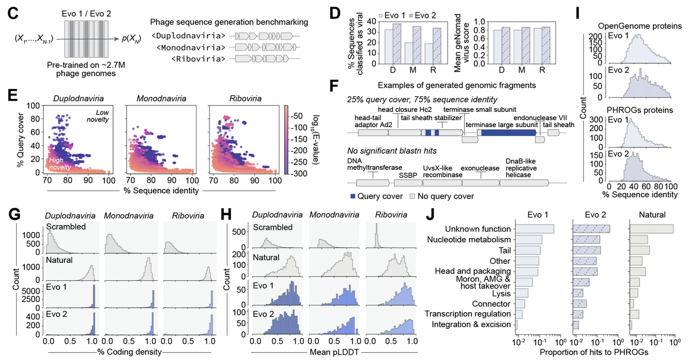
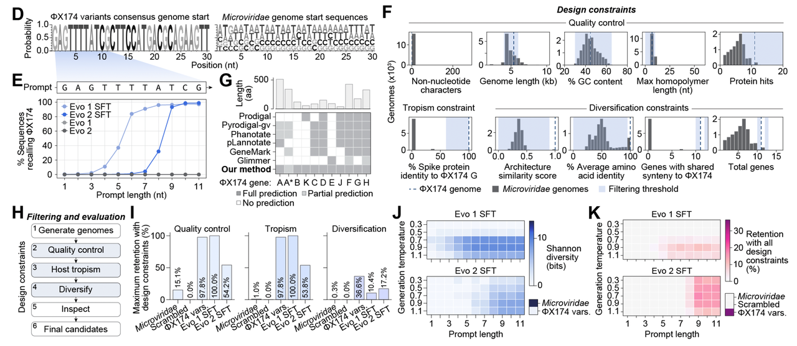
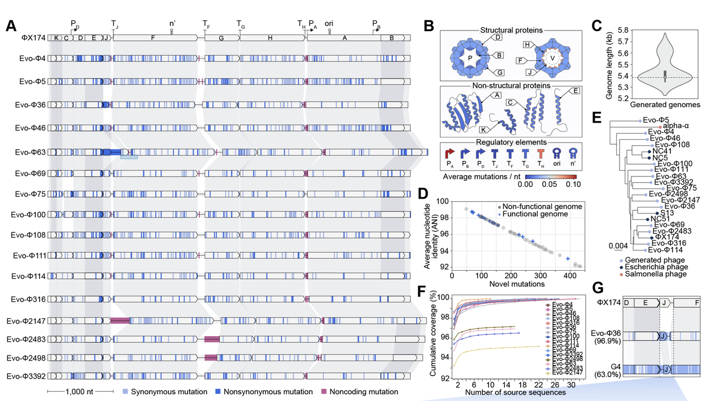
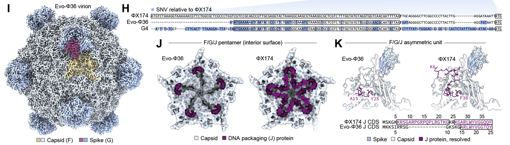
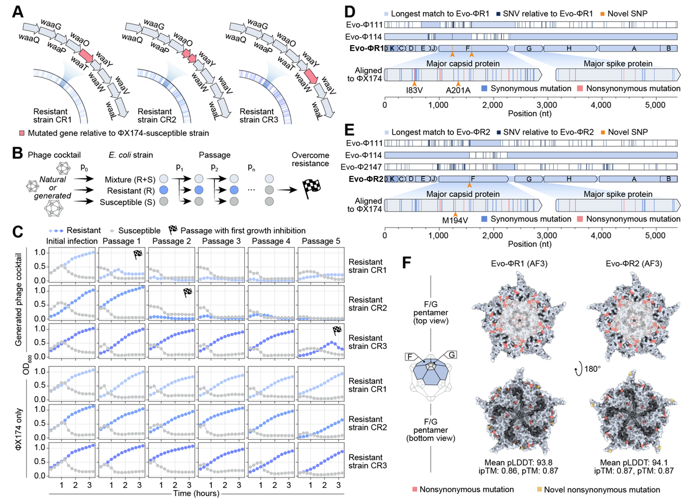

今天要分享的，是一篇我认为**保底CNS 正刊**的工作：**《Generative design of novel bacteriophages with genome language models》**。作者是Arc Institute的Brian Hie,是近年来在 **AI 与生物交叉** 领域迅速崛起的年轻学者。他的团队 Hie Lab 致力于把机器学习、特别是语言模型应用到分子和基因组的设计中，从蛋白质与抗体优化到整个病毒基因组的生成，都有重要成果。他们的研究目标不仅是**理解自然进化的规律**，更是利用 AI **加速甚至超越进化**，在确保安全可控的前提下，为药物开发和抗菌治疗打开全新路径。

作者团队在这篇文章中利用大型基因组语言模型(Evo)，首次实现了 **完整噬菌体基因组的生成、合成与复活**。

他们不仅证明 AI 可以“写出能活的基因组”，还展示了这些 AI 病毒在多个维度上 **超越了天然病毒**：

* **进化新颖性**：生成的基因组与已知噬菌体差异巨大，但依旧保持合理的功能框架；

* **实验验证**：302 个候选中有 16 个复活为可感染、可扩增的噬菌体；

* **性能优势**：部分 AI 病毒在适应性、裂解效率上超过野生型 ΦX174；

* **应用前景**：在耐药细菌面前，AI 病毒“鸡尾酒”能突破耐药屏障，而天然 ΦX174 完全失效。

这不仅是噬菌体研究的一次突破，更是 **生成式基因组学（generative genomics）** 的首次落地。

它标志着 AI 已经不止于蛋白质设计，而是真正迈向了 **生命系统的整体设计**。

🔗原文链接：https://doi.org/10.1101/2025.09.12.675911

***

## 一、背景介绍

如果说“蛋白质设计”是近年来合成生物学的热门话题，那&#x4E48;**“基因组设计”**&#x5219;是更高阶的终极挑战。

蛋白质不过几百上千个氨基酸，但一个基因组往往包含上千个基因、无数调控元件和复杂的互作关系。一个点突变可能就让整个系统崩溃。

在文章的 **Figure 1A** 中，作者用一张示意图直观展示了基因组设计的复杂性：基因方向性、调控序列、结构域之间的兼容性……每个因素都像齿轮一样咬合在一起，一旦出错，整个系统就可能“报废”。

也因此，设计基因组一直被认为是合成生物学的“圣杯问题”。过去几十年里，人类依靠理性设计、随机突变或定向进化，虽然也能改造基因组，但往往局限在局部优化。**真正“从零生成”一个全新的基因组，在这篇文章之前一直被视为不可企及。**

***

## **二、AI 的思路：从自然进化到“语言模型”**

自然进化用了几十亿年，不断试错，才塑造出我们今天看到的多样生命。那么，如果我们能把这种“进化的语法”学会，是否就能反向写出新的生命？

作者的思路正是如此：**把基因组看作一种语言**。

***

### **语言模型如何理解基因组？**

就像人类语言有语法、语义和上下文依赖，基因组也有自己的规则：哪些碱基可以排列在一起，哪些基因要协同表达，哪些调控元件必须同时存在。

团队训练的 **Evo 1 和 Evo 2 基因组语言模型**，在超过两百万份噬菌体基因组上进行了大规模预训练，相当于读完了整个“病毒语料库”。

* 在 **Figure 1B** 中，作者用示意图强调：自然进化只探索了巨大基因组空间的一小部分，而语言模型则有潜力跨越这些限制，去到自然没走过的区域。

### **生成的序列靠谱吗？**

光会“写”还不够，必须证明写出来的序列真的像是活的病毒基因组，而不是随机 DNA。

于是研究团队做了系统验证（Figure 1C–J）：

1. **病毒身份确认**

* 用 geNomad 工具分类，结果显示生成的序列大部分能被识别为病毒（Figure 1D）。

* 说明模型写出来的东西“像病毒”，而不是乱序列。

* **新颖性验证**

- 和已知序列比对，发现相似度低，很多片段完全没有自然界对应（Figure 1E–F）。

- 换句话说，生成的序列不是简单抄袭，而是真正的新组合。

* **基因组特征**

- 生成序列的编码密度（coding density）接近天然噬菌体，而远高于打乱的对照序列（Figure 1G）。

- 蛋白结构预测的置信度也与天然蛋白相当（Figure 1H），说明序列不仅是“字面正确”，还具备合理的折叠潜力。

* **蛋白质层面的合理性与多样性**

- 生成蛋白和数据库里的噬菌体蛋白比对，相似性普遍很低（Figure 1I），说明有进化新颖性。

- 但功能注释分布却和天然噬菌体很相似（Figure 1J），意味着“功能框架”被保留了。

### **小结**

Figure 1 整体传达的信息很明确：

* 语言模型真的学会了“病毒语法”，能写出结构合理的基因组；

* 这些基因组不是抄袭，而是有足够的新颖性；

* 同时在功能上和天然噬菌体保持一致。

AI **既能“写出像自然的东西”，又能“写出自然没写过的东西”**。这就是 Figure 1 想展示的核心亮点。

* 在 Figure 1B 中，作者用图示展示了这种思路：自然进化只是探索了广阔基因组空间中的一小部分，而语言模型则有潜力跳出自然的路径，去到“未曾被探索过”的区域。

* 在 Figure 1C 中，研究团队通过不同提示（prompt），让模型尝试生成来自不同病毒谱系的完整序列，结果发现生成的序列能被分类工具识别为“病毒样”，而不是一堆无意义的随机 DNA。

也就是说，**Evo 模型不只是复读自然的结果，而是真的学会了进化的潜在规则**，因此能够创造出自然界未出现过、但依然合理的基因组。

***

## **三、如何落地？模板选择与设计流程**

有了能“写基因组”的语言模型，还需要解决一个问题：**怎么让它写的东西既能活，又能按照我们设定的方向去活？**

### **设计工作流**

在 **Figure 2A** 中，作者给出了完整的工作流：

1. 先确定一个目标宿主（比如要感染哪种细菌）；

2. 再选择一个模板噬菌体（作为“参考范本”）；

3. 用相关的基因组数据对模型进行微调；

4. 设定设计约束（例如基因组长度范围、GC 含量、关键基因必须存在等）；

5. 让模型生成海量候选序列；

6. 通过计算过滤掉“不合格”的，再进入实验验证环节。

这套流程的核心思想是：**先给模型一个轨道，再让它自由发挥**。这样既能保持“像”，又能引入“新”。

### **模板选择：ΦX174**

在 **Figure 2B** 中，作者选择了一个非常经典的模板：**ΦX174 噬菌体**。

* 这是第一个被完整测序的 DNA 病毒基因组（1977 年）。

* 基因组很小，只有 5.4 kb，却包含 11 个基因和多个调控元件，复杂度刚好适合测试全基因组设计。

* 它感染的宿主是大肠杆菌 C 株，安全且研究历史丰富。

可以说，ΦX174 就像“**基因组设计的Hello World**”。

### **模型微调：专攻 Microviridae**

在 **Figure 2C** 中，研究团队展示了如何通过 **监督微调（SFT）** 把 Evo 模型“定制化”，专门训练在 Microviridae 家族的序列上。这样，模型不仅会写病毒，还会写“更像 ΦX174 的病毒”。

他们发现：

* 如果不给提示（prompt），模型很难直接写出 ΦX174 风格的基因组；

* 但只要在开头给几个 ΦX174 的保守序列片段作为提示，微调后的模型就能迅速生成完整的 ΦX174 类基因组（Figure 2D–E）。

* 这就像写作文时，先给标题和开头一句，后面整篇文章自然就顺下来了。

### **设计约束：三重过滤**

在 **Figure 2F**，作者提出了三类约束条件：

1. **基本质量**：长度 4–6 kb、GC 含量合适、不能有长的同碱基重复。

2. **宿主特异性**：确保生成的基因组里有和 ΦX174 足够相似的刺突蛋白（关键决定宿主范围）。

3. **进化新颖性**：要求生成的基因组和已知序列不太相似（<95% 蛋白质序列身份），同时基因排列既要保持基本框架，又允许增减一两个基因。

在 **Figure 2G**，团队还特别指出：现有的基因预测工具都无法完整标注 ΦX174 的 11 个基因，因为存在重叠 ORF。于是他们开发了一个专门的预测方法，确保生成的序列至少能命中大部分核心基因。

### **最终效果**

* 在 **Figure 2H–K**，作者展示了逐层过滤的结果：

  * 先通过基本质量控制，

  * 再通过宿主特异性过滤，

  * 最后应用多样性筛选。

* 即便经过严格的过滤，依然能保留相当比例的生成序列，而且多样性指标（香农多样性）依旧很高。

这套流程确保了：**生成的基因组既像 ΦX174，又有足够的新颖性，同时还能保证功能相关性**。

Figure 2 告诉我们，**AI 的生成能力需要被“驯化”**——先通过模板和微调，让它写在正确的轨道上；再通过层层过滤，确保生成的基因组既能活，又能进化出新东西。

***

## **四、实验验证：AI 生成的基因组真的能活**

再漂亮的序列，如果只存在于计算机里，都不算“真功夫”。**Figure 3** 的重点就是：把 AI 生成的基因组真正合成出来，然后看它们能不能变成活生生的噬菌体。

### **候选基因组**

在前一轮计算筛选后，作者从模型生成的几百个序列里，挑选了 **302 个候选基因组** 进入实验环节（Figure 3A–C）。

这些序列的特点是：

* 长度 4–6 kb，和 ΦX174 相当；

* 平均蛋白相似度最低只有 63%，说明进化新颖性很高；

* 但关键的刺突蛋白仍然保持 >85% 的相似度，确保感染目标宿主的可能性。

在 Figure 3B–C 的基因组结构对比图里，我们能看到：**这些序列虽然整体基因排列与 ΦX174 接近，但很多基因都有明显的“断裂”或“替换”，既保证了框架，又带来了变化**。

### **“重启”病毒**

接下来是最精彩的一步：把这些序列真正合成出来，尝试“重启”成活的噬菌体。

* 在 **Figure 3D**，作者画出了完整的实验流程：先通过 DNA 合成拼接出双链 DNA，再把它转入大肠杆菌 ，让细菌的细胞机制把它包装成病毒颗粒。

* 这就像把一份“操作系统源码”装进硬件，看看能不能启动。

结果非常惊喜：

* 在 **Figure 3E** 的斑块实验里，可以看到这些人工基因组真的能形成一个个清晰的噬菌斑，证明病毒活了。

* 如果在关键裂解基因里加上失活突变，则不会形成斑块，验证了实验的可靠性。

### **功能测试**

进一步，作者还用多种方式验证这些 AI 病毒的功能：

* 在 **Figure 3F–G** 的生长曲线上，感染过的细菌群体在短时间内被迅速抑制，和野生型 ΦX174 的效果类似。

* 在 **Figure 3H**，这些 AI 病毒能被大量扩增和滴定，说明具备完整的生命周期。

* 在 **Figure 3I**，作者检测了宿主范围：结果显示，这些病毒能够感染大肠杆菌 C（目标宿主），还能意外感染到 E. coli W，但不会感染其他 6 株非目标大肠杆菌。说明设计时设定的宿主特异性过滤是可靠的。

最终，302 个候选里有 **16 个 AI 生成的基因组**成功“复活”为可存活的噬菌体。

### **小结**

Figure 3 想传达的核心信息是：

* AI 写出来的并不是一堆虚拟序列，而是真的能合成出活病毒；

* 这些病毒不仅能感染目标宿主，还严格保持了设计时的特异性；

* 从计算到实验，**AI 生成的基因组第一次跨越了“虚拟—现实”的鸿沟**。

***

## **五、进化与结构新颖性**

在拿到 16 个成功复活的 AI 噬菌体之后，研究团队并没有就此止步。他们进一步问：**这些病毒的基因组和结构，到底有多新颖？** Figure 4 就是答案。

### **基因组层面的新颖性**

* 在 **Figure 4A** 的基因组比对图里，可以看到这些 AI 病毒和 ΦX174 的差异：上百处同义突变、非同义突变以及非编码区的变化。

* 其中一些变化非常显著：

  * Evo-Φ63 出现了一个新的 J 基因插入；

  * Evo-Φ114 丢失了 K 基因；

  * Evo-Φ75 和 Evo-Φ100 的 C 基因出现大规模缺失；

  * Evo-Φ4 和 Evo-Φ46 的 E 基因出现大幅延长。

  * 这些变化在自然的进化过程中很少能稳定存在。

* 在 **Figure 4B**，作者统计了突变热点：结构蛋白 J 和一些调控元件是最容易发生变化的，而复制起点和部分终止子则完全保守。说明模型在创新的同时，仍然保留了核心“不可动”的模块。

* 在 **Figure 4D–E** 的系统发育分析里，16 个 AI 病毒和已知的 Microviridae 噬菌体形成了独立分支，有些序列和最近的自然噬菌体相比只有 93% 的核苷酸相似度，已经接近“新物种”的界定标准。

### **自然无法实现的组合**

最令人兴奋的例子是 **Evo-Φ36**：

* 在 **Figure 4G–H** 的比对中，它的 J 基因（负责基因组装入和结构支撑）完全被来自另一个远缘噬菌体 G4 的版本替代。

* 按照过去的实验，如果直接把 G4 的 J 基因换到 ΦX174 里，是**不可存活**的。

* 但 AI 模型却给出了一个“上下文兼容”的组合：虽然用的是 G4 的 J 基因，但它周围的非编码区和 ΦX174 保持一致，从而让整个系统能正常工作。

### **结构层面的惊喜**

为了验证这一点，作者用冷冻电镜（cryo-EM）解析了 Evo-Φ36 的病毒颗粒结构（Figure 4I–K）：

* 结果发现，它的 J 蛋白和衣壳的结合方式与 ΦX174 不同，但依然保持了整体装配稳定性。

* 特别是 J 蛋白的 N 端不再和衣壳结合，而是更可能承担 DNA 结合功能。

* 这意味着模型不仅创造出了“自然界没成功过”的基因替换，还同时找到了**全新的蛋白质-蛋白质协同解法**。

### **小结**

Figure 4 的核心信息是：

* AI 病毒不是简单“改几个碱基”，而是真正带来了**数百处基因组创新**；

* 它们有的接近自然新物种的标准，有的甚至创造出了自然界无法稳定存在的组合；

* 在结构层面，AI 设计出的解法能够突破传统进化的“禁区”。

换句话说，这一步展示了 **AI 生成的基因组不只是“活得下去”，而是“活得与众不同”**。

***

## **六、适应性与竞争优势**

活下去是一回事，活得更好又是另一回事。作者在 **Figure 5** 中设计了多种竞争实验，测试这些 AI 病毒在与野生型 ΦX174 的对抗中，是否具备优势。

### **混战实验：谁能胜出？**

* 在 **Figure 5A** 的实验设计图中，研究团队把 16 个 AI 病毒和野生型 ΦX174 以相同剂量（MOI）混合感染同一个大肠杆菌群体。

* 然后通过测序追踪每个病毒种群的数量变化，累计“涨幅”最大的，就代表适应性最强。

结果很惊人（Figure 5B–D）：

* 在三轮独立的竞争实验里，有 **3 个 AI 病毒（Evo-Φ69、Evo-Φ100、Evo-Φ111） consistently 跻身前五**，而 ΦX174 只在其中两轮进入前五，最高也只能排第三。

* 其中 **Evo-Φ69 表现最亮眼**，在所有实验里都稳居第一，感染 6 小时后种群数量增加了 16–65 倍，而 ΦX174 的涨幅只有 1.3–4 倍。

这说明 AI 不仅能“复制”一个能活的病毒，还能创造出比自然原型更具竞争力的新病毒。

### **裂解动力学：谁杀菌更快？**

除了混战，作者还单独测量了每个病毒的“杀伤效率”（Figure 5E）：

* 通过跟踪感染后的细菌生长曲线，他们比较了不同病毒的裂解速度和强度。

* 其中 **Evo-Φ2483 裂解效率最快最强**，能在 135 分钟内把细菌群体降到极低水平，而 ΦX174 需要 180 分钟才能做到，且最低细胞密度还更高。

* 其他几个 AI 病毒（Evo-Φ111、Evo-Φ69、Evo-Φ108）也都表现出比 ΦX174 更强的裂解效果。

### **关键发现**

* 有的 AI 病毒在混战中胜出（适应性高）；

* 有的 AI 病毒在裂解速度上领先（杀伤力强）；

* 不同 AI 病毒展现了多样化的“性能优势”，说明它们不只是简单模仿，而是探索出了不同的进化路径。

### **小结**

Figure 5 的核心信息是：

* **AI 病毒的适应性和杀菌效率，在多个维度上超过了天然 ΦX174**；

* 这表明生成模型不仅能复刻自然，还能高效探索自然未必能轻易到达的“高性能区域”。

换句话说，AI 在病毒设计上实现了“功能超越”，创造出了一批比自然更强的候选者。

***

## **七、AI 病毒如何克服耐药性**

噬菌体最大的应用潜力之一，就是用来对抗耐药细菌。但问题在于：**细菌进化出耐药性往往很快**，而天然噬菌体往往“一招鲜”，遇到耐药菌株就完全失效。

**Figure 6** 展示了一个非常关键的发现：AI 病毒在克服耐药性方面展现出天然噬菌体做不到的优势。

### **耐药菌株的挑战**

* 作者首先构建了三种对野生型 ΦX174 耐药的大肠杆菌 C 突变株（Figure 6A–B）。

* 实验证明：这些菌株对 ΦX174 完全没有反应，ΦX174 感染后几乎不产生任何噬菌斑（Figure 6C）。

* 换句话说，天然 ΦX174 在这些耐药菌面前彻底“报废”。

### **AI 病毒的突破**

然后，研究团队测试了 16 个 AI 病毒在这些耐药菌株上的表现（Figure 6D–E）：

* 单个 AI 病毒往往在某些耐药菌株上依旧失败，但**不同 AI 病毒的感染谱并不重叠**。

* 有的能感染耐药株 1，但不能感染耐药株 2；有的则反之。

于是，作者尝试了一个“病毒鸡尾酒”的思路（Figure 6F）：

* 把 16 个 AI 病毒混合在一起，用来同时攻击三株耐药细菌。

* 结果显示：**混合后的 AI 病毒组合，几乎完全消除了所有耐药菌群体**。

* 对比之下，野生型 ΦX174 即使加量也完全无效。

### **核心意义**

这说明：

1. **AI 病毒的多样性** 本身就是一种优势 —— 它们覆盖了更广的宿主谱。

2. 当它们组合在一起，就能像“精准打击小分队”一样，全面应对不同的耐药突变。

3. 这为未来设计 **可定制的噬菌体鸡尾酒疗法** 提供了新思路，有潜力应用于对抗抗生素耐药危机。

### **小结**

Figure 6 的信息很直接：

* 天然 ΦX174 遇到耐药菌完全无能为力；

* 但 AI 生成的噬菌体凭借多样化的基因组创新，能够 **集体突破耐药屏障**。

这意味着，AI 病毒不仅是“新奇的科学展示”，更可能成为未来抗菌治疗中的 **实用武器**。

***

## **八、总结与展望**

从 **Figure 1 到 Figure 6**，这篇文章完整展示了一条令人振奋的路径：

* **从语言模型的“虚拟生成”**（学会进化语法，写出像样的基因组），

* **到实验室的“真实验证”**（302 个候选 → 16 个成功复活），

* **再到功能和应用的“性能超越”**（更强的适应性、杀菌效率，以及克服耐药性）。

这是第一次，人类真正依靠 AI 生成并“重启”了全新的噬菌体基因组。

这项工作的意义远不止于病毒本身：

* 它证明了 **AI 可以从蛋白质设计跨越到全基因组设计**，生命系统的复杂性不再是不可逾越的障碍。

* 它为 **个性化抗菌疗法** 打开了可能性：未来，我们或许可以针对不同的耐药细菌，用 AI 即时生成噬菌体“鸡尾酒”。

* 它更是宣告了一个新方向：**生成式基因组学（generative genomics）**。

在文章的讨论部分，作者用了很克制的语言。但从学界的眼光看，这是一个**真正意义上的范式转变**：

* 过去我们只能微调自然已有的基因组；

* 现在，AI 已经可以帮助我们探索自然未曾走过的“生命空间”。

这不仅是一次技术突破，更是一次哲学式的跃迁：

我们第一次看到，AI 可以作为“进化的代理人”，与自然共同探索生命的可能性。

