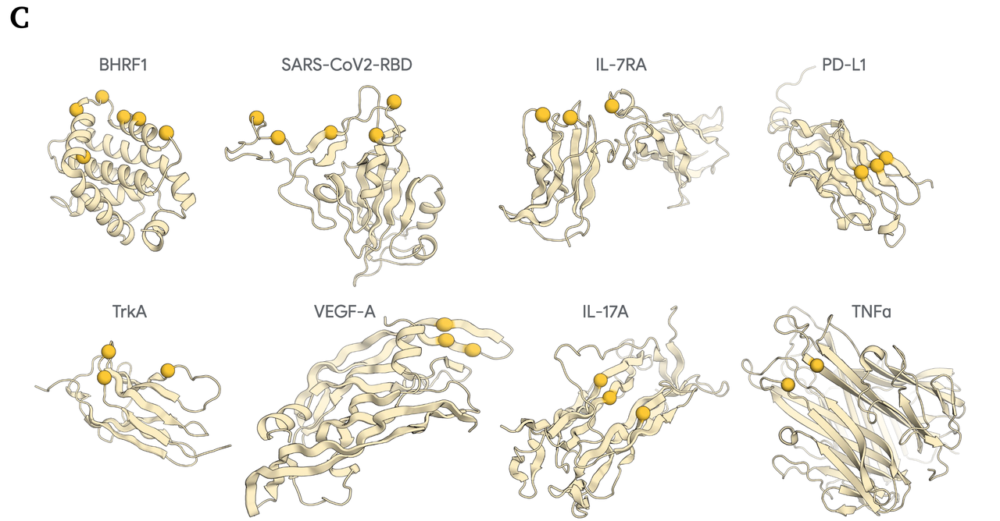
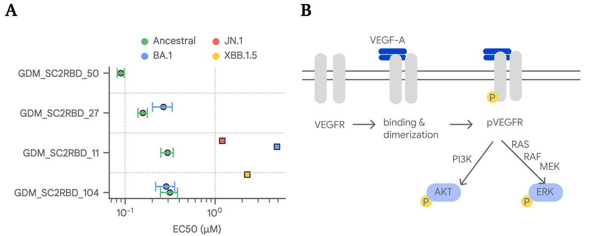
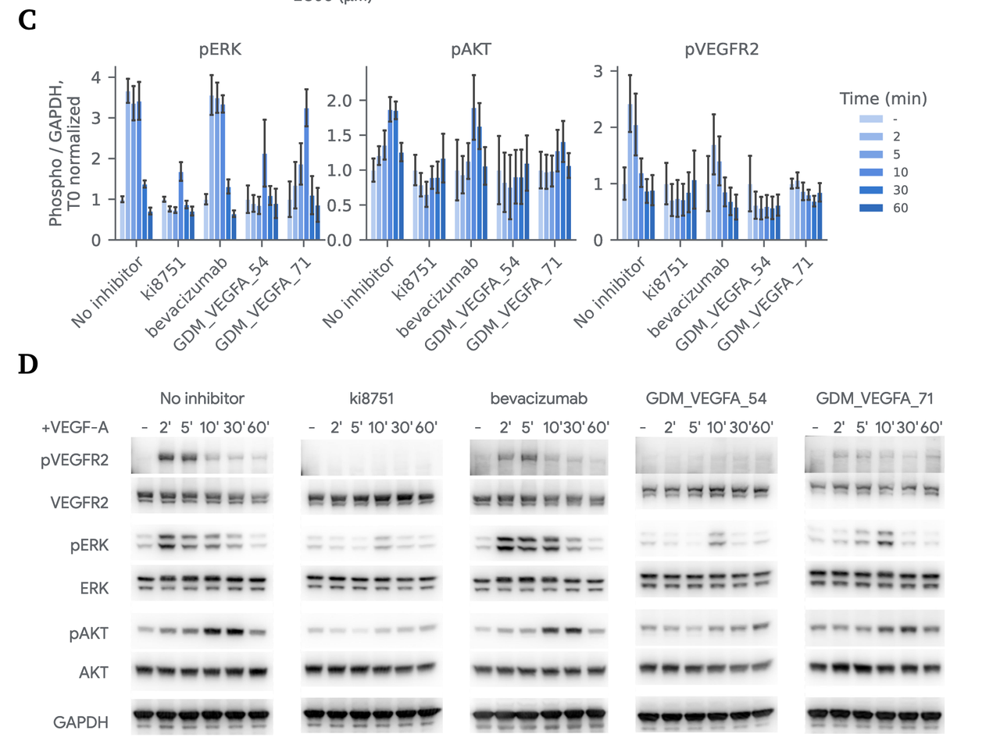
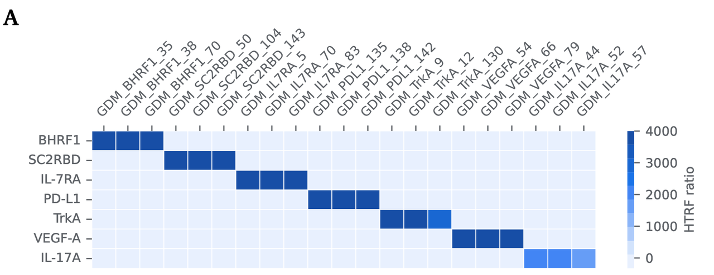

在蛋白质科学的世界里，**DeepMind** 已经是一个绕不开的名字。几年前，AlphaFold 改变了蛋白质结构预测的格局，让无数科研人员第一次可以轻松获取高精度的蛋白质三维结构，因此获得了诺奖。而在去年（2024），DeepMind 团队再一次出手，把目光从“预测”转向了“设计”。

他们在去年的技术报告中推出了 **AlphaProteo** ——一个专门面向 **高亲和力蛋白结合物设计** 的系统。论文题目是《De novo design of high-affinity protein binders with AlphaProteo》，由 Google DeepMind 与 Francis Crick 研究所等合作完成。

这篇工作没有透露太多技术上的细节，而主要是在做实验验证，那一年后的今天，让我们来看看他们都做了什么吧，和现在的技术相比，是否还保持了优势。

🔗原文链接：https://doi.org/10.48550/arXiv.2409.08022

***

### **一、为什么需要新的蛋白质设计工具？**

蛋白质结合物（protein binders）是生物医学研究和药物开发中的“万能钥匙”。无论是抗体药物、信号通路的调控，还是新一代诊断工具，它们几乎无处不在。

然而，**传统方法**（比如免疫动物得到抗体、或者用定向进化筛选）有几个天然的局限：

* **随机性强**：你无法控制抗体最终会结合在蛋白的哪个表面位点。

* **效率低**：通常需要大量实验轮次才能筛出一个高亲和力的分子。

* **难以复制**：遇到特殊的靶点（比如平坦或极性很强的表面），往往失败率极高。

这也解释了为什么过去十年，虽然我们有了很多强大的抗体类药物，但设计过程依然像是“黑箱作业”，靠运气、靠试错。

在这样的背景下，AlphaProteo 的出现格外重要。它想要解决的核心问题是：

**能不能通过计算机，直接生成一个对目标蛋白“量身定做”的结合物？**

在论文的 **Figure 1A和B** 里，团队用一个直观的示意图展示了 AlphaProteo 的工作方式：

1. 输入一个靶标蛋白的结构，并标记关键的“热点残基”；

2. 模型自动生成符合这些要求的候选结合蛋白；

3. 再通过过滤器筛选，留下最有可能成功的设计。

这意味着科学家不必再依赖大规模实验筛选，而是能更高效地针对某个特定功能位点，生成高亲和力结合物。

从这里开始，文章就进入了真正的实验结果部分——AlphaProteo 究竟表现如何？

***

### **二、实验结果总览：AlphaProteo 的成绩单**

在实验验证环节，DeepMind 团队选择了 **8 个不同的蛋白靶点**，涵盖了从病毒蛋白（比如 SARS-CoV-2 的 RBD）到临床相关的人类蛋白（比如 PD-L1、VEGF-A），难度层次各不相同。

论文中的 **Figure 1C** 展示了这些靶点的结构模型和热点残基：

* 有凹槽型的（如 EB 病毒蛋白 BHRF1），相对容易结合；

* 也有平坦、极性强的（如 PD-L1、TNF-α），通常被认为是设计难度极高的靶点；

* 还有医学应用前景明确的 VEGF-A、IL-17A 等。

结果如何呢？

1. **成功率显著提升**

在 **Figure 1D** 的柱状图里可以看到，AlphaProteo 在 7 个靶点上都获得了不错的结合成功率（9%–88%），其中 BHRF1 的成功率高达 **88%**。

相比之下，之前的主流方法 RFdiffusion，在某些靶点上甚至接近 **0% 成功率**。

换句话说，**AlphaProteo 能够在一次中等规模（96 孔板量级）的筛选中，就产出多个可用的结合物**，大幅减少了实验上的工作量。

* **亲和力达到亚纳摩尔级**

不过，能结合只是第一步，更关键的指标是结合的紧密程度（亲和力，Kd）。

在 **Figure 1E** 中，AlphaProteo 设计出的结合物在 7 个靶点上的亲和力都优于现有方法，其中：

* IL-7RA 的最佳设计达到了 **82 皮摩尔（pM）**，属于抗体级别的高亲和力；

* VEGF-A 的结合物亲和力是 **0.48 nM**，而且这是首次有计算设计方法在这个重要靶点上获得成功。

总体来说，AlphaProteo 的设计在 **不经过实验优化** 的情况下，就能做到比现有方法“快好省”。

* **“首创”成果**

特别值得一提的是：AlphaProteo 是第一个在 VEGF-A 上成功设计出结合物的方法。

这一突破不仅证明了模型的强大能力，也展示了它在临床相关目标上的潜在应用价值。

***

如果说前面展示的是“量”和“质”的成绩单，那么接下来的内容，就是看这些设计在 **真实功能验证** 中表现如何。

***

### **三、具体功能验证案例：从分子到功能**

光有漂亮的亲和力数据还不够，真正的挑战是：**这些设计出来的蛋白，能不能在真实的生物体系里发挥作用？**

在这方面，AlphaProteo 给出了两个令人印象深刻的案例。

#### **案例一：中和 SARS-CoV-2**

研究团队把设计好的结合物用来对付 **新冠病毒的刺突蛋白 RBD**。

* 在 **Figure 4A** 中可以看到，多个设计（如 GDM\_SC2RBD\_11、104、50）在细胞实验中有效阻断了病毒进入 Vero 细胞。

* 它们能够中和多个 SARS-CoV-2 变体，其中有的设计甚至对三种变体都有效。

* 在 **Figure 5A** 里，冷冻电镜结构进一步验证了这些结合物的结合模式，分辨率在 4.5–6 Å 之间，和 AlphaFold 的预测高度吻合。

#### **案例二：抑制 VEGF-A 信号通路**

VEGF-A 是肿瘤血管生成和眼科疾病的重要靶点。

* 在 **Figure 4B-D** 的细胞实验中，设计的结合物（如 GDM\_VEGFA\_54）显著降低了 VEGFR2 及下游 ERK、AKT 的磷酸化水平。

* 对比来看，它的效果甚至超过了临床使用的抗体药物 **Bevacizumab（Avastin）**，并且在等摩尔浓度下表现更强。

* 在 **Figure 5B-E** 中，X 射线晶体学结构进一步确认了结合模式，分辨率达到 2.65 Å，结合界面上的关键氢键和疏水相互作用与设计几乎完全一致。

***

从这两个案例我们可以看出，AlphaProteo 已经走出了“计算机预测”的范畴，真正实现了**功能级别的验证**。这对于整个蛋白质设计领域来说，是一个重要的里程碑。

***

### **四、设计多样性与特异性**

如果说高成功率和高亲和力展示了 AlphaProteo 的“硬实力”，那么它在 **特异性和多样性** 上的表现，则体现了系统的成熟度。

1. **结合的专一性**

在 **Figure 3A** 的实验中，研究人员把设计好的结合物拿去测试，看它们是否会和其他靶点也发生结合。

结果很清晰：

* 每个结合&#x7269;**只在**&#x5B83;的目标蛋白上显示强信号；

* 在其他 6 个非目标蛋白上几乎没有检测到结合。

这说明 AlphaProteo 的设计不仅“能结合”，而且“只结合它该结合的对象”。对于药物开发来说，这一点至关重要，因为非特异性结合往往意味着副作用。

* **结构上的多样性**

更有意思的是，AlphaProteo 生成的成功设计并不是单一路径。

在 **Figure 3B** 里可以看到，不同的结合物呈现出多种折叠模式：

* 有全 α-螺旋型的；

* 有 α/β 混合型的；

* 甚至还有全 β-折叠型的。

这种结构上的多样性意味着：**AlphaProteo 并不是在“复制粘贴”某种固定框架，而是真正探索出了多种解决方案**。

这在实际应用中很重要，因为不同的下游场景可能对分子的稳定性、尺寸、表达方式都有不同要求。多样性的设计库，可以让科学家更灵活地选择最合适的候选。

***

### **五、局限与展望**

尽管 AlphaProteo 展现出了惊人的能力，但这篇论文也诚实地指出了它目前的局限。

1. **并非所有靶点都能成功**

团队在 8 个靶点里，有 7 个获得了成功设计，唯一的失败案例是 **TNF-α**。

* 这个靶点的难点在于：它的结合区域平坦且高度极性，是出了名的“难搞”。

* 在 in silico（计算预测）阶段，AlphaProteo 的成功率几乎为 0，实验验证也确实没有获得有效的结合物。

这个例子提醒我们：**即使是最先进的 AI 模型，也依然受制于蛋白质表面物理化学特性的限制**。

* **依赖高质量结构输入**

AlphaProteo 的设计流程都基于已知的高分辨率蛋白质结构作为输入。

这意味着：

* 如果靶点缺乏晶体学或冷冻电镜的结构数据，设计可能会受限；

* 对于天然构象高度多变、或者无序的蛋白质区域，模型的表现也有待验证。

* **未来发展方向**

论文在结尾也给出了展望：

* 改进算法，以应对像 TNF-α 这样极难的靶点；

* 拓展到那些缺乏高分辨率结构的蛋白，甚至考虑动态构象；

* 应用范围不止于药物：还包括信号通路调控、活细胞成像、蛋白质工程等更广阔的生物学研究领域。

***

### **六、总结**

从 AlphaFold 到 AlphaProteo，DeepMind 展示了一条清晰的技术演进路线：

* 前者解决了“蛋白质长什么样”的难题；

* 后者则进一步迈向“我们能不能设计出想要的蛋白质”。

在这篇论文中，AlphaProteo 证明了：

* **一次中通量筛选**就能获得高亲和力结合物；

* 在多个靶点上，成功率和亲和力都**全面超越现有方法**；

* 更重要的是，这些分子在 **病毒中和和信号通路抑制实验中，真的发挥了预期功能**。

它不仅仅是一个“计算方法”，而是让蛋白质设计真正具备了“即刻应用”的可能性。

当然，我们也要看到，它目前依然依赖高质量的结构输入，并且在某些极难靶点（如 TNF-α）上还未攻克。但这并不妨碍我们把 AlphaProteo 看作蛋白质设计领域的一个 **里程碑**。

未来，随着算法不断进化、实验验证积累更多经验，我们或许正站在一个全新时代的门口：

**蛋白质设计不再依赖盲目筛选，而是像搭积木一样，精准、快速、可控。**

