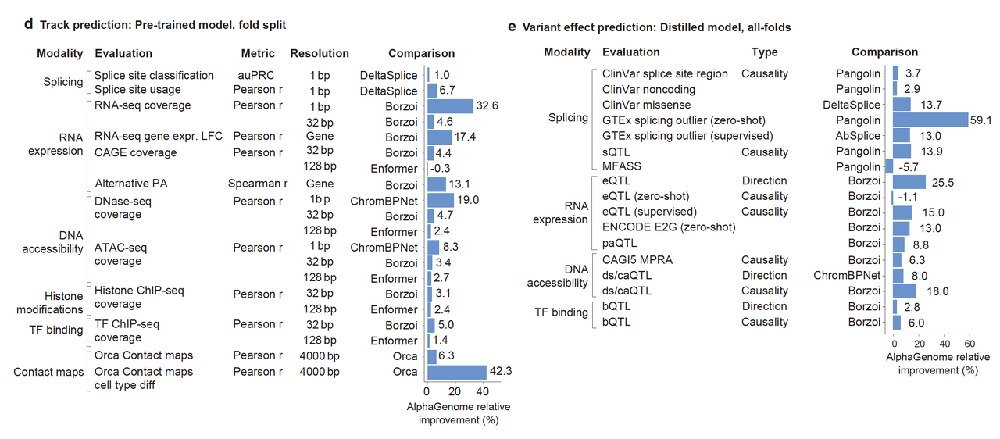
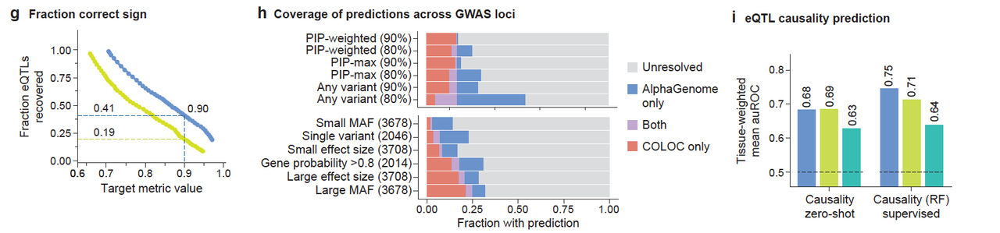
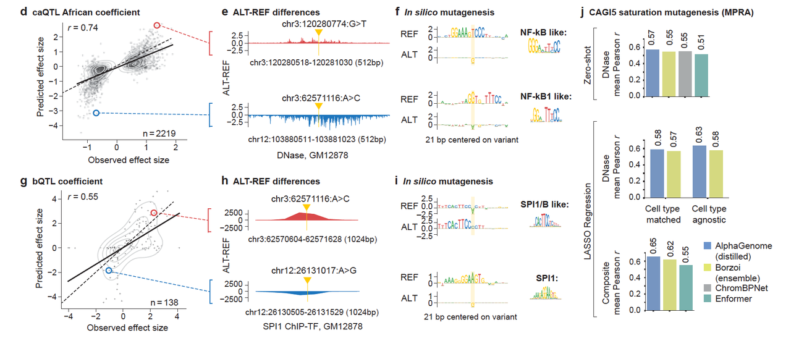
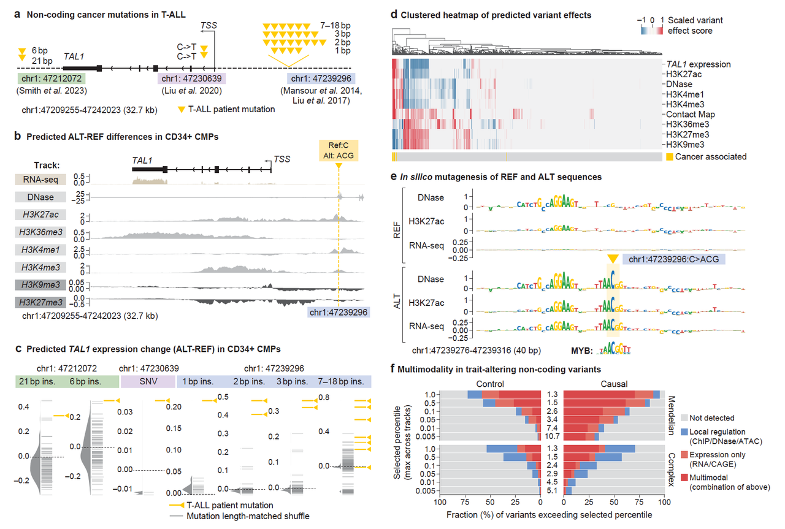

现代基因组学面临的最大挑战之一，是如何解释 **非编码区域的遗传变异**。这些变异占据了我们基因组的98%以上，但却不直接编码蛋白质——它们调控的是“什么时候、在哪里、如何”表达基因。

过去，研究人员通常需要**多个专用模型**来分别预测：

* 剪接（SpliceAI、Pangolin）

* 染色质可接近性（ChromBPNet）

* 表达调控（Borzoi）

* 3D结构（Orca）

但这种碎片式的方式不仅繁琐，还限制了全局调控机制的解析。

基于此，昨天（2025年6月25日）DeepMind 提出了 **AlphaGenome**：一个**统一建模的AI系统**，能一次性预测11种基因调控模态，兼顾**远程调控建模能力**和**单碱基分辨率**。这就是本文的主角。

## **一、AlphaGenome是什么？一个把整个基因调控“装进一个模型”的系统**

AlphaGenome 输入的是长达 **1 Mb（百万碱基）** 的 DNA 序列，通过 **U-Net + Transformer** 模型架构进行处理，输出 11 类功能轨迹，涵盖：

| **模态类型** | **示例数据**                  |
| -------- | ------------------------- |
| 转录表达     | RNA-seq、CAGE、PRO-cap      |
| 剪接机制     | 剪接位点、剪接连接、使用率             |
| 染色质可及性   | DNase-seq、ATAC-seq        |
| 表观遗传修饰   | 各类ChIP-seq（如H3K27ac）      |
| 转录因子结合   | TF ChIP-seq               |
| 三维染色质结构  | Hi-C/micro-C contact maps |

它采用两阶段训练策略（图1b–c）：

1. **预训练**（多个教师模型），学习全基因组各模态的实验数据。

2. **蒸馏成学生模型**：只需一次推理，即可预测所有模态和变异效应，**不到1秒/个变异**。

> 这让AlphaGenome具备**多模态、高分辨率、长范围建模、推理高效**等综合能力。

## **二、AlphaGenome准吗？全面性能碾压所有主流模型**

在 24 个基因轨迹预测任务中，AlphaGenome 在 **22 个上表现最优**，大多数模态相对提升 10%–40% 不等（图1d）。

在 26 个变异效应预测任务中，**24 个任务达成SOTA**（图1e），包括：

* 剪接变异（超越 SpliceAI、Pangolin）

* 表达变异（eQTL、GTEx：超越 Borzoi）

* 染色质状态变异（超过 ChromBPNet）

> **AlphaGenome不是某个任务做得好，而是全方位做得好。**

## **三、AlphaGenome怎么做到的？深入案例剖析剪接、表达、染色质预测**

### **A. 剪接预测：不是“位点预测器”，而是“剪接建模机”**

AlphaGenome 是唯一同时预测：

* 剪接位点（donor/acceptor）

* 使用率（usage）

* 剪接连接（splice junctions）

* RNA-seq 跨外显子的 coverage 变化

的计算工具，其他的工具都只能预测其中一个或两个任务。

在多个 GTEx 剪接异常的案例中（图3b–c），AlphaGenome 完全还原外显子跳跃或新剪接连接的形成，且能识别motif机制（图3d）。

它还在 6 个剪接相关基准任务中拿下冠军，包括 ClinVar 病理剪接变异、GTEx 稀有变异、sQTL、MFASS 高通量验证（图3f–i）。

> **从预测“哪儿剪”到预测“怎么剪”**

***

### **🔬 B. 表达预测：不仅预测“强度”，还预测“方向”和“机制”**

通过在 GTEx 的数据中比较模型预测和实际观测，AlphaGenome 对表达变异（eQTL）预测：

* 效应强度相关性从 0.39 → **0.49**

* 方向预测准确率 AUROC 提高至 **0.80**

* 特别对远距离变异 >35kb 仍有优势（图4c–g）

更关键的是，它能解释 GWAS 信号的方向（图4h）——你知道某个变异与疾病有关，但你不知道它是上调还是下调某个基因？AlphaGenome 能给出答案。

> **eQTL 信号“定向器”**

***

### **🔬 C. 染色质与转录因子结合预测：看懂调控开关的“通断”**

AlphaGenome 在 ATAC、DNase、TF-ChIP 数据上对变异预测也超越了当前强模型：

* 可接近性 QTL（caQTL）、DNase 敏感性（dsQTL）

* 转录因子结合 QTL（bQTL）

在图5d–i中，模型能精准捕捉 NF-κB、SPI1 等 TF 的结合motif，并通过 **in silico mutagenesis** 显示哪些核苷酸对绑定最关键。

> **TF调控“微操控”解释器**

## **四、AlphaGenome能干什么？跨模态解释肿瘤突变机制**

在 T-ALL 白血病中，研究者识别了多个非编码致癌突变影响 **TAL1** 基因的表达。

AlphaGenome 展示了对这些突变的**跨模态解释能力**：

* 在突变位点预测出增强子激活（H3K27ac 上升）

* TAL1表达预测显著上调

* motif分析发现变异引入 MYB motif，为增强子形成机制（图6b–e）

> **致病突变的“调控解释器”**

## **五、总结：AlphaGenome，不只是“预测器”，更是“调控理解器”**

AlphaGenome 不只是像传统的深度学习模型一样，做“分类任务”或“回归任务”那么简单，它是一个能理解调控结构、解释变异机制、支持多任务推理的基因组AI系统。

它的突破来自：

* **全模态**建模

* **长距离依赖**捕捉

* **高分辨率**细节识别

* 实用的推理效率

> 做到大一统（**全模态**）以及具有一定的**可解释性**，让这个工具的可能发挥的价值无法估量。

## **🧭 讨论：通用基因组AI的可能与挑战**

AlphaGenome 的发布标志着一个关键的转折点：我们正在从**零散、模态特异的模型生态**，走向一个**统一、通用的预测框架**。这不仅提升了预测的精度，也重构了我们与基因调控数据之间的交互方式。

### **一体化预测是必然趋势**

传统方法往往依赖“一个任务一个模型”：

* 剪接用 SpliceAI

* 开放性用 ChromBPNet

* 表达用 Enformer/Borzoi

这种方法虽然精确，但代价是复杂、效率低、无法跨模态整合。而 AlphaGenome 的一体化框架提供了一个更高层次的解决方案，能够：

* 同时预测多个调控模态

* 支持单碱基分辨率和远程调控上下文

* 用一次推理，完成变异效应的全景评估

这不仅在科研中实用，也让大型人类变异数据库的解释变得更加可扩展。

### **模型能“解释”变异，而不只是“预测”它**

AlphaGenome 不仅提供预测分数，还能解释变异背后的调控机制。例如在 TAL1 的白血病案例中，它识别出了变异引入的 MYB motif、染色质状态的改变，以及表达水平的变化——这使模型真正从“预测器”演进成了“调控解释器”。

此外，in silico mutagenesis、剪接连接建模、表达方向预测等功能，也都指向同一个目标：**理解变异是如何改变生物系统的**。

### **挑战仍在：组织特异性和机制细节**

尽管 AlphaGenome 表现出色，但它并非完美无缺。论文中也坦诚指出：

* 某些组织特异的表达或剪接模式仍难以精准建模

* 某些中间层机制（如RNA稳定性、翻译效率）未能显式建模

* 某些模态（如polyadenylation）预测尚依赖间接信号，未直接训练

这些问题提醒我们，当前的 AI 模型虽强，但在面对极端稀有变异、复杂组织上下文和多因子交互时，仍需更多数据、更丰富的结构和更强的生物归纳能力。

## **AlphaGenome 启示了什么？**

它让我们看到了一个可能的未来：

> 研究者只需输入一段 DNA 序列或一个变异，即可获得关于该序列在不同生物层面（表达、剪接、染色质、TF绑定等）的影响预测，甚至机制解释。

这不仅节省了模型选择、数据整合的负担，更重要的是，它加速了我们对人类非编码基因组的系统理解。

> 如同 AlphaFold 改变了结构生物学，**AlphaGenome 正在悄然重塑我们解读调控基因组的方式。**

博客链接：https://deepmind.google/discover/blog/alphagenome-ai-for-better-understanding-the-genome/#:\~:text=Today%2C%20we%20introduce%20AlphaGenome%2C%20a%20new%20artificial%20intelligence,a%20wide%20range%20of%20biological%20processes%20regulating%20genes.

预印本文章链接：https://storage.googleapis.com/deepmind-media/papers/alphagenome.pdf

