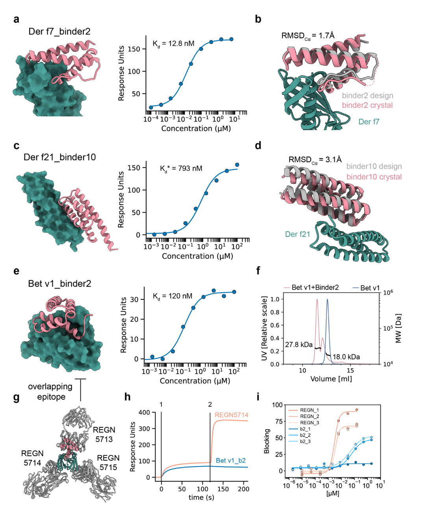
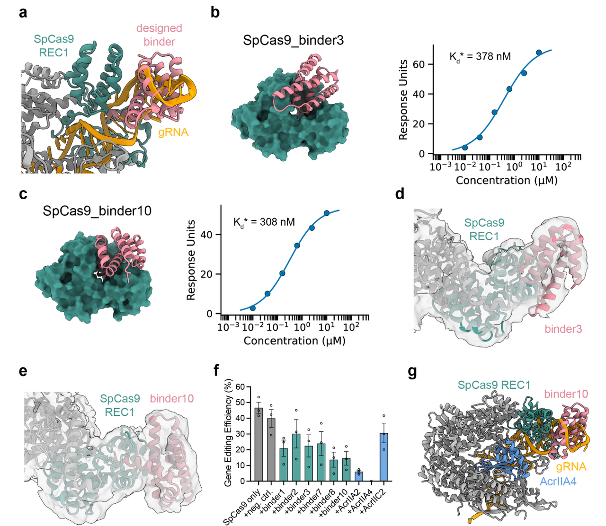

今天要介绍的这篇论文《BindCraft: one-shot design of functional protein binders》提出了一个自动化蛋白质结合剂设计平台——**BindCraft**，它通过反向优化 AlphaFold2 模型，无需高通量筛选即可快速设计出高亲和力的功能性结合蛋白。

在蛋白结合剂开发中，传统方法往往依赖昂贵的实验筛选和结构信息，效率低、门槛高。**BindCraft 的出现，为缺乏结构基础和筛选平台的实验室提供了一种“开箱即用”的解决方案，极大降低了蛋白设计的技术门槛**，在免疫调节、变应原阻断、CRISPR干预等多个领域展现出广泛应用潜力。

***

### **🧠** **研究背景与目标**

**背景：**

* 蛋白-蛋白相互作用（PPIs）在几乎所有生命过程（如免疫、信号转导）中都至关重要。

* 传统设计蛋白结合剂的方法（如抗体筛选、定向进化等）成本高、效率低。

* 深度学习模型（尤其是 AlphaFold2）的发展为结构预测与结合设计提供了强大工具。

**目标**：

* 开发一种高效、自动化的蛋白质设计平台 **BindCraft**；

* 利用 AlphaFold2 模型进行结构预测与反向优化，无需已知结合位点；

* 实现“**设计一次即成功**”（**one-shot design**），降低实验依赖；

* 推动蛋白质工程向广泛可及、按需定制的发展。

***

### **🧪** **BindCraft 的核心原理与创新点**

BindCraft 的设计流程如图所示，围绕 AlphaFold2（AF2）展开，形成一个从目标结构输入到功能结合剂输出的全自动闭环系统：

#### **🔁** **整体流程概览：**

1. **目标蛋白结构输入（Target protein）**

   * 用户提供蛋白三维结构（可从AlphaFold、PDB获取）；

   * 可选定结合热点（Hotspot）或自动识别结合区域。

* **结合剂设计初始生成（AF2 multimer trajectory）**

  * 采用 **AlphaFold2 Multimer** 模型进行“幻觉式”设计（hallucination）；

  * 结合剂的骨架结构与序列协同优化，同时预测其与目标蛋白的结合界面；

  * 每一步预测都动态调整两者界面结构，提高适配性。

* **序列微调（solMPNN）**

  * 利用 **solMPNN** 优化非界面区域（即远离结合界面的位置），以提升蛋白的表达性、稳定性和可溶性；

  * 保留关键结合区域不变，从而保持亲和力。

* **结构验证与筛选（AF2 monomer）**

  * 使用 **AF2 单体模型**重新预测优化后的设计结构；

  * 筛选步骤结合 AlphaFold confidence score 与 Rosetta 打分机制，确保结构稳定且合理；

  * 最终输出具有高亲和力和良好结构质量的结合剂候选。

#### **🌟** **关键创新点**

* **反向传播式结构设计**：通过 AlphaFold2 模型权重实现反向优化，**无需大规模结构采样**或数据库模板；

* **多步神经网络协同优化**：将 AF2、MPNN、Rosetta 等模型有机**集成**，每步优化不同目标（结合位点、稳定性、全局折叠）；

* **非依赖已知位点**：**无需已知结合区域**也能生成高亲和力结合剂，扩大适用范围；

* **一步到位式（One-shot）策略**：不同于传统方法需筛选数千个设计，BindCraft 常仅需**十几个设计**即有成功结合结果；

* **普适且自动化**：支持多种蛋白类型（如受体、变应原、核酸酶等），流程自动，适合**非结构生物学背景**的用户。

***

### **🔬** **实验验证**

作者通过设计并测试共**九个蛋白靶点（共四类蛋白）目标**，验证了 BindCraft 在多样场景下的有效性（见上图）：

* **细胞受体类（Cellular receptors）**：如 PD-1、PD-L1、IFNAR2 和 CD45，设计结合剂展示出**纳摩尔级亲和力**，其中 PD-1 的最佳结合剂亲和力甚至低于 1 nM。

* **常见过敏原（Common allergens）**：针对 DerF7、DerF21 和 BetV1 的设计表明，BindCraft 可用于阻断 IgE 结合位点，具有潜在治疗价值。

* **多结构域核酸酶（SpCas9）**：6 个设计中全部验证成功，证明该方法可用于调控基因编辑工具。

* **新设计蛋白与复杂结构蛋白（De novo & Structural）**：如 BBF-14 和 Sas6，也获得良好结合效果，显示该方法对未知或难靶蛋白也适用。

***

### **🧪 BindCraft设计流程简介（Design Protocol）**

该流程是一个自动化的设计管线，分为如下关键步骤 ：

#### **1.** **输入配置**

* 用户以 JSON 格式提供目标蛋白（PDB格式）、binder长度范围、目标设计数量等；

* 可指定结合热点（residue/chains）或不指定，由系统自动选点。

#### **2.** **AF2幻觉设计（Hallucination）**

* 利用 ColabDesign 实现的 **AlphaFold2 Multimer** 进行 binder 序列与结构生成；

* 初始化为随机序列，通过反向传播和误差梯度（L×20）优化每个残基；

* 使用五种 AF2 模型轮换，提高鲁棒性、避免过拟合。

#### **3.** **设计损失函数（Design Loss）**

综合多个结构与界面质量指标，常用的权重包括：

* 结构可信度（Binder confidence pLDDT, weight 0.1）

* 相互作用界面可信度（interface confidence i\_pTM, weight 0.05）

* 对齐误差 (Normalized prediceted alignment error pAE）等（binder 内部误差: weight 0.4，binder-target间误差, weight 0.1）

* 接触损失（Reisude contact loss , weight 1.0）

* 螺旋化倾向（helicity loss, weight -0.3）鼓励非螺旋结构

* 结合点收缩（终端靠近, weight 0.1）

#### **4.** **序列优化阶段（4个阶段）**

序列优化阶段是 BindCraft 设计流程的**关键环节之一**，目标是在已初步拟合目标蛋白的结合剂结构基础上，进一步优化其序列，以提高亲和力、结构稳定性以及生物可表达性。主要通过以下四个阶段来实现：

##### **阶段一：连续序列空间优化**

* **目标**：探索多样性的序列-结构空间，尤其是在结合界面。

* **方法**：

  * 序列以 **logits**（连续值）表示，每个位置允许多个氨基酸选择；

  * 每一步的序列计算为：

$$

\text{Sequence} = (1 - \lambda) \cdot \text{logits} + \lambda \cdot \text{softmax}(\text{logits} / T)$$

其中：

* $$

  \lambda = \frac{\text{step} + 1}{\text{iterations}}$$

* $$

  T = 1.0$$，为恒定温度

* 通过迭代，动态地将优化从logits逐步引导至概率分布。

* **特殊处理：**

  * 若 AlphaFold2 confidence 分数（pLDDT）低，提前终止该设计轨迹；

  * 若检测到 β-sheet 构象，增加 **AF2循环次数从1到3**，提高结构预测精度

* **迭代轮次**：

  * 初始50步用于粗略收敛；

  * 若表现良好，再进行25步延伸优化。

##### **阶段二：softmax 收敛收束**

* **目标**：从概率表示过渡到更可信、收敛的氨基酸选择。

* **方法**：

  * logits → softmax，得到明确的概率分布；

  * 温度 T 随迭代逐步降低，引导从探索向收敛过渡

$$

T = 10^{-2} + (1 - 10^{-2}) \cdot \left(1 - \frac{\text{step} + 1}{\text{iterations}}\right)^2$$&#x20;

* 学习率也随温度同步衰减，确保收敛稳定。

##### **阶段三：Straight-through Estimator**

* **目标**：从概率向离散表示过渡，同时保持可反向传播。

* **方法**：

  * 序列以 **one-hot 形式呈现给模型**（即每个位点为单个氨基酸）；

  * 但反向传播依然通过 softmax 进行（称为“Straight-through”）；

  * 实现“看起来是离散的、训练时是连续的”效果。

##### **阶段四：离散微调**

* **目标**：最终固定具体氨基酸序列，确保最佳的结构质量和接口表现。

* **方法**：

  * 使用 softmax 概率分布对每个位点进行 **随机采样突变**；

  * 每次采样$$  X = 0.05 \times \text{binder length}  $$个残基，保留最优损失组合；

  * 类似于 **局部搜索 + 贪婪优化**。

##### **✅** **最终筛选标准**

* **pLDDT < 0.7** → 排除；

* **界面接触点 < 7** → 排除；

* **骨架严重冲突或异常扭曲结构** → 排除。

#### 5. **后处理优化 （solMPNN + AF2 + Rosetta)**

这一阶段的目的是对初步设计的结合剂进行**结构精炼和功能验证**，最终确保它们不仅“结合得上”，还具备**良好的稳定性、表达性和能量学合理性**。这是 BindCraft 区别于许多简单AI生成方法的重要一环。

##### **🌟 1.** **MPNNsol 优化：提高结合剂稳定性与溶解性**

* 适用于：**已通过结构筛选的“成功设计轨迹”**；

* 工具：使用 **ProteinMPNN 的溶剂权重版本（MPNNsol）**；

* 优化策略：

  * **保留结合界面附近4 Å以内的残基**，避免破坏亲和力；

  * 对其余 **核心和表面残基重新设计**，每个轨迹生成 **20 个新序列**；

  * 温度设为 **0.1**（控制采样多样性），不引入骨架噪声（backbone noise = 0.0）

##### **🔁 2.** **结构验证：AF2单体模式再预测**

* 使用 **AlphaFold2 monomer 模型**对新序列进行重构预测；

* 参数设置：

  * **循环（recycle）次数为3次**，提高预测精度；

  * 使用 **2个基于模板的模型**，但以“单序列模式”运行，防止多序列比对偏差；

* 目的：验证MPNNsol优化后的序列是否保持结构可靠性。

##### **⚙️ 3.** **能量最小化与界面评估：Rosetta分析**

* 使用 **Rosetta 的 FastRelax 模块**对 AF2 预测结构进行**全原子能量最小化**（200次迭代）；

* 再通过 **InterfaceAnalyzer 模块**分析蛋白-蛋白界面质量，计算包括：

  * 界面能量（binding energy）；

  * 接触面积；

  * 副链/主链结构调整对结合效果的贡献；

#### **6. 筛选标准总结：确保设计质量的过滤条件**

在 BindCraft 流程的最后阶段，所有设计将通过一系列**预设过滤条件**进行筛选，以确保仅保留结构可信、功能合理、具实验潜力的高质量binder。

这些标准基于既往文献经验并在本研究中进一步优化，具体包括：

1. **AF2整体结构可信度（pLDDT）**：> 0.8

2. **AF2结合界面可信度（i\_pTM）**：> 0.5

3. **AF2界面对齐误差（i\_pAE）**：> 0.35（值越高表示对齐误差越小）

4. **Rosetta界面形状互补性（Shape Complementarity）**：> 0.55

5. **未饱和氢键数（unsatisfied H-bonds）**：< 3

6. **结合剂表面疏水性**：< 35%

7. **结合态与游离态的RMSD差异**：< 3.5 Å

这些标准共同确保输出binder**结构稳定、界面紧密、可溶性良好、预测结果可信**，适合进入实验验证阶段。

***

### **🧾 总结与讨论**

#### **🔬 1. 背景与意义**

* 蛋白-蛋白相互作用（PPIs）的计算设计长期是蛋白质工程的核心挑战；

* 难点在于：我们对分子识别机制（特别是结合位点的物理化学特征）仍了解有限；

* 借助 AlphaFold2 等深度学习结构预测工具，现已能对新设计的结合剂进行更准确评估。

#### **⚙️ 2. BindCraft 的独特优势**

* 基于 **AF2 网络的反向传播优化**，首次实现结合剂“幻觉式”设计；

* 相比于多数固定靶点的方法，BindCraft 允许目标蛋白本身存在柔性，有助于捕捉结合诱导的构象变化；

* 系统可自动识别高结合倾向位点，无需事先定义目标区域。

#### **📈 3. 实验表现与成功率**

* 在12种复杂目标蛋白上设计结合剂，**亲和力大多达到纳摩尔水平**，极少数为微摩尔；

* 平均成功率为 **46.3%**，显著高于传统方法（如 RFdiffusion、AlphaProteo）；

* 在社区挑战中设计的结合剂还获得**第一名**，成功靶向 EGFR 高难度靶点。

#### **🔍 4. 面对的挑战与扩展前景**

* PPI设计的主要挑战在于选择合适的结合表位，尤其是疏水且结构平坦的区域；

* BindCraft 能处理既有已知结合位点的蛋白，也能在 de novo、变应原或核酸酶等复杂系统中自动定位结合区域；

* 在设计结合 **蛋白-核酸界面**结合剂方面也展现出潜力，为未来开发转录因子抑制剂等功能工具提供新方向。

#### **🧪 5. 局限性与潜在问题**

1. **参数需个性化调整**

   * 默认设置（迭代次数、损失权重、筛选阈值）**可能不适用于所有目标蛋白**；

   * 对于不同靶标，可能需要根据经验调整这些参数以获得理想结果。

2. **结合位点选择仍关键**

   * 尽管 AlphaFold2 在自动识别结合位点方面表现优秀，**指定热点位点仍能提升设计成功率**；

   * 自动识别虽然有效，但在特定生物功能需求下，人工选择更具可控性。

3. **亲水界面预测较弱**

   * 相比疏水界面，AF2 在**亲水性结合界面**的预测与设计效果更差，需谨慎解读结果。

4. **结构变形常见但可控**

   * 在设计过程中，某些结合剂轨迹可能出现结构变形或“被压扁”（squashed）；

   * 这是 **AF2 Multimer 对输入序列高度敏感**所致，属正常现象；

   * 此类无效轨迹会被系统自动识别并快速剔除，不影响整体流程稳定性。

因此，使用 BindCraft 时要注意：**虽然系统自动化程度高，但仍需人为判断与适配，特别是在新靶点上使用时**。

***

###

***

### **📚 原文与资源信息**

* **论文标题**：*BindCraft: one-shot design of functional protein binders*

* **发表平台**：bioRxiv（预印本）

* **原文链接**：https://www.biorxiv.org/content/10.1101/2024.09.30.615802v3

* **代码仓库（GitHub）**：

* BindCraft 官方开源代码与使用说明已公开，支持用户在本地运行完整设计流程：

* 🔗 https://github.com/martinpacesa/BindCraft
