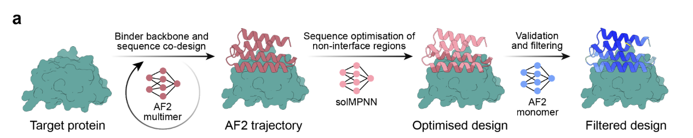
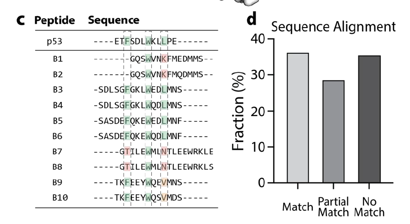
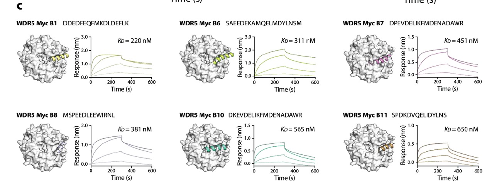
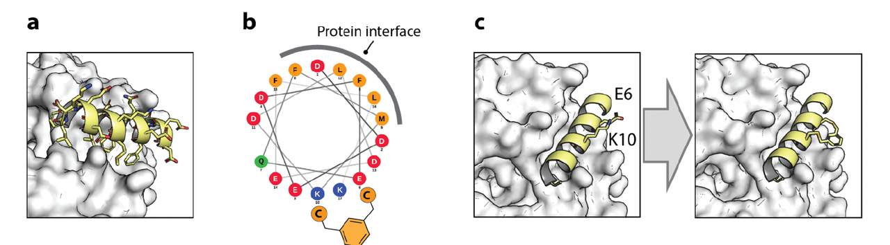

**关键词**：Peptides, Alphafold, BindCraft, De novo peptide design

🔗原文链接：https://www.biorxiv.org/content/10.1101/2025.07.23.666285v1

***

## 研究总结

这篇论文《Generative Design of High-Affinity Peptides Using BindCraft》主要研究了使用一个叫 **BindCraft** 的计算工具来“**从蛋白质结构出发，生成高亲和力的肽类配体（peptide binders）**”。

### **研究目标**

作者希望评估 BindCraft 是否能：

* 从目标蛋白的三维结构出发，**自动生成能特异性结合的短肽序列（10–20个氨基酸）**；

* 为药物开发提供一个**无需复杂筛选实验**的替代手段。

*

### **研究方法与主要实验**

1. **工具简介**

BindCraft 是一个基于 AlphaFold 的结构引导生成模型，原本设计用于生成“迷你蛋白（miniprotein）”结合物。这篇论文尝试将其用于生成更短的、潜在更具药用价值的“肽类”。

* **两个目标蛋白：MDM2 和 WDR5**

  * **MDM2**：一种癌症相关蛋白，天然与 p53 蛋白结合。

  * **WDR5**：与染色质修饰和癌基因如 MYC 有关，具有两个已知的结合位点：WIN 和 WBM。

* **生成与实验验证**

  * BindCraft 生成了针对 MDM2 的 70 条候选肽链，其中合成了 15 条，有 7 条显示出纳摩尔级别的结合亲和力（KD = 65–165 nM）。

  * 对 WDR5 的两个结合位点分别生成了肽，其中 WIN 位点无有效结合肽，但在 WBM 位点发现了 6 条 KD 在 219–650 nM 的结合肽。

  * 进一步对最佳肽做了“**Stapling（主链钉固化）**”结构修饰，使其稳定 α-螺旋结构，结合力提升到 KD = 39 nM。

### **研究结论**

* **BindCraft 可以用于从蛋白结构中自动生成功能性肽类结合剂，具备一定的命中率。**

* 成功生成 MDM2 和 WDR5（WBM位点）的高亲和力肽，失败于 PD-1/PD-L1 和 WDR5 WIN 位点。

* 相较于 phage display 等实验筛选方法，BindCraft 提供了结构信息，可直接用于优化，如肽钉固。

* 对于不具备深度计算背景的实验室，BindCraft 是一个“可直接上手”的工具。

***

## **一、研究背景：为什么要“从结构出发设计肽药”？**

现代药物开发越来越重视蛋白–蛋白相互作用（PPI）的干扰，而肽类分子是阻断这类接口的理想形式。相比小分子，肽能更好地覆盖大而平坦的蛋白结合面；相比迷你蛋白（miniprotein），肽具有更好的合成性、药代属性和潜在的细胞穿透性。

然而，**如何快速找到能结合目标蛋白的高亲和力肽**，一直是药物设计中的难题。传统的筛选手段如 phage display 或 mRNA display 成本高、周期长，且不能主动控制靶点结构或结合位点。

于是一个关键问题被提出：

> “我们能否直接从蛋白质三维结构出发，通过计算工具自动生成具有结合能力的短肽序列？”

这正是 BindCraft 平台所尝试解决的问题。

***

## **二、技术工具：什么是 BindCraft？**

BindCraft 是一个基于 AlphaFold 架构开发的结构引导生成模型，原本用于生成小型蛋白（miniproteins）结合配体。它的主要特点包括：

* 输入：目标蛋白结构（PDB）+ 目标结合位点残基；

* 输出：一批结构上拟合结合界面的肽或小蛋白序列；

* 附加输出：预测的肽-蛋白复合物结构，可用于后续优化；

* 目标用户：没有计算背景的药物/化学/结构实验室也可使用。

研究者希望通过这项研究来评估：

> “BindCraft 能否也用于**短肽（10–20 个氨基酸）**&#x7684;结构引导生成？”

***

## **三、第一步：以 MDM2 为模板的“概念验证”**

### **为什么选择 MDM2？**

MDM2 是一个非常经典的肽结合靶点：

* 它与 p53 蛋白结合界面小且明确；

* 结构清晰（PDB: 1YCR）；

* 天然结合肽是短 α-螺旋结构，含关键疏水三元组 F/W/L；

* 已有大量肽类优化数据作对比。

### **BindCraft 如何操作？**

研究者将 MDM2 的结构输入 BindCraft，并指定 p53 结合界面关键残基作为目标区域，生成了 70 条候选肽（10–20 个氨基酸）。

### **结构分析结果：**

* 所有候选肽预测结构均为 α-螺旋；

* 其中约 36% 含有完整的 F/W/L 热点三元组；

* 另有 28% 包含部分热点（如 F/W/V、F/M/L 等）。

### **实验验证：**

* 合成了其中的 15 条；

* 使用 BLI 测定与 MDM2 的亲和力，有 7 条表现出清晰的结合动力学（KD = 65–165 nM）；

* 大多数有效肽中确实包含 F/W/L；

* 通过竞争实验验证这些肽能阻断 p53 的结合，说明靶点位点是正确的。

✅ **阶段性结论：**

BindCraft 可以从结构出发生成高命中率的短肽候选，其中包含已知关键结合元素，并且实验上可验证其功能活性。

***

## **四、第二步：从“简单靶点”转向“结构复杂”的 WDR5**

### **为什么选择 WDR5？**

WDR5 是另一个重要的致癌蛋白，具有两个已知的结合界面：

* WIN 位点（与 MLL 蛋白结合）；

* WBM 位点（与 MYC 蛋白结合）。

与 MDM2 不同的是：

* 两个位点都不是天然 α-螺旋结合；

* 天然肽为 loop 或柔性结构；

* 是对 BindCraft 的一次挑战。

### **实验设计：**

对两个位点分别进行 BindCraft 设计：

* WIN site：以 PDB 6DY7 中的 F133 为锚点；

* WBM site：以 L240 为锚点；

* 各生成 100 条肽，选前 10 条合成验证。

### **实验结果：**

* WIN site 所有肽均无结合活性；

* WBM site 中有 6 条肽显示出中等亲和力（KD = 219–650 nM）；

* 有效肽中普遍富含带负电残基，与 WDR5 的正电结合面匹配。

❌ **WIN失败，WBM成功。**

✅ **阶段性结论：**

BindCraft 可能偏向于设计 α-螺旋结构的结合肽，这对于 WIN site 等“柔性结合界面”是挑战；但在 WBM site 上仍能生成功能性肽，展示其适应不同结构位点的潜力。

## **五、第三步：结构驱动的优化 —— Stapling 案例**

在 WBM 成功肽中，研究者选取 Myc\_B1 做结构优化，验证 BindCraft 输出结构的实际应用价值。

### **设计思路：**

* 利用预测结构识别两个不参与结合、背面暴露的残基 Glu6 和 Lys10；

* 将其换成半胱氨酸，用 meta-xylene 做 i,i+4 的 Stapling；

* 测定其亲和力与功能抑制效果。

### **实验结果：**

* Stapled 版 KD = 39 nM，比原始版本高 6 倍；

* 在竞争实验中，stapled 肽能更强地抑制 WDR5 与 MYC 的结合（最大抑制 57% vs 25%）。

✅ **阶段性结论：**

结构预测不仅指导 hit 设计，还能直接用于药化优化。传统 display 技术不具备这种“结构优化”的路径，显示了 BindCraft 更强的后期扩展性。

## **六、总体评价与研究贡献**

### **✅ 主要发现：**

1. BindCraft 可生成功能性短肽 binders，尤其适用于 α-螺旋结合靶点；

2. 成功应用于两个癌症相关蛋白（MDM2 和 WDR5）；

3. 生成肽具备高度结构合理性，可直接进行优化设计（如 stapling）；

4. 使用门槛低，无需修改代码，适合普通实验室操作。

### **⚠️ 局限性：**

* 对于非 α-螺旋结合界面（如 PD-1/PD-L1, WDR5-WIN），设计命中率较低；

* 可能内在偏好螺旋类结构，限制某些接口设计能力。

***

## **🧩 结语：从肽的结构生成到功能验证，BindCraft 展示了“结构驱动型药物设计”的新范式**

这项研究不是简单地展示了一个 AI 工具的性能，而是围绕“结构–设计–验证–优化”构建了一整条药物早期开发路径的雏形。对于希望探索“计算辅助肽药设计”的研究者来说，它提供了技术路径、成功模板和挑战边界，是一篇具有代表性的里程碑式研究。
