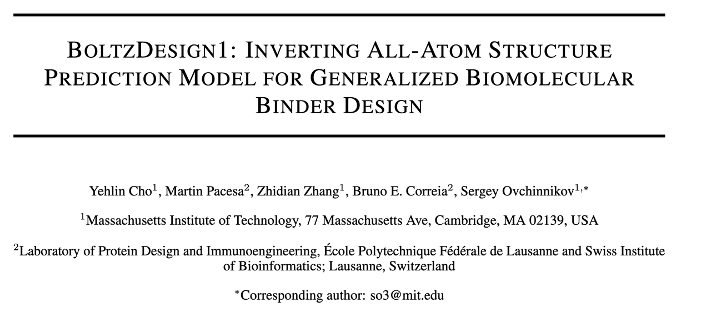
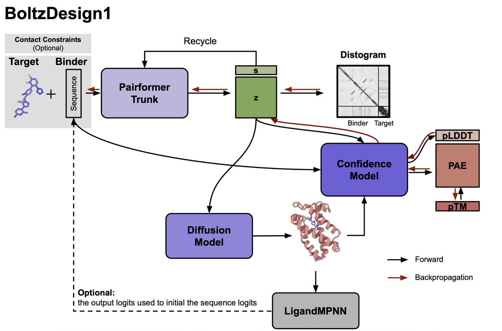
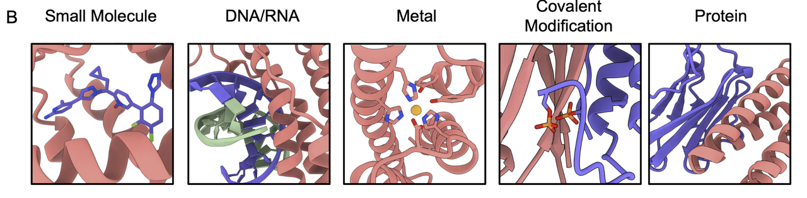
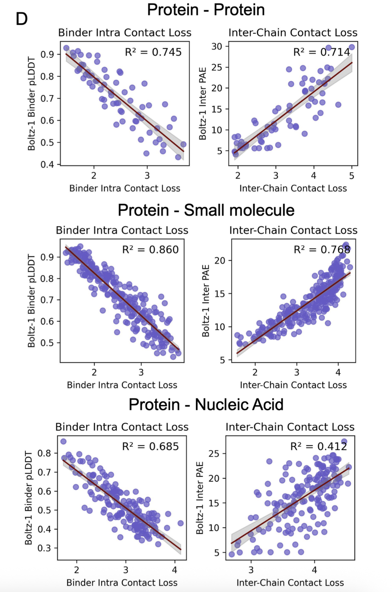
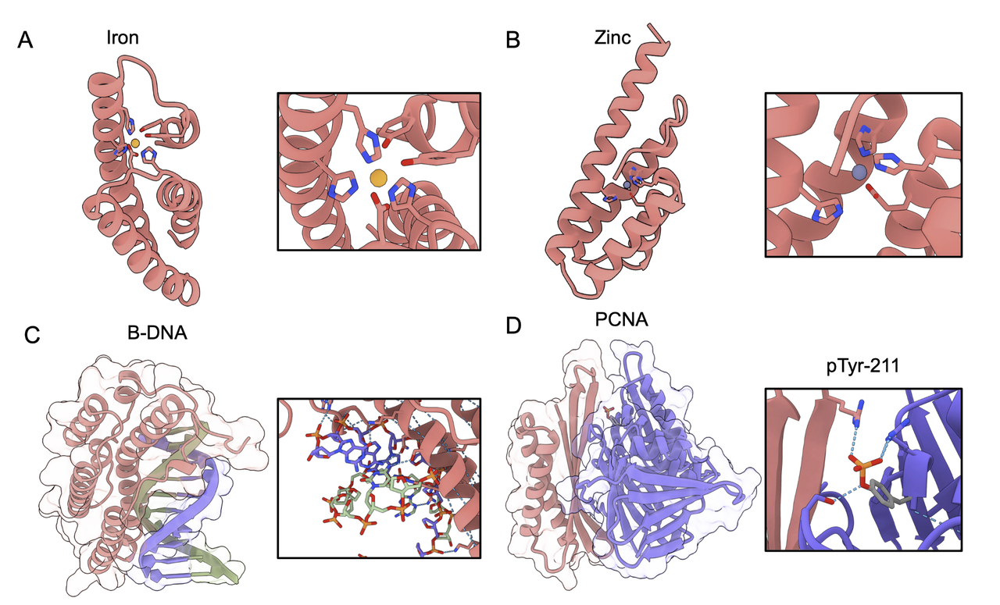

> **蓝极说：**
>
> 前段时间读了字节团队基于**Protenix**这个AF3复现模型做的蛋白设计工具**PXDesign**，今天突然想到，同样是复现AF3的**Boltz**他们做蛋白设计模型了吗？于是就查到了这篇文章，发现蛋白质设计的大牛Sergey Ovchinnikov在4月就在arxiv上传了基于Boltz的蛋白设计模型**BoltDesign1**。读的过程中，发现他们对蛋白质设计的处理**很有新意**，有自己的**小trick**，而且从结果来看，效果还不错，今天给大家解读一下，希望能对各位有所帮助。现在BoltzDesign1也已经完全**开源**，大家感兴趣的也可以去使用。

📖**原文链接**：https://doi.org/10.1101/2025.04.06.647261

🔗**代码链接**：https://github.com/yehlincho/BoltzDesign1

👉**colab链接**：https://colab.research.google.com/github/yehlincho/BoltzDesign1/blob/main/Boltzdesign1.ipynb

***

## **第一部分：引子——从结构预测到反向设计**

过去几年，蛋白质结构预测模型的发展可谓是突飞猛进。AlphaFold2 的出现，让科学家们第一次能大规模、准确地预测蛋白质的三维结构；随后 AlphaFold3 、 RoseTTAFold-All-Atom、Boltz 的发布，更是将预测范围扩展到了小分子、核酸、金属离子乃至翻译后修饰。

> 这股浪潮改变了蛋白质研究的格局：**预测结构**变得越来越容易。

但问题随之而来：

> 👉 如果我们能预测结构，那么能不能“**反过来**”，直接利用这些强大的预测模型来 **设计新的结合蛋白** 呢？

这就是“反向优化”或者说“**幻觉（hallucination）**”的概念——不是单纯预测已有序列的结构，而是让模型**主动“想象”出能稳定结合目标分子的全新序列**。

这一次，MIT的Sergey团队与 EPFL 的团队提出了一种新的方法：**BoltzDesign1，**&#x7528;Boltz作为结构预测工具，通过hallucination的方法做了一个全原子设计工&#x5177;**。**

它的特别之处在于：

* 不需要昂贵的模型再训练；

* 计算开销**远低于**以往的**扩散模型**优化；

* 最关键的是，它不仅能设计蛋白–蛋白结合物，还能**推广**到小分子、金属、DNA/RNA 乃至翻译后修饰蛋白。

在上图中，这一点被直观地展示出来：

* **黑色**箭头：传统的预测路径，从序列到结构；

* **红色**&#x7BAD;头：BoltzDesign1 &#x7684;**反向设计路径**，从“想要的相互作用”出发，通过梯度回传一步&#x6B65;**收敛到理想序列**。

> 可以说，这是把结构预测能力，真正推向了**通用设计平台**的新尝试。

***

## **第二部分：BoltzDesign1 的核心思路**

BoltzDesign1 的核心创新在于：它把一个原本用于结构预测的全原子模型(Boltz1)，**反过来当成设计引擎来用**。

不同于以往直接在三维结构上做优化，BoltzDesign1 选择在 **distogram（原子对距离的概率分布）** 上动手：

* 这样不仅能捕捉到分子间的**相互作用趋势**；

* 还**避免**了逐步追踪三维坐标时的**高昂计算开销**。

在整个流程中，BoltzDesign1 主要依赖两个模块：

* **Pairformer**：负责给出序列–结构之间的“配对特征”，预测原子对之间的距离分布；

* **Confidence 模块**：用来评估设计出的结构是否可信。

通过这两个模块，BoltzDesign1能够在反向传播时不断修正输入序列，让它逐渐收敛到既合理又能稳定结合目标分子的状态。

**Figure 1B**也展示了这种方法的通用性：不仅能处理蛋白质，还能扩展到小分子、金属离子、DNA/RNA，甚至带有翻译后修饰的蛋白质。

> **BoltzDesign1 的特别之处在于，它不是去生成单一的结构，而是去塑造一个概率分布，从而引导设计结果更稳定、更具多样性。**

***

## **第三部分：Distogram 是否足够？**

在设计中，最大的挑战之一是：**能不能只依赖 distogram，就足以支撑稳定可靠的结合设计？**

毕竟 distogram只是“原子对距离的概率分布”，而不是完整的三维结构。

研究团队先做了一个验证：他们把 BoltzDesign1 生成的 distogram 与完整的结构预测结果进行对比。结果很惊喜——在大多数情况下，distogram 已经能够很好地捕捉目标和结合物之间的关键接触。具体来看，超过 **七成的设计在接触预测上的准确率（P@K）超过 0.5**，这说明 distogram 并不是一个模糊的“草图”，而是已经具备了足够的结构信息（Figure 2A–C）。

接着，他们又考察了 distogram 的“接触损失”与模型置信度指标（pLDDT 和 pAE）之间的关系。结果显示：

* 对于蛋白质和小分子，distogram 接触损失和置信度之间有着很强的相关性；

* 对于核酸结合物，相关性则明显较弱，需要额外依赖 Confidence 模块的支持（Figure 2D）。

这组实验的意义在于，它证明了：

* **distogram 本身就足以作为设计的核心优化目标**，不仅能节省计算资源，还能保证设计质量；

* 同时，它也揭示出不同类型的靶标差异：蛋白质和小分子更容易被捕捉，而核酸则需要额外的建模支持。

> **BoltzDesign1 把设计问题化繁为简，用 distogram 就能走得很远。**

***

## **第四部分：小分子结合物的验证**

为了验证 BoltzDesign1 的能力，作者首先选择了四个经典的小分子配体：IAI、FAD、SAM 和 OQO。

这些小分子此前已经被 RfDiffusionAA 用来测试过，因此非常适合作为对照。

BoltzDesign1 在这几个靶标上交出了漂亮的答卷。

设计出的结合物不仅能紧密包裹住小分子，还形成了关键的氢键、疏水相互作用和 π–π stacking 等结合模式（Figure 3B–C）。也就是说，Boltzdesign1设计的蛋白不仅对小分子“**贴上去**”，还“**咬得牢**”。

更重要的是，**成功率大幅领先**。按照 AlphaFold3 的评估标准（整体置信度 pLDDT > 0.7，界面误差 ipAE < 10），BoltzDesign1 在所有四个小分子上都优于 RfDiffusionAA（Figure 3D）。特别是在同时使用 Pairformer 与 Confidence 模块时，成功率更是显著提升。

除了成功率，**结构多样性**也是一个亮点。BoltzDesign1 生成的结合物，其平均 TM-score 更低（约 0.36，相比 RfDiffusionAA 的 0.46），说明这些设计彼此差异更大，代表性更强（Figure 4A）。

并且，通过在优化过程中加入“helix loss”这一控制项，研究人员还能够引导二级结构的分布：当 helix loss 权重增加时，结合物的 β-sheet 含量显著上升（Figure 4B–C）。这意味着 BoltzDesign1 不仅能给出答案，还能根据需求“定制”答案。

总结来说，在小分子结合物的设计测试中，BoltzDesign1 展现了两个鲜明的优势：

1. **更高的设计成功率** ——比已有方法更可靠。

2. **更丰富的结构多样性** ——不仅能成功，还能设计出“多种不同的成功”。

> **BoltzDesign1 不只是会解题，还会解出一整套有创造性的解法。**

***

## **第五部分：迈向广谱结合物设计**

如果说小分子结合物的测试展示了 BoltzDesign1 的“**基本功**”，那么接下来的探索则展示了它的“野心”——**一个通用的结合物设计平台**。

研究团队把视野扩展到更复杂、更广泛的分子类型：

* **金属离子**：设计出的结合物能准确再现经典的配位几何，例如铁的八面体配位、锌的四面体配位，并且关键残基（Tyr、Asp、His 等）也恰到好处地参与到配位中（Figure 5A–B）。

* **DNA 结合物**：对于 B-DNA，BoltzDesign1 给出的蛋白序列能够贴合双螺旋的形状，形成氢键和静电互补，尤其是带正电的氨基酸侧链与 DNA 磷酸骨架的相互作用（Figure 5C）。

* **翻译后修饰识别**：研究人员还尝试设计能识别特定翻译后修饰的结合物。例如，靶向 **PCNA 的 Tyr-211 磷酸化位点**，可能干预其与癌症相关的信号通路；或是结合 **Smad2 的磷酸化位点**，阻止其形成致癌的三聚体；再比如针对 **CD45 的糖基化位点**，有望用于免疫调控（Figure 5D–F）。这些结合物不仅与蛋白目标本身作用，还能精确地识别修饰基团。

这些案例说明，BoltzDesign1 并不是一个“单一任务的工具”，而是能够在多种场景下灵活迁移。无论目标是小分子、金属、核酸，还是修饰过的蛋白质，它都能生成合理的结合物序列。

> 用一句更宏大的话说：
>
> **BoltzDesign1 正在把“反向设计”从单一的蛋白–蛋白问题，推向一个覆盖生命分子世界的通用框架。**

***

## **第六部分：总结与展望**

综上，BoltzDesign1 展现了三个鲜明的亮点：

1. **更高的成功率** ——在小分子结合物设计中，显著优于已有方法。

2. **更丰富的多样性** ——不仅能生成“一个正确答案”，还能给出一系列多样化的设计。

3. **更广泛的适用性** ——从小分子、金属离子，到 DNA、RNA，乃至带有翻译后修饰的蛋白质，都能胜任。

更难得的是，这一切并不是依赖昂贵的扩散步骤，而是通过 **distogram** 与 **Confidence** 模块来实现，极大降低了计算开销。换句话说，**它不仅聪明，而且高效。**

当然，BoltzDesign1 也还有一些局限：比如目前**没有引入模板约束**，**对核酸结合物的处理能力还有限**；同时，模型既做设计又做评估，也可能带来一定的偏差。但这些都属于可以逐步解决的问题。

未来，随着优化方法的改进与实验验证的加入，BoltzDesign1 有望成为一个真正的 **通用分子结合物设计平台**。

它可能会推动药物发现、酶工程、诊断工具等多个领域的发展。

> **BoltzDesign1 把“预测”真正转化为了“设计”，为通用分子结合物的创造打开了一扇大门。**

原文链接：https://doi.org/10.1101/2025.04.06.647261

