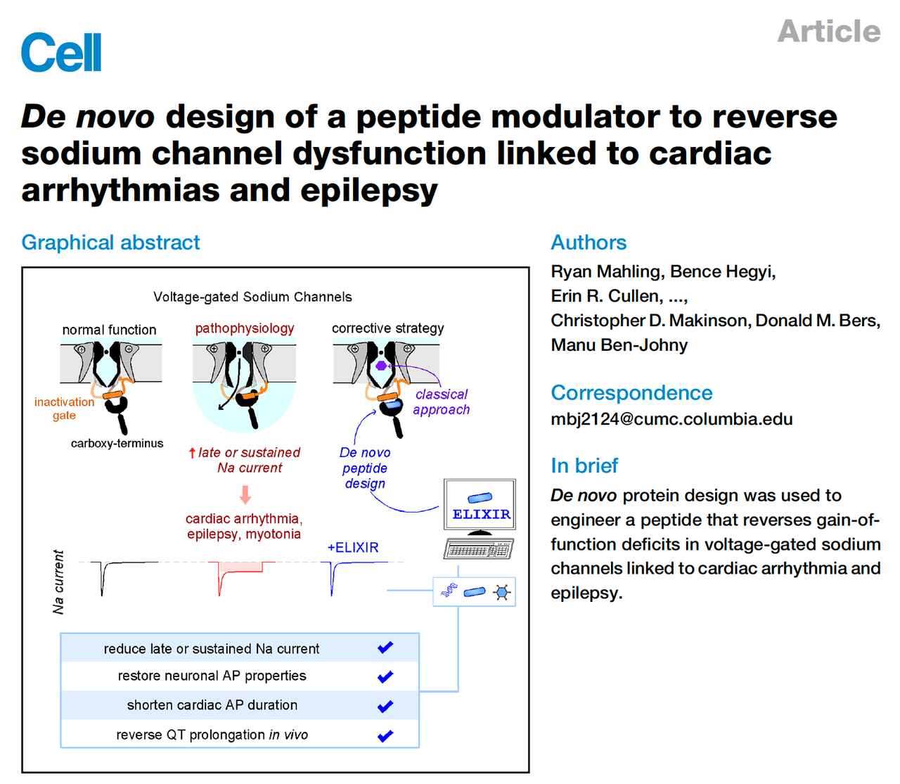
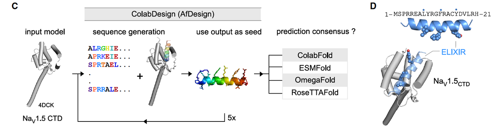
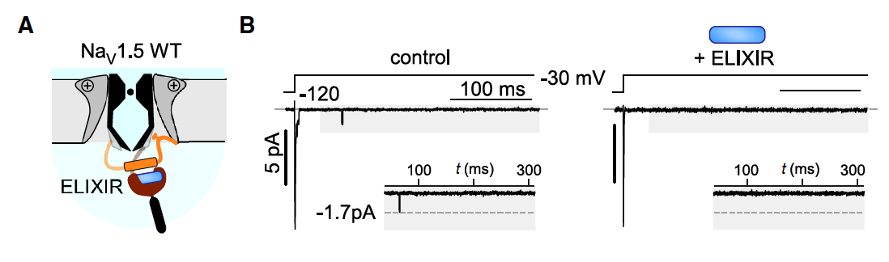
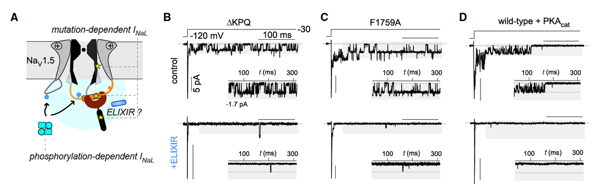
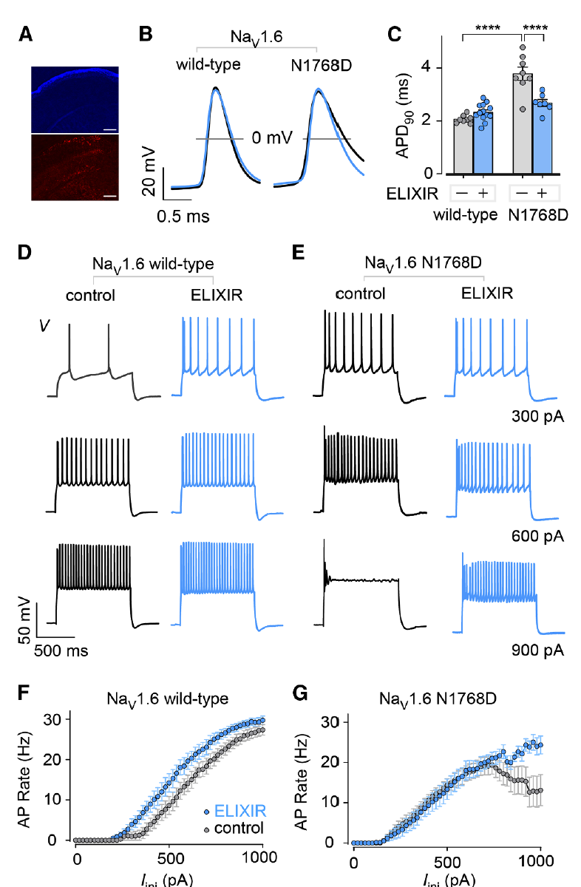
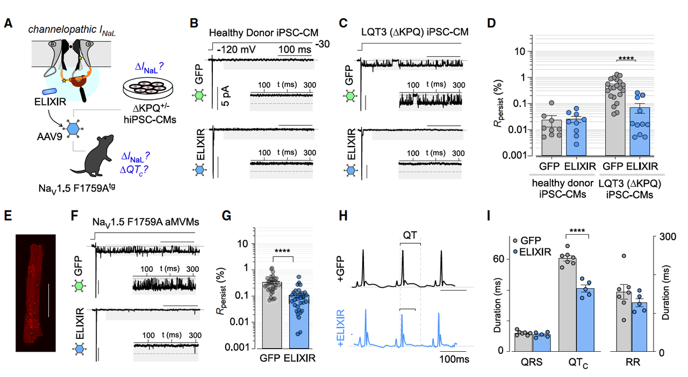

> 蓝极说：
>
> 今天要分享的是 *Cell* 昨天（2025.08.19）刚刚online的一篇工作 —— **《De novo design of a peptide modulator to reverse sodium channel dysfunction linked to cardiac arrhythmias and epilepsy》**。这篇文章报道了一个从零设计的多肽 **ELIXIR**，它能精准修复病态钠通道的功能异常，从而逆转心律失常和癫痫模型中的病理表型。
>
> 之所以选择讲这篇文章，有两个原因：
>
> 一方面，**蛋白质设计在膜蛋白上的应用一直极少**。相比可溶性蛋白，膜蛋白结构更复杂、动态性更强，给计算设计带来了巨大挑战。
>
> 另一方面，**钠通道是膜蛋白里最“庞然大物”之一**，不仅由四个重复结构域组成，还参与复杂的电生理调控。长期以来，即使是结构预测也常常不够准确，更别提基于结构的精准设计。
>
>
>
> 正是在这样的背景下，这篇工作首次展示了：我们可以用 **de novo 蛋白质设计的方法，写出一条短肽，精准调节钠通道的病态功能**。这不仅是一项技术突破，也为“通道病”治疗打开了新思路。

***

心脏跳动异常，或者神经元“放电过度”，往往会让我们想到 **心律失常** 和 **癫痫** 这两类严重疾病。它们看似不同，一个是心脏病，一个是神经系统疾病，但在分子层面却有着惊人的共性——**电压门控钠通道的“失控”**。

正常情况下，钠通道打开后很快关闭，动作电位能被严格调控；但一旦失活环节出了问题，就会出现一个不该存在的“尾巴电流”，也就是所谓的 **晚钠电流（late sodium current, INaL）**。这个持续的钠离子渗入，会拉长心脏动作电位，增加心律失常风险；在神经元中，它则导致过度兴奋，触发癫痫发作。

传统的小分子药物，比如 **Ranolazine**，虽然能一定程度上抑制晚电流，但往往“刀子太钝”，既切掉了病态信号，也容易误伤正常通道，甚至带来副作用。

就在这样的背景下，这篇 *Cell* 的新工作登场了：研究团队用 **蛋白质设计**，从零开始创造了一条全新的小肽——**ELIXIR**。它的使命不是“无差别打击”，而是精准修复：只锁定那些病态的钠通道，把它们拉回正常轨道。

***

### 1. **机制与设计思路：如何用蛋白质设计修复钠通道？**

#### 1.1 **病变的起点：晚钠电流**

要理解 ELIXIR 的设计逻辑，我们先要看看病变通道的问题出在哪。

在正常情况下，钠通道会快速激活和失活，让动作电位“一闪即逝”。但在一些心律失常和癫痫相关突变中，**失活环节出现障碍**，导致通道持续漏钠，产生 **晚电流（INaL）**。这种不该存在的电流让心肌动作电位延长（心律失常风险↑），或让神经元过度兴奋（癫痫风险↑）。

#### 1.2 **关键弱点：失活门与 CTD 的“卡位”**

钠通道的失活依赖一个“失活门”（inactivation gate, IG），它像插销一样能迅速把通道堵上。

* **正常情况下**：IG 会从 CTD 的 EF-hand-like 区域（EFL）释放，再去孔口完成“关门”。

* **病理情况下**：IG 被卡在 EFL 上，没法去执行任务 → 通道持续漏钠。

> 这意味着，**EFL 是一个理想靶点**：如果有东西能和 IG 竞争性结合，就能把 IG“解救”出来，让它回到孔口，恢复正常失活。

#### 1.3 **设计策略：写一条“解锁肽”**

研究团队用 **ColabDesign** 进行了 de novo 设计，结果得出了一条 **21个氨基酸的短肽**，命名为 **ELIXIR**。它的设计考虑了几个关键点：

1. **模仿失活门的关键特征**

   * 疏水性核心（L8、F12、Y16），刚好能嵌进 EFL 的疏水口袋。

   * 两侧配上带正电残基，提高结合稳定性。

2. **避免“抄作业”**

   * 与原生失活门的序列相似度只有 \~24%，说明这是一次“重新编写”，而不是简单复制。

   * 在数据库里，它和已知蛋白都没有明显同源关系，是真正的 **de novo 设计**。

3. **实验友好化改造**

   * 在第15位做了一个保守替换（C → S），避免体外实验中出现二硫键干扰。

#### 1.4 **功能关键残基验证**

研究团队进一步用突变实验来证明设计的合理性：

* 把 **L8/Y16 改成 Ala，F12 改成 Glu** → 结合力和功能抑制效果显著下降。

* 说明这三个残基就是设计的“卡位核心”。

* 结合实验（荧光标记、FRET）也证实了 ELIXIR 与 NaV1.5 CTD 的结合亲和力在 **亚微摩尔级别（KD≈0.9 μM）**。

> 这说明，ELIXIR 并不是一条随意拼出来的肽，而是一个 **基于结构逻辑、关键残基驱动的精准设计**。

**小结亮点**：

ELIXIR 的设计逻辑是：

1. 找准 **EFL 这个卡位点**，

2. 写一条能塞进去的小肽，**模仿但不复制失活门**，

3. 用关键残基保证结合和功能，

4. 再通过实验逐步验证。

它就像一把特制的钥匙，精准插入钠通道调控区，把失活机制重新“解锁”。

***

### 2. **功能验证：精准抑制病态通道，而不伤正常功能**

设计出 ELIXIR 之后，研究团队的第一个问题就是：**它真的能在细胞里修复病态通道吗？**

#### 2.1 **正常通道：几乎不受影响**

研究者在 HEK293 细胞中表达了 **野生型 NaV1.5** 通道，观察其晚电流 INaL。

* 正常情况下，INaL 本来就很低。

* 加入 ELIXIR 后，通道的激活、失活动力学几乎没有变化。

> 这说明 **ELIXIR 不会乱动正常通道**，选择性非常好。

***

#### 2.2 **病态突变体：显著修复**

接下来，他们测试了一个与心律失常相关的 **NaV1.5 Δ1864 突变体**，这个突变会导致通道 CTD 缺失，晚电流暴涨（高达野生型的 \~40 倍）。

* 在这个病态背景下，ELIXIR 能让 INaL **下降超过 12 倍**，几乎恢复到接近正常水平。

* 作为对照，临床常用的 **Ranolazine（10 μM）** 只能降低约 4 倍。

> 对比之下，ELIXIR 的选择性和效力远超传统药物。

***

#### 2.3 **功能-结构验证：关键残基决定效果**

为了确认 ELIXIR 的作用真的依赖于它和 CTD 的结合，研究者做了几个关键实验：

* 把 ELIXIR 的 L8/Y16 改成 Ala，或者 F12 改成 Glu → 抑制效果明显下降。

* 把通道本身的 EFL 片段删掉（Δ1810 突变体） → ELIXIR 完全失效。

而且，结合实验的亲和力（KD）和功能抑制程度（INaL下降幅度）呈线性相关。

> 这直接证明了：ELIXIR 的抑制效果 **依赖于它精准结合在 NaV1.5 的 CTD-EFL 位点**。

***

**这一部分的亮点总结**：

1. **精准性**：对野生型几乎无影响，但能强效抑制病态突变体。

2. **优效性**：效果优于传统小分子药物 Ranolazine。

3. **机制验证**：作用完全依赖设计的结合位点，实验数据和设计逻辑高度吻合。

> 换句话说，ELIXIR 并不是“一刀切”的钠通道抑制剂，而是一种 **“病理选择性修复因子”**。

***

### 3. **广谱效应：跨突变、跨机制、跨亚型的修复能力**

#### 3.1 **多突变、多机制下的通用性**

钠通道病变并不仅仅是一个突变，而是可以通过不同机制导致晚电流升高：

* **经典 LQT3 ΔKPQ 突变** → ELIXIR 抑制晚电流约 13 倍。

* **药物耐受性突变 F1759A**（对传统抗心律失常药无效） → ELIXIR 依然能抑制 \~12 倍。

* **IQ/AA 突变**（阻断 CaM 结合） → ELIXIR 也能显著降低晚电流。

* **激酶修饰导致的病理状态**：

  * PKA 过度活化 → 晚电流 ↑5 倍，ELIXIR 可逆转。

  * CaMKII 突变活化 → 晚电流 ↑2 倍，ELIXIR 也能修复。

> 无论是基因突变还是后天修饰，只要机制导致失活受阻，ELIXIR 都能“接管修复”。

#### 3.2 **剂量依赖性**

为了让 ELIXIR 能进入细胞，研究团队给它加了一个细胞穿透肽（cpp），命名为 **ELIXIR-cpp**。

* 结果显示 ELIXIR-cpp 在细胞内呈剂量依赖性抑制晚电流，IC50 \~ 330 nM。

* 这一数值与它在体外测得的结合亲和力（\~0.9 μM）高度一致。

> 说明它的作用并非偶然，而是一个可控的剂量效应。

***

#### 3.3 **跨亚型的病理选择性**

人体有 9 种不同的 NaV 通道亚型（1.1–1.9），分布在心脏、神经、肌肉等不同组织。一个潜在风险是：ELIXIR 会不会误伤其他亚型？

* **野生型 Nav1.1、Nav1.4、Nav1.6、Nav1.7**：ELIXIR 几乎没有影响。

* **病理突变型**：

  * Nav1.4 F1698I（肌强直相关突变） → 晚电流升高 \~4 倍，ELIXIR 可完全拉回到正常水平。

  * Nav1.6 N1768D（癫痫突变） → 晚电流升高 \~10 倍，ELIXIR 也能逆转接近正常。

> 也就是说，**ELIXIR 只在通道“病态失活”的情况下发挥作用，野生型则几乎不受影响**。

***

**这一部分的亮点总结**：

1. **广谱有效**：无论是不同突变（ΔKPQ、F1759A、IQ/AA）还是不同机制（PKA、CaMKII），ELIXIR 都能抑制晚电流。

2. **剂量可控**：表现出经典的剂量依赖性。

3. **病理选择性**：对正常通道无影响，但能精准修复病态亚型（心脏、神经、骨骼肌均验证）。

> 这使 ELIXIR 不只是“单一病的工具”，而是潜在的 **“跨疾病通道修复平台”**。

***

### 4. **从动物到患者：跨层级的功能验证**

#### 4.1 **癫痫小鼠的神经元修复**

研究团队在一个 **SCN8A N1768D 突变小鼠模型** 中测试了 ELIXIR。这类小鼠表现为：

* 神经元动作电位（AP）延长，

* 频繁出现 **去极化阻滞（depolarization block）**，导致神经元无法正常发放，

* 临床上对应严重癫痫和 SUDEP（癫痫猝死）。

他们用 AAV9 病毒把 **ELIXIR 基因**送入小鼠脑内：

* **结果**：突变神经元的动作电位时程（APD）缩短，接近正常水平。

* **去极化阻滞明显减少**，神经元放电恢复规律。

> ELIXIR 在神经系统中 **不仅抑制晚电流，还能实实在在修复神经元的电生理功能**。

***

#### 4.2 **心衰小鼠的心肌细胞修复**

在心脏病模型中，研究者选择了 **CaMKIIδ 过表达小鼠**，这种小鼠会发展为心力衰竭，心肌细胞的晚电流显著升高。

* &#x7528;**&#x20;ELIXIR-cpp（带细胞穿透肽）**&#x5904;理心肌细胞后：

  * 晚电流下降到接近正常水平，

  * 动作电位时程（APD）缩短，

  * **动作电位的短期变异性（STV）降低**，电活动更稳定。

> 在心脏模型中，ELIXIR 展现出和神经模型类似的“病理修复”特性。

***

#### 4.3 **患者来源细胞 & 转基因小鼠验证**

为了更接近临床，团队进一步测试了：

1. **LQT3 患者来源的 iPSC 心肌细胞（ΔKPQ 突变）**：

   * 突变细胞晚电流升高明显，

   * ELIXIR 表达后晚电流下降到接近健康供体水平。

2. **F1759A 转基因小鼠（抗药性心律失常模型）**：

   * 心肌细胞晚电流升高，QT 间期延长，

   * ELIXIR 病毒注射后 → 晚电流下降，**QT 间期显著缩短**，心电图接近正常。

> 这是一个 **从细胞 → 动物 → 患者来源细胞** 的完整验证链条，强烈支撑 ELIXIR 的转化潜力。

***

**这一部分的亮点总结**：

1. **癫痫模型**：修复神经元 AP，减少去极化阻滞。

2. **心衰模型**：缩短动作电位时程，减少电活动不稳定性。

3. **患者来源细胞 & 抗药性小鼠**：成功逆转 LQT3 的病理表型。

> 从神经到心脏，从小鼠到人源细胞，ELIXIR 的“跨系统修复能力”得到了全方位验证。

***

### 5. **总结与前景：从实验室到未来治疗**

通过从零设计的 21 个氨基酸短肽 **ELIXIR**，这篇工作展示了一个令人振奋的事实：

我们不仅可以理解离子通道的病理机制，还可以 **用计算蛋白设计“写”出一个修复分子，把病态通道拉回正轨**。

#### 5.1 **ELIXIR 的三大亮点**

1. **de novo 设计**

   * 不依赖天然蛋白或同源片段，完全是从结构逻辑出发设计的新分子。

   * 这说明“从零开始写药”的时代正在到来。

2. **病理选择性**

   * 对正常通道几乎没有影响，

   * 但能精准识别和修复各种病态突变或修饰导致的晚电流异常。

   * 相比传统药物“杀敌一千，自损八百”，ELIXIR 的策略更接近“精准修复”。

3. **跨疾病通用性**

   * 无论是心律失常、癫痫，还是肌强直等钠通道病，ELIXIR 都能发挥作用。

   * 这一点极大扩展了它的应用前景，未来可能发展为 **“通道病修复平台”**。

***

#### 5.2 **未来展望**

* **临床应用挑战**：

  * 因为针对的靶点在细胞内，所以如何高效、长期、安全地把 ELIXIR 送入细胞，是转化的关键难题。

  * 文章中使用了细胞穿透肽和病毒载体，这些方法各有局限。

* **优化方向**：

  * 通过 **亲和力成熟** 或 **突变特异性设计**，可以让 ELIXIR 更高效、更精确。

  * 也可能通过小分子模拟，找到能模仿 ELIXIR 功能的新药物。

* **更大图景**：

  * 钠通道只是第一步，

  * 这种 **结构驱动的 de novo 蛋白质设计策略** 完全可以扩展到钙通道、钾通道，甚至其他复杂膜蛋白。

  * 它代表了一种 **“精准修复分子缺陷”** 的新药开发范式。

***

> **一句话总结**：
>
> ELIXIR 不只是一个为心律失常和癫痫设计的小肽，它更像是一个“概念验证”：**我们可以通过计算蛋白设计，为通道病量身打造修复工具，打开未来精准医学的新可能。**

### 6. **蓝极点评：**

> 钠离子通道一直是一个很难进行binder设计的靶点，多肽设计相较于大的binder设计也更困难，这篇文章把两件难做的事情结合在一起，通过找到了一个很巧妙的切入点（针对胞内的CTD小区域做设计），通过不太难的设计方法，得到了很好的结果。所以，现在的设计工具已经足够强大，与其追求更好的工具，不如追求对靶点更深的理解。
