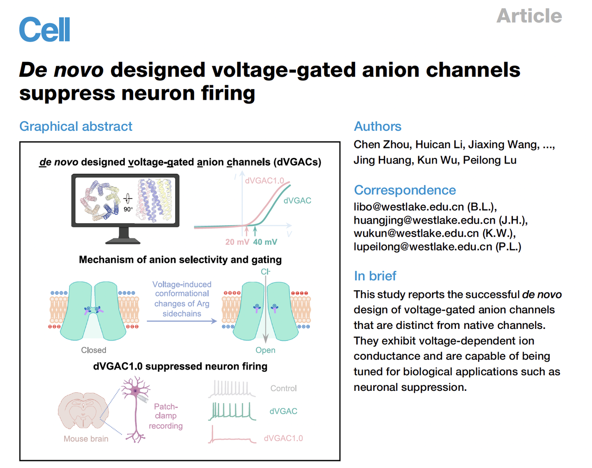
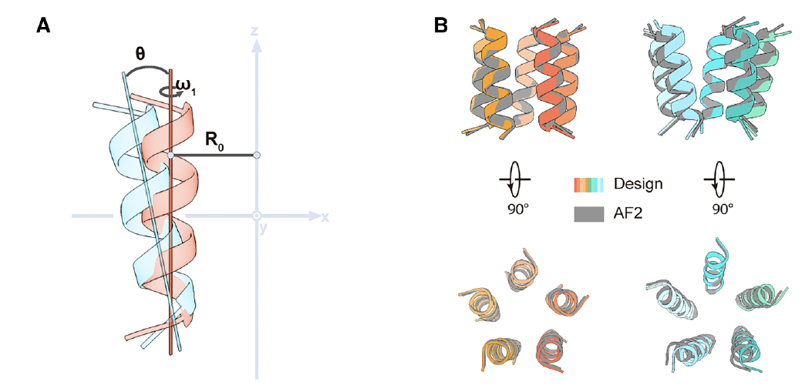
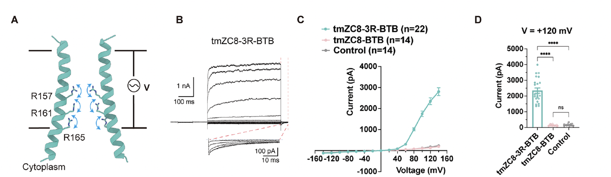
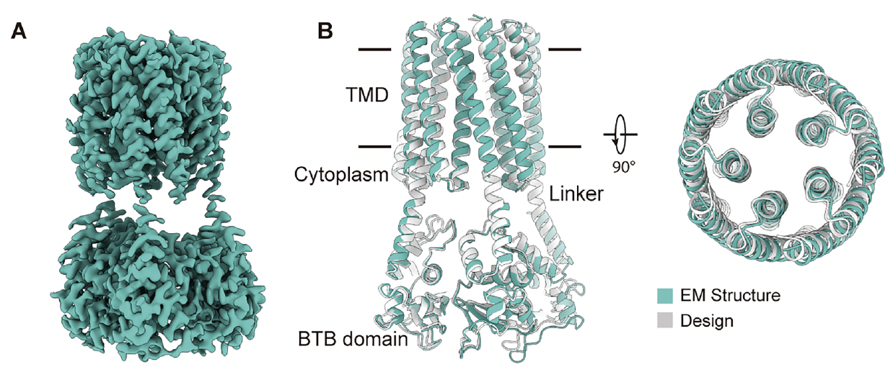
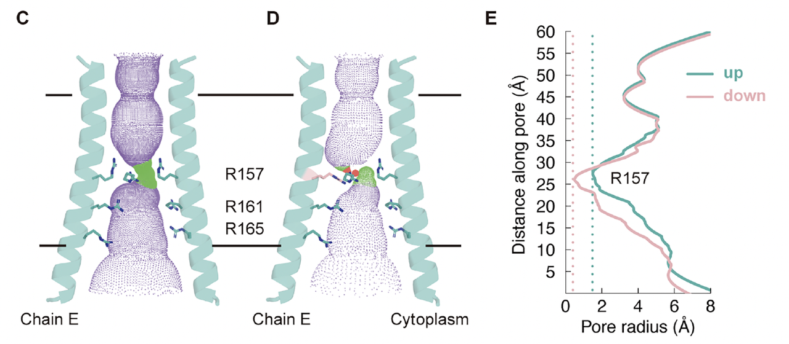
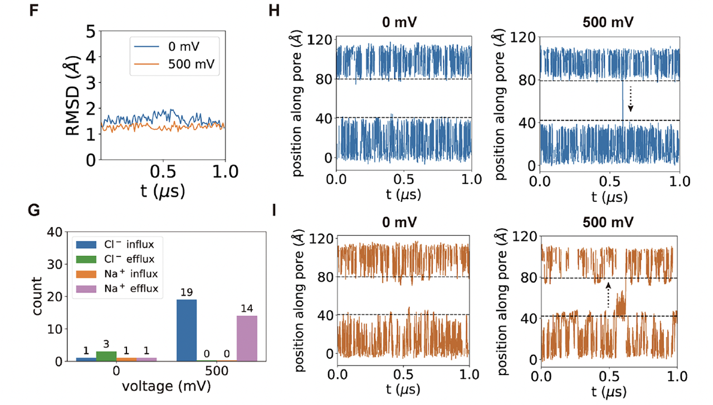
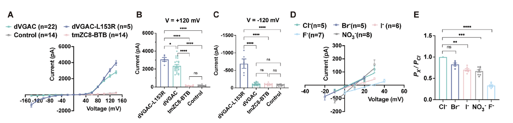
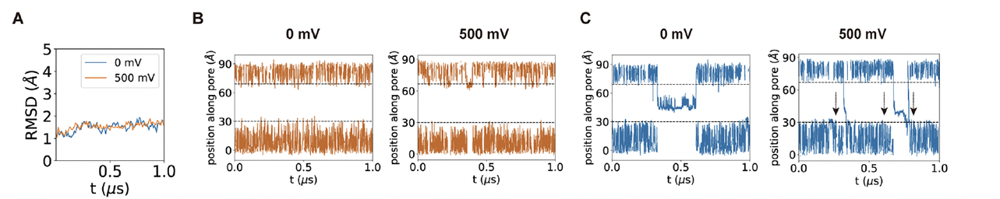
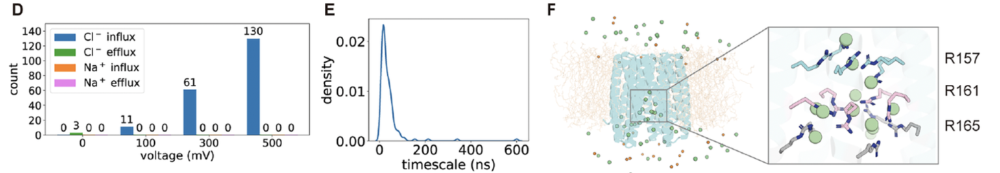
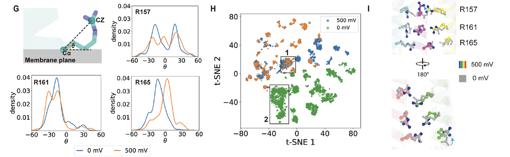

> 蓝极说：
>
>
>
> 在蛋白质设计的世界里，**能稳定折叠的水溶性蛋白**已经被攻克得七七八八；**能镶嵌进膜的跨膜蛋白**，也逐渐从“禁区”变成了“高地”；但要让一个**人工蛋白“感受电压”、还能开关离子**——这几乎是蛋白设计的“珠穆朗玛峰”。
>
>
>
> 今天，我们要聊的，是西湖大学**卢培龙老师团队上周（2025.10.16）**&#x5728; *Cell* 上发表的最新成果：
>
> 他们不仅**从零构建出一个电压门控的阴离子通道（de novo Voltage-Gated Anion Channel, dVGAC），**&#x8FD8;让它真的在**神经元里响应电压、抑制放电**。
>
>
>
> 这是一个真正意义上的——
>
> 从结构到功能、从计算到电流、从“设计”到“感电”的里程碑。

🔗原文链接：<https://doi.org/10.1016/j.cell.2025.09.017>

***

## **一、从自然到设计：一个能“感电”的人工通道是如何诞生的**

### 1. **研究背景：电压门控通道的“最后高地”**

在生物电信号的世界里，**电压门控离子通道（Voltage-Gated Ion Channels, VGICs）** 是最核心的元件。它们嵌在细胞膜中，感受膜电位变化，从而调节离子流动，控制神经放电、心跳节律乃至肌肉收缩。

过去几十年，结构生物学已经揭示了VGIC的多种天然形式——从钾通道、钠通道到氯通道——但它们的“电压响应”几乎都依赖于庞大而复杂的结构域，例如典型的**S1–S4电压感应区**。这让“人工重建”变得几乎不可能。

在蛋白质设计领域，研究者已经能构建出**稳定的跨膜骨架**、甚至可导电的“漏通道”，（卢老师之前也de novo设计出跨膜荧光激活蛋白，详情请查看：）但真正**能被电压调控开关的人工通道**，直到现在都未曾实现。

这正是卢培龙老师团队想要解决的问题：

> 能否从最基本的物理原理出发，设计出一个完全人工、可电压响应的离子通道？

***

### 2. **设计思路：从物理出发的极简门控模型**

团队没有选择模仿天然通道的复杂结构，而是重新思考“门控”的最小物理单元。他们提出一种**极简的电压响应假设**：

* 如果一个跨膜通道在几何上对称、中心通透、且内部带有可移动的电荷，

* 那么它就有可能在膜电位变化时发生局部构象变化——实现电压门控。

为此，他们设计了一个**五聚体三螺旋跨膜骨架（TMH3C5）**。

每个亚基由三根跨膜α螺旋组成，五个亚基围成一个**对称的中空孔道**（Fig.1C–F）。外层螺旋稳定整个结构，内层螺旋形成导电通道。

几何形态呈“漏斗状”：

* 宽的一端朝向胞内，窄的一端朝向胞外；

* 电场沿通道轴线方向作用于孔道中心——为电荷响应提供天然的物理环境。

这个设计不是模仿自然，而是**从静电学与结构约束出发**，为“感电”功能奠定了可计算、可操控的框架。

***

### 3. **关键设计：三层精氨酸构成的“电荷阀门”**

骨架只是开始。要让通道“感电”，必须引入**可响应电场的带电元件**。

团队在孔道中心设计了**三层带正电的精氨酸（Arg）环**：

* 每层由五个亚基各提供一个Arg侧链，

* 三层沿通道轴线分布，形成连续的正电荷堆叠。

这种布局实现了两种功能的统一：

1. **电压感应**：电场变化会驱动Arg侧链在局部旋转与重排，

2. 改变通道的孔径与电势能垒，从而调节离子通透；

3. **阴离子选择性**：带正电的孔道中心对Cl⁻具有天然吸引作用。

与天然通道的外部电压感应结构不同，这里是一&#x4E2A;**“内源式门控机制”**：

门控单元直接位于导电孔中，由局部电荷分布实现电压响应。

这一设计简化了天然VGIC的复杂性，同时在原理上保持功能等价。

***

### 4. **电生理验证：从模型到电流**

为了验证这一假设，研究团队在HEK293T细胞中表达不同设计版本的通道并进行膜片钳测试。

结果表明：

* 当通道中包含**三层Arg电荷阀门**时，出现显著的电压依赖性；

* 电流在正电位下迅速增强，负电位下几乎完全关闭，

* 呈现典型的**外向整流（outward rectification）**&#x7279;征（Fig.2E–H）。

* 离子替换实验进一步证明该通道**选择性导通Cl⁻离子**；

* 单通道电导测定约为 **42 pS**（Fig.2I–K）。

实验结果说明，这个从零设计的蛋白不仅稳定折叠、嵌入膜中，还确实实现了**电压门控的阴离子通透功能**。

这使得它成为第一个具有可控电响应的**de novo设计通道蛋白**。

***

### 5. **小结：从结构到功能的物理闭环**

这一部分构成了整篇工作的逻辑核心：

* **结构基础**：对称且可预测的五聚体骨架；

* **电荷布局**：精确分布的三层正电Arg环；

* **功能实现**：实验验证的电压门控与离子选择性。

dVGAC 展示了一种全新的蛋白设计思路——

不依赖天然结构域，而是通过**最小化设计**，在人工骨架中实现复杂的生物功能。

这不仅是一次“能导电”的突破，更重要的是：

> 它证明了“电压感应”这一高度复杂的生物功能，可以被设计出来。

***

## **二、结构验证——Cryo-EM让“设计”变成“现实”**

### 1. **从设计模型到原子级结构验证**

在蛋白设计领域，一个常见的问题是：

> “计算机里长得漂亮的模型，在现实中是否真的能折叠成那样？”

过去很多“成功的功能演示”最终都在结构验证中“翻车”，原因在于设计模型往往依赖理想化假设，而真实蛋白在膜环境中可能塌陷或错折。

卢培龙老师团队非常清楚这一点。

在功能验证之后，他们直接用**冷冻电镜（Cryo-EM）**&#x89E3;析了 dVGAC 的结构，分辨率高达 **2.9 Å** —— 这对于一个完全人工的跨膜小蛋白来说，这个分辨率已经非常高了。

***

### 2. **模型与结构的惊人重合**

结果几乎完美：

Cryo-EM 结构与设计模型的主链均方根偏差（RMSD）仅约 **1.1 Å**，这意味着设计中每个原子的位置都被精确再现。

在结构图（Fig.3A–B）中可以看到：

五聚体的整体形态与计算模型高度一致，内外双层螺旋束排列清晰、对称中心未发生任何塌陷。

这一点极为关键——

它说明团队设计的**跨膜几何与相互作用模式在膜环境中完全可实现**，不再只是“计算的幻觉”。

***

### 3. **电压门控的“微观开关”：R157的双构象**

更令人兴奋的是，Cryo-EM 数据揭示了通道中心精氨酸层的**构象双态性**。

特别是位于中间层的 **R157 残基**，在同一结构中出现两种明显的取向（Fig3C-F)：

* 一种指向通道轴心，形成收缩态；

* 另一种旋转外翻，形成开放态。

这与团队最初设想的“电压驱动下精氨酸侧链旋转”机制高度吻合。

也就是说，通道的开关状态并非依赖大尺度结构重排，而是由**局部电荷侧链的旋转**实现的。

在原子层面上，电压响应的“开门动作”被直接捕捉到了。

***

### 4. **离子识别的结构证据**

为了进一步验证离子选择性，研究者在实验中加入了碘离子（I⁻），解析得到的结构中可以清晰看到：

位于底层的 **R161** 与 I⁻ 形成稳定的静电结合。

这一密度信号直接证明了通道对阴离子的亲和与特异性。

通道内部没有任何可见的阳离子结合位点，从结构上解释了其对 Cl⁻ 的高度选择性。

***

### 5. **结构验证的意义：从可计算到可制造**

在这一步，研究团队实现了 de novo 设计的“闭环”：

1. **计算模型 → 实验功能 → 原子结构对比 → 机制重现。**

2. 所有关键功能（电压响应、阴离子选择）都有结构证据支撑。

这不仅验证了 dVGAC 的设计正确性，

更说明这种“以物理机制为导向”的设计路径具备可预测性与可复制性。

***

## **三、机制剖析——“电荷层”如何让蛋白学会感电**

### 1. 三层精氨酸：电压门控的分子基线

在实现电压依赖性之后，团队进一步想回答一个关键问题：

> 通道中心那三层精氨酸，到底各自承担什么角色？

他们依次替换不同位置的精氨酸残基，

比较突变体在电压下的电流响应。

结果清晰而有层次：

* **R157G（中层）**：电流显著减弱，电压依赖性几乎消失，说明这一层主导**电场感应与开关响应**。

* **R161A（下层）**：通道失去外向整流特征，阴离子选择性被削弱，提示其参与**离子筛选**。

* **R165L（最底层）**：尽管失去了正电荷，电流曲线几乎与野生型重合，表明该位点主要**稳定导电环境**而非直接感应电场。

* **tmZC8-BTB（骨架对照）**：完全没有可检测电流，验证了电荷层的必要性。

这组实验建立了一个重要认识：

> dVGAC 的电压响应不是分布式的偶然现象，而是由**精氨酸三层形成的定向电场体系**主导的。

上层与中层是“传感器”，下层是“筛选器”，三者协同构成一个高度耦合的“电荷阀门”。

***

### 2. **非感电对照：tmZC8-BTB 的结构与动力学**

为了验证电压响应确实源自电荷层，研究团队还对**不含精氨酸的对照通道 tmZC8-BTB**进行了深入表征。

#### **（1）结构层面：稳定但“静默”**

Cryo-EM 分辨率 ≈ 3 Å，结构与设计模型 RMSD ≈ 1.2 Å（Fig. 5A–E）。

跨膜螺旋束保持完好、孔径适中（约 3–4 Å），显示这一骨架在膜环境中**结构稳定且可折叠**。

然而，孔道电势几乎中性，缺乏能够感应电场的内部电荷。

换句话说——形态完美，却无法“通电”。

#### **（2）动力学层面：电场下依旧平静**

1 μs 分子动力学模拟结果表明（Fig. 5F–I）：

* RMSD 在 3 Å 左右，无论 0 mV 还是 500 mV 都维持稳定；

* Cl⁻ 与 Na⁺ 的穿孔事件极少，

* 离子在孔道内上下随机震荡，但无净通量。

这意味着 tmZC8-BTB 虽然“结构健全”，却**完全不响应电压**，无法驱动定向离子流。

### 3. **对照结论：结构稳定性 ≠ 功能可响应**

dVGAC 与 tmZC8-BTB 的对比实验构成了整篇论文最有力的论据之一：

这组结果明确指出：

**电压门控的核心不是结构本身，而是孔道中心的精氨酸电荷层。**

它在膜电场中产生取向变化，构成真正的“电压传感模块”。

***

### 4. **小结：从结构设计到机制确认**

Figure 4–5 共同完成了机制层面的闭环验证：

1. 通过突变分析揭示“谁在感电”；

2. 通过非感电对照证明“为什么能感电”。

这种逻辑从功能到结构再到动力学的三重验证，

让 dVGAC 的“电荷层门控”机制成为**首个经原子级证据支持的人工电压感应模型**。

***

## **四、功能优化与神经元验证——让人工通道“接入生命电路”**

### 1. **dVGAC 的功能确认：真正能“通电”的人工通道**

在完成结构与机制验证后，团队首先对 dVGAC 的导电性质进行了系统的电生理测试。

膜片钳结果（Fig.6A–C）显示：

* **dVGAC** 在正电位下表现出显著的电流增加，而对照组 **tmZC8-BTB** 几乎无响应；

* **L153R** 等结构突变体的电流幅度明显下降，进一步印证了通道中精氨酸分布的关键性。

接着，研究者分析了通道对不同阴离子的选择性（Fig.6D–E）。

结果表明：

dVGAC 对 Cl⁻、Br⁻、NO₃⁻ 离子均具高通透性，但对 F⁻ 几乎不导通。由此推断，**孔道内的正电场** 是决定阴离子选择性的主要因素。

这一部分确认了：

> dVGAC 不仅能稳定嵌入膜中，还具有与天然通道相当的离子导通与选择性特征。

***

### 2. **功能优化：R165D 降低激活电位，形成 dVGAC1.0**

在理解了通道各层电荷的功能后，团队希望让人工通道的激活阈值进入神经元的生理电压范围。

他们在底层精氨酸（R165）处引入**负电突变 R165D**，调整孔道中心的静电势分布。

这一版本被命名为 **dVGAC1.0**。

结果令人惊喜：

* 在 +20 mV 即可触发电流（Fig.6F–H）；

* 电流幅度与响应斜率均高于原型 dVGAC；

* 离子选择性保持稳定，对 Cl⁻ 优先导通（Fig.6I–J）。

也就是说，**R165D 成功将门控阈值降低至神经生理区间**，同时保留原有的导电性能——使通道从“能工作”变为“能调控”。

***

### 3. **神经元验证：人工通道能抑制放电**

为了验证这一功能在生物体系中的可行性，

研究者将 tmZC8-BTB、dVGAC 与 dVGAC1.0

分别通过 AAV 载体表达于小鼠杏仁核（amygdala）的神经元中（Fig.6K–L）。

电生理记录（Fig.6M–O）显示：

* 对照组与 tmZC8-BTB 神经元保持正常放电频率；

* 表达 dVGAC 的神经元放电受到一定抑制；

* 而表达 **dVGAC1.0** 的神经元放电显著减少，

* 在同样注入电流条件下，动作电位数量下降超过一半。

这些数据表明：

> dVGAC1.0 在神经元膜上可被生理电压激活，并通过阴离子导入有效抑制神经兴奋性活动。

***

### 4. **小结：从结构功能到生理调控**

这一部分的核心成就，是把“设计蛋白”推到了真正的生命层面。

从完全人工的分子，到能响应神经信号的“生物元件”，dVGAC 系列通道首次证明——

> 电压门控可以被设计、优化，并嵌入生命体系。

这不仅是蛋白设计的突破，更为“人工神经调控”提供了一个**分子级的可编程接口**。

## **五、机制模拟——原子级别的“通电瞬间”**

### 1. **研究思路：用计算“看见”通道如何开关**

前面通过实验，我们已经知道 dVGAC 确实具有电压门控特性。但科学问题仍然在于：

> 它究竟是**如何响应电场变化**的？
>
> 电场如何驱动局部结构的变化，从而控制离子通道的开闭？

这些问题在实验上难以直接观察，

于是团队利用长时间尺度的**分子动力学模拟（MD）**&#x6765;重建整个过程。

在模拟中，他们对嵌入脂双层的 dVGAC 施加不同强度的跨膜电场，记录氯离子（Cl⁻）在通道内的运动轨迹、孔径变化以及电荷分布演化。

***

### 2. **模拟结果：电场触发的“电荷旋转”**

模拟结果非常直观：

当外加电压从 0 mV 升至 500 mV 时，通道中心的三层精氨酸（尤其是 R157 和 R161）的侧链发生**明显取向重排**——

它们从“收拢”状态逐步旋转，形成一个连续的离子通道通路。

可以看到电荷分布图中，原本集中在通道壁的正电荷在高电压下向孔中心偏移，导致局部静电势能垒下降。

这正是**电压门控的微观物理本质**：

> 电场驱动带电残基重排，从而降低离子通道能垒，实现“开门”。

***

### 3. **离子流动的时间轨迹：Cl⁻ 的“单分子旅行”**

在 1 微秒的模拟中，研究者统计了 Cl⁻ 离子的轨迹分布。

结果显示，在无电场（0 mV）下，离子主要在通道两侧震荡，几乎没有净通量；

而在 500 mV 电压下，Cl⁻ 的轨迹出现连续贯通，沿通道轴线方向穿过三层精氨酸堆叠区（Fig.7D–E）。

换句话说，在“感电”的瞬间，孔道并没有产生宏观的结构重排，而是通过**局部带电侧链的旋转**就完成了导通。

这是整个研究中最具象的画面：

> 一个人工蛋白在电场作用下，像分子机器一样完成了“原子尺度的开关动作”。

***

### 4. **机制解析：内源式电压门控的新物理图景**

研究者进一步计算了电场方向与离子流速之间的相关性。

结果表明，通道的响应高度对称、快速、可逆：

当电场方向反转时，精氨酸层重新回到“闭合”取向，孔径能垒随之升高，离子流被抑制。

这说明 dVGAC 的电压响应是一个典型的**电荷驱动构象平衡过程**：

它不依赖复杂的蛋白运动，而是由几对局部氢键与静电相互作用微调完成。

这种机制与天然通道中的 S4 结构域截然不同：

* 天然通道通过长距离螺旋滑动实现门控；

* dVGAC 则通过**最小原子尺度的电荷旋转**完成同样功能。

这为“电压门控的简化物理模型”提供了首个真实范例。

### 5. **小结：设计与物理的统一**

Figure 7 的分子模拟让整个研究形成了从**设计 → 验证 → 机制**的闭环。

这一结果清晰地证明：

> 电压感应并不需要复杂的天然结构域，只需精确布置几个电荷，就能在人工蛋白中重建这一机制。

至此，卢培龙老师团队的工作完成了一个令人震撼的闭环：

从原理推导 → 结构设计 → 实验验证 → 动力学机制。

他们不只是“造出一个能导电的蛋白”，而是展示了**如何从物理第一性原理出发，设计出可预测行为的分子机器**。

dVGAC 的出现意味着：

> 人工蛋白不仅可以折叠、结合、发光，
>
> 它们还可以**感受、响应并调控电信号**。

这或许是蛋白质设计真正进入“可编程生命系统工程”的起点。

***

## **六、结语：当设计走向思考——从 dVGAC 看蛋白的“第二生命”**

### 1. **从折叠到功能：蛋白设计的第二阶段**

过去十年，蛋白设计的目标多停留在“能折叠、能存在”。我们证明了算法可以生成稳定结构，可以模仿天然骨架、创造新的配体结合位点。

而 **dVGAC** 的意义在于，它第一次证明：

> 人工蛋白不仅能稳定存在，还能像天然蛋白一样——**感知世界，并做出响应。**

它会“通电”，会“开关”，会在神经元里抑制信号。这意味着蛋白设计开始迈入第二阶段：**从“静态结构”走向“动态功能”。**

***

### 2. **从模仿自然到重建原理**

dVGAC 的突破在于，它没有照搬任何天然模板。

它的门控不依赖传统的 S4 电压感应结构，而是用最少的几层精氨酸，重建了电压响应的物理本质。

这是一种**从原理出发的生物设计**：

先定义能量与电场的关系，再让分子去实现它。

在某种意义上，这比模仿自然更困难——但也更自由。

它意味着我们正在**重写生物功能的构造方式**。

不再是“自然给了我们什么”，而是“我们可以创造什么样的自然”。

***

### 3. **蛋白质：未来的“电路元件”**

当我们能在原子层面设计电压响应，未来的蛋白不再只是“生命分子”，而是**信息与能量的接口**。

我们或许可以构建出：

* 可控放电或抑制的人工神经网络；

* 可与电子系统耦合的生物传感电路；

* 甚至能根据外部电信号自动调节行为的“活体材料”。

这就是 dVGAC 所代表的未来方向：

> 从蛋白质设计走向“分子级计算”。

***

### 4. **致谢与余韵**

这项精彩的工作来自 **西湖大学卢培龙老师团队**，不仅在技术上跨越了蛋白设计的边界，更在概念上，让“设计”从一种结构生物学实践，变成了一种关于生命本质的物理探索。

在那个跨膜小孔中，我们看到的不只是几根螺旋，而是一种新的问题：

> 如果生命的功能可以被精确重建，
>
> 那生命的“设计”与“自然”之间，
>
> 还会有界限吗？

