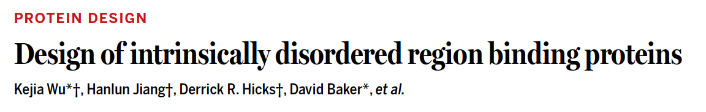
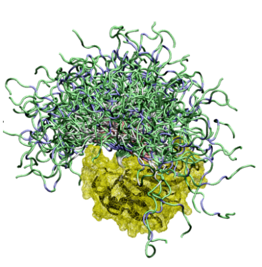
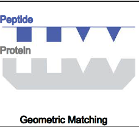
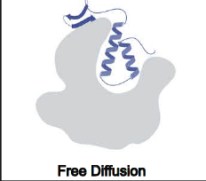
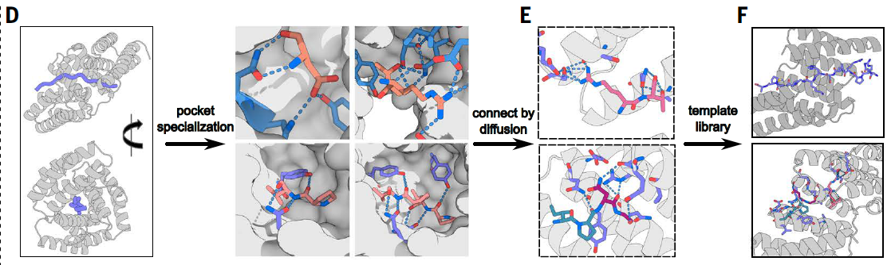
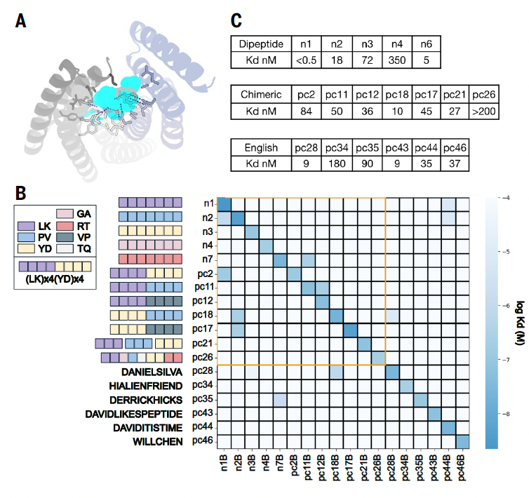
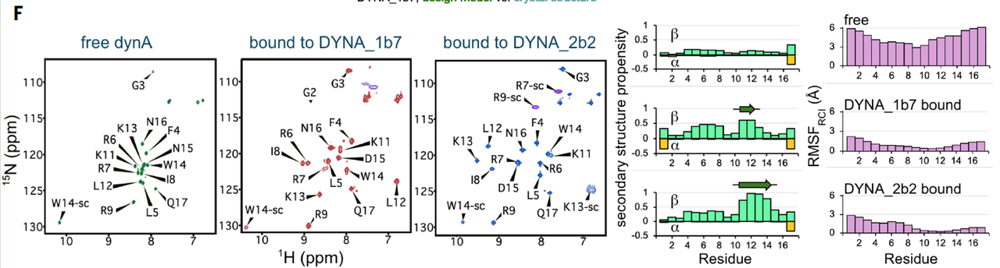
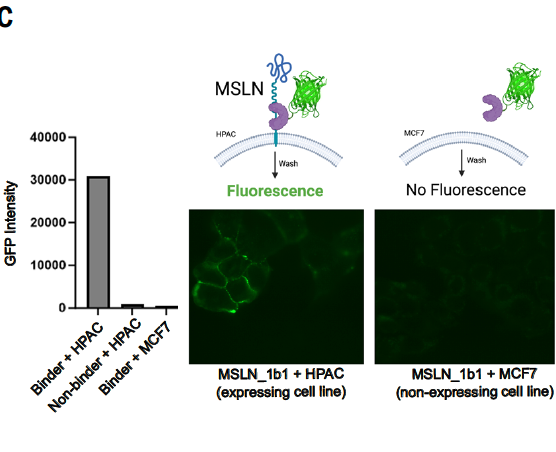
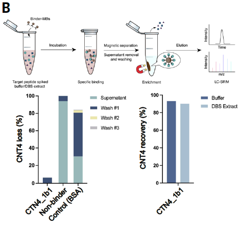

***

## 一页总结

#### **【引言】**

**内在无序的蛋白质和肽段**在生物学中具有重要作用。但由于这些区域缺乏固定结构，且序列和构象高度多变，导致传统方法很难识别和靶向它们。虽然可以通过免疫接种或抗体库筛选获得特异性的抗体，但这些方法耗时耗力，而且无序抗原在注射后容易降解。因此，**开发一种可通过计算设计、能识别特定无序肽段序列的蛋白质**，成为一个重要的科学挑战。

#### **🧠【研究思路】**

本研究希望开发一个通用方法，来识别任意的“本质无序区域”（IDR）序列，这样可以应用于**蛋白质组学、靶向治疗、生物传感与测序等多个领域**。作者提出一种“诱导契合”（induced fit）策略，利用IDR自身的柔性优势。、他们通过**物理建模与深度学习相结合的方法**，首先构建了一组用于识别重复肽段的蛋白质模板，然后使用 **深度学习模型 RFdiffusion** 对其进行扩展与泛化，从而可以匹配任意IDR序列。最后，通过机器学习优化序列和构象，从而得到高亲和力的结合蛋白。

#### **🧪【研究结果】**

* 设计了可结合 **18种合成肽段**和**21种具有医学意义的天然IDR序列**的蛋白。

* 实验显示，大多数设计的蛋白都能与其目标高效结合（亲和力为皮摩尔至纳摩尔级别）。

* 总体上，在测试的43个目标中，有39个获得了成功的结合蛋白。

* 所有设计的蛋白都**只结合其目标**，没有交叉反应。

* 这些设计被用于：从细胞裂解液中富集低丰度蛋白、靶向癌症受体、抑制G蛋白偶联受体信号通路，并可引导蛋白在细胞中的定位。

#### **🧩【研究结论】**

本文展示的计算设计方法，能针对任意IDR序列设计出结合蛋白，**有效解决了传统技术难以靶向无序蛋白的问题**。通过诱导目标肽段进入稳定的结合构象（例如疏水面朝向结合口袋、极性残基形成特定氢键），实现高选择性结合。这种方法相比识别有固定结构的目标更具灵活性和普适性。该方法为未来设计识别任意无序蛋白区域的结合分子，提供了一个强大工具。

***

## 1. **研究背景与问题提出**

蛋白质在生命体系中承担着几乎所有的功能任务，从酶催化、分子识别，到结构支撑和信号转导，几乎无所不包。根据经典分子生物学的观点，蛋白质的功能依赖于其精确的三维结构。

然而，近年来大量研究发现，有一类蛋白或蛋白片段**在天然状态下并不形成稳定结构**，而是以高柔性、动态波动的形式存在，这类区域被称为**本质无序区域（intrinsically disordered regions, IDRs）**，其所处的蛋白也常被称为无结构蛋白（intrinsically disordered proteins, IDPs）。

尽管缺乏固定结构，IDRs 并非“无用之地”。相反，它们在细胞内起着关键的调控作用，广泛参与转录调节、信号传递、蛋白质复合体装配及应激响应等多种生命过程。许多疾病相关蛋白（包括癌症、神经退行性疾病和感染性疾病）也都包含显著的IDRs。例如，癌症中常见的转录因子融合蛋白、某些细胞膜受体的胞外区域，乃至神经肽类配体，都是以无序状态参与功能执行。

**然而，正是这种“无序性”成为了目前技术难以攻克的障碍。**&#x7531;于缺乏稳定的空间构象，传统的靶向方法——如小分子筛选、抗体开发或配体诱导策略——在面对IDRs时常常失效。一方面，IDRs难以结晶，不易解析结构；另一方面，传统抗体或药物分子很难精准识别其多变的构象，导致靶向失败或者选择性不足。此外，IDRs 通常含有大量极性和带电氨基酸，进一步加剧了识别难度。

目前已知的方法中，虽然可以通过免疫接种或体外筛选方式获得某些针对无序肽段的抗体，但这类过程往往耗时长、成本高，且所得抗体容易因靶点降解或构象变化而失效。因此，科学界长期缺乏一种**系统性、通用性的方法**，来针对这些具有高生物学价值却又高度结构不稳定的IDRs进行识别与干预。

本文的研究正是面向这一挑战提出解决方案。研究团队尝试设计一种全新的、可计算生成的蛋白质平台，用以**特异性识别任意给定的IDR序列**，从而填补这一重要空白。这不仅是一个蛋白质设计的问题，更是蛋白识别与功能调控领域中的一次理论与技术的突破。

***

## 2. **研究目标与设计思想**

面对IDRs识别难的问题，本研究的目标是构建一套**通用的、可扩展的蛋白质设计框架**，能够根据任意无序区域的氨基酸序列，设计出与其**高亲和力、高选择性结合**的人工蛋白。理想状态下，该系统应当具备以下能力：

1. **适配性强**：能够识别种类广泛、构象高度多变的IDR序列；

2. **特异性高**：仅与目标序列结合，避免与序列相似的其他区域发生交叉反应；

3. **亲和力强**：达到皮摩尔至纳摩尔级别的结合常数，具备实验与应用价值；

4. **易于设计与高效验证**：减少实验筛选成本，提升候选成功率。

### **设计理念核心：利用“无序”的优势，通过诱导契合实现精准识别**

传统设计方法往往尝试锁定目标蛋白已知的稳定构象，这在面对天然结构复杂或变化大的目标（如IDRs）时很难奏效。本研究另辟蹊径，提出一种更为灵活的设计思路：**利用IDR结构未定的特点，通过“诱导契合”机制（induced fit）强行将其“引导”进入一个结合态，从而实现结合。**

这种策略的关键在于：

* **设计者不依赖目标本身已有结构**，而是通过人工设计结合蛋白来“塑造”IDR的构象；

* **利用结合界面上的多重氢键、疏水作用和电荷匹配**，稳定目标肽段在结合状态下的构型；

* 最终目标是**使IDR在结合过程中进入一个“结合适配构象”，而非事先假设其天然构象。**

### **技术路线：物理建模 + 深度学习的融合设计策略**

为实现这一目标，研究团队构建了一个**由物理建模引导、深度学习辅助的设计框架**，可以概括为三步：

#### 2.1 **构建结合“模板口袋”库**：

* 使用经典的蛋白设计平台 Rosetta，设计出多个重复蛋白骨架；

* 每个骨架包含能精确容纳目标肽段的结合口袋（binding pockets），适配不同构象、不同极性特征的氨基酸；

* 将多个口袋通过AI工具 RFdiffusion 进行拼接、组合，构建出大量具有不同结构与结合能力的模板集。

详细方法：

##### **（1）设计蛋白-肽结合口袋（binding pockets）（图D）**

研究首先从具有重复单元的蛋白结构出发（如α螺旋重复蛋白），通过物理设计方法（Rosetta）构建出一系列能与目标肽段形成稳定接触的蛋白结构单元。其中，每个口袋可识别一个氨基酸或一个二肽（如LK、YD、RT等），并形成特定的氢键网络与疏水界面。

##### **（2）通过AI拼装形成多样模板（图E）**

利用深度学习生成模型 **RFdiffusion**，将多个不同的口袋模块在空间上重组，拼接成完整蛋白骨架。这个过程产生大量模板结构，具备：

* 不同序列识别能力

* 不同结合构象适配性

* 保持构象稳定性的空间布局

最终得到**1000种以上**的蛋白模板，每一种都能容纳一个8–40氨基酸长度的肽段，并通过特定“口袋”完成识别。

> 图1F中，不同颜色的“口袋”模块被组合成新的蛋白结构，如将红、蓝、紫三个结构单元通过RFdiffusion连成一个整体蛋白。

#### 2.2 **“穿线匹配”目标序列**：

对于任意一个目标IDR序列，研究团队并不直接尝试识别整个区域，而是首先将其分解为多个可能的8–40氨基酸长度的片段（subsequences），然后逐个尝试匹配模板库中的结构。

* 将目标IDR序列中的各个片段穿入模板库中；

* 通过几何匹配与能量评分，筛选出最可能实现高亲和力结合的“模板–序列”组合。

##### **具体过程包括：**

* 过滤掉复杂度低、在蛋白质组中出现频繁的片段，以提高特异性；

* 将剩余片段分别“穿入”模板骨架，尝试定位其在结构中的最佳位置；

* 通过几何匹配打分、氨基酸环境兼容性分析，筛选出最适合的“模板–序列”组合。

这个过程类似于从成千上万把钥匙中挑选最合适的一把，用于开启目标IDR的“结合锁孔”。

#### 2.3 **结构与序列优化**：

初步匹配完成后，结合蛋白仍需进行精细优化，以实现理想的亲和力与选择性。

* 使用机器学习方法 ProteinMPNN 进行蛋白序列优化；

* 再通过 RFdiffusion 对骨架进行局部调整与整体精炼，确保结合界面的几何与化学兼容性；

* 产出结构稳定、能特异识别IDR目标的人工结合蛋白。

##### **优化手段包括：**

* **单侧优化（one-sided diffusion）**：保持目标序列不变，仅优化蛋白骨架；

* **双侧优化（two-sided diffusion）**：目标和结合蛋白可同时优化，获取最大匹配；

* **局部保留扩展（motif diffusion）**：保留关键结合位点，重建其余结构，提升整体稳定性与多样性。

最终产出的是一组三维结构明确、序列确定、理论结合能优异的人工结合蛋白候选体，具备实验验证的潜力

> **这一设计流程充分融合了物理设计的局部精度**与**生成式深度学习的结构多样性**，使其能够灵活应对IDRs序列构象多变、化学特征复杂的挑战，成为识别无序蛋白的新范式。

## 3. **实验验证与结果总结**

在设计出大量人工结合蛋白之后，研究团队对其识别性能进行了系统性实验验证。测试对象覆盖了从**合成肽段到天然本质无序区域（IDRs）的广泛序列，验证了该设计平台在亲和力、特异性与通用性**方面的综合表现。

### 3.1 **合成序列的测试验证**

为初步验证设计流程的有效性，作者首先针对**18种合成目标肽段**进行了绑定蛋白的设计与测试。这些序列包括：

* 重复的二肽序列（如LK、RT、PV、YD等）

* 任意设计的非自然序列（甚至包括英文单词）

通过NanoLuc二元系统（nanoBiT）和生物层干涉法（BLI）检测结合效果，结果显示：

* 设计成功率极高：**18个目标中多数获得了Kd低于100 nM的结合蛋白**

* 最高亲和力达到单个数皮摩尔（pM）级别

* 特异性表现优秀：在全对全（18×18）交叉测试中，结合蛋白仅对其设计靶点表现出强结合，无明显交叉反应

这一结果初步验证了该设计策略不仅能“构出能结合的蛋白”，而且具备**高度选择性与功能可控性**。

### 3.2 **天然无序蛋白目标的设计与验证**

进一步，研究团队将设计方法扩展至**21个天然IDR靶点**，这些靶点具有高度序列差异和构象多样性，广泛来源于不同生物功能与疾病相关蛋白，包括：

* 神经肽类配体（如dynorphin A 和 B）

* G蛋白偶联受体相关区段

* 癌症相关的膜蛋白胞外无序区段（如mesothelin, MSLN）

* 融合蛋白（如EWS/FLI）特异片段

* 疾病相关人类复杂蛋白的无序片段（如FAM21）

实验策略与之前一致，首先生成多个候选结合蛋白（平均每个目标设计约28种），然后利用BLI检测其结合能力。结果表明：

* **在21个天然目标中，有21个成功获得绑定蛋白（命中率100%）**

* 其中34个设计的结合蛋白亲和力达到皮摩尔到10纳摩尔之间，显示出较强结合能力

* 成功绑定目标中包括极具挑战性的高极性序列（部分极性氨基酸含量高达84%）

* 多数目标肽段在游离状态下无稳定构象，但在结合后被诱导进入可识别结构，验证“诱导契合”理念

> 值得强调的是，这一结果在蛋白设计领域是非常少见的高成功率，尤其是面对这些传统方法难以识别的天然无序序列。

### 3.3 **设计适应性的广泛性分析**

作者进一步分析了目标序列的构象属性与极性特征对设计成功的影响，发现：

* 结合亲和力与目标序列的极性、结构倾向无明显相关性

* 换言之，该设计平台**不依赖于目标序列的具体类型或结构背景**

* 这一点显示出方法的**普适性与鲁棒性**

> **小结：**&#x4ECE;18个合成目标到21个天然蛋白目标，研究团队总计测试了43个不同的IDR目标，成功获得39个具有实验结合能力的人工蛋白，展示出前所未有的设计成功率与广泛适应性，为IDR识别问题提供了一个系统性解决方案。

## 4. **结构验证**

在蛋白质设计领域，一个重要问题是：**设计模型是否真实可靠？换言之，计算所得的结合结构是否能够在实验中成立？本研究通过高分辨率结构生物学手段**，对设计所得的人工结合蛋白进行了结构验证，从而确认其识别机制是否符合设计预期。

### 4.1 **结合蛋白与目标肽的晶体结构解析**

以**dynorphin A**（一种与慢性疼痛相关的神经肽）为模型，研究团队对一个亲和力为7 nM 的结合蛋白 DYNA\_1b7 与目标肽复合物进行了**X 射线晶体结构解析**，分辨率为 **3.15 Å**。结果显示：

* **设计模型与晶体结构高度一致**

  * 蛋白-肽复合物的主链均方根偏差（RMSD）为 **1.2 Å**

  * 接口侧链排列的 RMSD 为 **2.9 Å**

* 所有关键结合氢键（由结合蛋白中ASN19、ASN69、ASN70等形成）均在晶体结构中得到确认

* 被设计识别的目标肽序列区域（LEU5–ARG9）**在晶体中几乎与模型完全重合（Cα RMSD = 0.6 Å）**

这表明，设计不仅成功实现了结合，而且能够**诱导一个无结构的目标肽段在结合时进入特定构象**，符合“诱导契合”的设计理念。

### 4.2 **NMR 证实肽段在结合后从无序转为有序**

进一步，为了研究结合状态下目标肽的动态构象变化，研究团队对 **15N-13C 标记的 dynorphin A** 进行了**NMR（核磁共振）分析**，分别检测其游离态与结合态的光谱特征：

* 游离状态下，dynorphin A 显示为典型的无序状态

* 与DYNA\_1b7 或优化版 DYNA\_2b2 结合后，目标肽表现出**明确的结构特征**，包括主链排列的稳定性增强与侧链共振信号增强

* 某些关键残基（如Lys13）在结合态中出现明显氢键稳定信号，说明结合蛋白**不仅识别了目标序列，还通过氢键和疏水作用引导其构象转变**

这一结果从分子层面证实：**设计的结合蛋白能够使本质无序的目标肽段进入稳定的结合态结构，从而实现特异性识别**

### 4.3 **多种结合构象共存，展现设计灵活性**

在后续的结构采样中，研究者还观察到 dynorphin A 可在不同设计中呈现为**多种结合构象**，包括：

* 近似完全拉直的线性结构

* 局部螺旋结构

* 片段状β链构象

这表明，该设计方法并非强制目标进入固定结构，而是通过构建多样化的结合界面来**适配目标序列可能采用的多个构象解**，体现出高度的灵活性与适应性。

> **小结：无论从X射线晶体结构，还是NMR动态谱图，均验证了计算设计所得结合蛋白在实际分子层面上的准确性、功能性和诱导性**。这不仅增强了该设计方法的可信度，也为进一步的功能应用打下结构基础。

## 5. **功能展示与应用前景**

设计一种能够识别本质无序区域（IDRs）的蛋白，其科研意义已经在前文明确。然而，若这一技术能**在真实生物体系中展现出功能性和通用性**，则其应用前景将远超基础研究。

本研究进一步通过一系列实验证明，所设计的结合蛋白不仅具备高亲和力与高特异性，还能在**体外、细胞环境甚至复杂生物样本中执行功能任务**，具备广泛的应用潜力。

### 5.1 **从复杂样本中富集天然蛋白复合体**

研究者设计了可识别 **FAM21 无序尾部** 的结合蛋白（FAM21\_1b1），该尾部属于 WASH 蛋白复合体，是细胞膜蛋白运输的重要调控因子。

* 使用 FAM21\_1b1 修饰的亲和柱对 HEK293 细胞裂解液进行富集实验；

* 结果表明，该设计蛋白不仅成功结合目标肽段，还**共富集了多个与其生理功能相关的蛋白成员**；

* 表明结合蛋白可作为功能性探针，用于研究蛋白互作网络，支持其在**蛋白质组学与功能筛选**中的应用价值。

### 5.2 **靶向癌症相关膜蛋白的胞外无序区域**

癌细胞表面常表达某些特异性膜蛋白，如 **mesothelin（MSLN）**，其胞外段包含无序结构，难以被传统抗体精确识别。

* 作者设计的 MSLN\_1b1 能特异识别该胞外无序区域；

* 在癌细胞表面进行共定位实验，观察到高度聚集信号；

* 这意味着该结合蛋白可作为**癌症标志物探针**，用于活细胞成像、靶向治疗递送等场景。

### 5.3 **用于质谱前富集分析：提高低丰度肽段检测灵敏度**

某些疾病相关蛋白常以极低丰度出现在血浆中，不易被常规质谱检测捕获。

* 研究者将结合蛋白 CTN4\_1b1 应用于 **N-terminal peptide enrichment**；

* 能显著提升 **低丰度 N端肽段** 的回收率与定量准确性；

* 表明结合蛋白可作为**样本预处理工具**，服务于**蛋白质组学与精准诊断**研究。

### 5.4 **阻断神经信号通路：靶向疼痛相关的dynorphin–KOR系统**

dynorphin A 是激活 κ-阿片受体（KOR）的内源性肽，过度激活与慢性疼痛密切相关。

* 设计蛋白 DYNA\_2b2 能以皮摩尔级别结合 dynorphin A；

* 与 KOR 共表达时，能显著阻断 dynorphin A 引发的 β-arrestin2 聚集信号；

* 提供了一个**无需直接干扰受体本身、即可抑制信号通路**的思路，具备**治疗慢性疼痛或成瘾相关通路的潜力**。

### 5.5 **在活细胞中实现精准识别与定位调控**

为测试结合蛋白在**细胞内环境中的特异性与稳定性**，作者构建了多个带有 GFP 标记的结合蛋白，并与目标肽段融合蛋白共表达，观察亚细胞定位：

* 所有设计蛋白均能准确识别其对应靶点；

* 未观察到明显交叉识别现象；

* 表明其可用于**细胞器定位、分子信号调控、合成生物学装置**等场景。

> **小结：**&#x7ED3;合蛋白不仅在结构与亲和力上经得起验证，更在实际复杂生物体系中展现出高度的功能性、可操作性与特异性，具备广泛科研与应用潜力。

## 6. **总结与展望**

识别本质无序区域（IDRs）是现代结构生物学、蛋白质工程与药物开发中的重要挑战。由于IDRs缺乏稳定的三维结构，长期以来被认为“不适合设计”，因而在很大程度上被现有识别技术与药物筛选体系所忽略。

本研究工作以高度系统化的方式提出并实现了一种**全新的蛋白质设计策略**，能够：

* 不依赖于目标已有结构信息；

* 结合**物理构象建模**与**深度学习生成建模**；

* 快速生成可高亲和力结合任意肽段的人工结合蛋白；

* 并在**结构、亲和力、特异性、功能性与通用性**多个维度上获得实验证实。

通过对43个目标序列的系统测试，以及在结构生物学、细胞实验、质谱富集、信号调控等多场景下的功能展示，本研究不仅验证了该设计方法的技术可行性，更展示了其作为**基础科研工具**与**生物应用平台**的广泛潜力。

更为重要的是，这一研究突破了蛋白质工程中“只能靶向有结构的目标”的传统观念，提出了一种“**通过设计诱导构象”的识别新范式**。这种方式使得无序蛋白不再是设计体系的盲区，而成为可以主动靶向、解析与调控的新对象。

原文链接：https://doi.org/10.1126/science.adr8063

