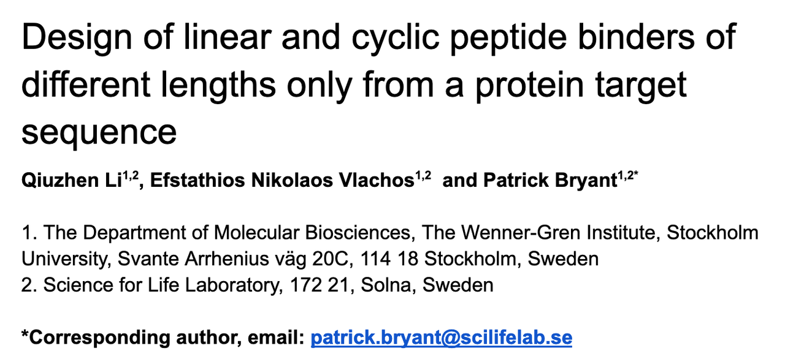
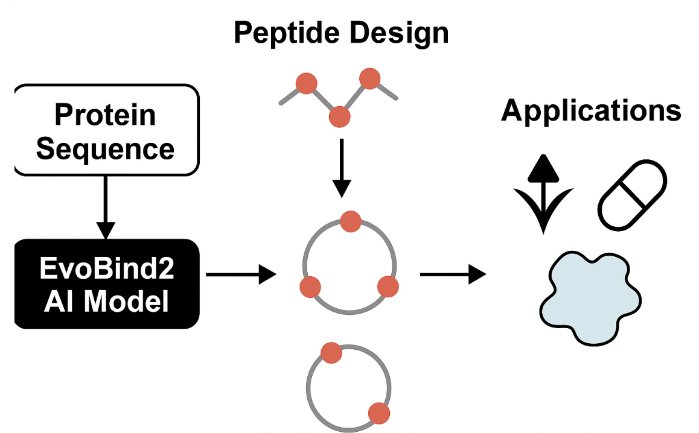
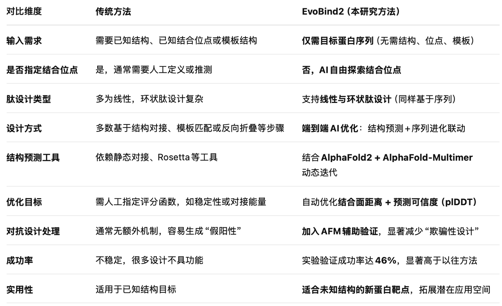

**作者**：Qiuzhen Li, Efstathios Nikolaos Vlachos, Patrick Bryant

**单位**：斯德哥尔摩大学 Wenner-Gren研究所 & Science for Life Laboratory

**预印本链接**：<https://doi.org/10.1101/2024.06.20.599739>

***

## **一、研究背景**

蛋白质的结构预测已因AlphaFold等AI技术取得突破性进展。然而，**如何从序列信息直接设计具有功能（如结合能力）的蛋白质或肽分子**，仍然是合成生物学和蛋白质工程中的重大挑战。

传统的结合物设计依赖于：

* 靶标蛋白的**三维结构**

* 已知的**结合位点**

* 事先定义的**肽长度**或**骨架模板**

这种依赖限制了新靶点的开发和筛选能力。为了解决这个问题，本文提出了一&#x4E2A;**“盲设计”策略（EvoBind2)**，即在**没有**结构或靶点位置信息的情况下，直接从序列设计肽类结合分子。

***

## **二、与传统方法的对比**

#### **🔍 核心创新点**

1. **全盲设计（Blind Design）能力：**

EvoBind2是目前首个实现无需结构、位点、模板信息、即可全自动生成肽结合物的系统。

* **结构预测+进化优化联动：**

通过结构预测驱动序列迭代，结合预测可信度和几何距离进行优化，增强设计合理性。

* **对抗性过滤机制：**

引入AlphaFold-Multimer辅助交叉验证，有效剔除“高评分但不真实结合”的序列。

***

## 三、“无结构输入设计”的科学难点与意义

#### **🧩 科学难点**

##### **1.** **缺乏结构信息导致搜索空间极大**

* 在没有已知结构或结合位点指导的情况下，肽设计必须**同时决定肽的位置、结构与序列**，这使得设计空间呈指数级增长（20^L 种序列 + 无限种结构构象）。

* 对于传统方法而言，这相当于在没有地图的情况下寻找目标。

##### **2.** **无共进化信息，降低预测可靠性**

* AlphaFold2 等工具在结构预测上依赖于多序列比对（MSA）中的**共进化信号**。

* 设计新肽时，仅有目标蛋白序列，缺乏MSA背景，这导致结构预测准确性下降。

##### **3.** **高评分≠真实结合：对抗性设计问题**

* AI模型可能“过拟合”某些结构特征，生成“看起来可信”的但实际上无功能的序列（即“adversarial designs”）。

* 判断哪些预测结果是“假阳性”非常困难，需要额外机制避免模型欺骗。

##### **4.** **评估标准缺失**

* 传统的评分标准如 plDDT、interface RMSD 等，在这种完全盲设计中**难以预测真实亲和力**，缺少可靠的后验验证机制。

#### **🌟 科学意义与潜力**

##### **1.** **摆脱结构依赖，解放设计范围**

* 绝大多数天然蛋白无已解析结构，EvoBind2 的方法可用于**任意蛋白靶点**，极大拓宽设计空间，推动生物工程的“结构自由化”。

##### **2.** **实现从“功能导向”而非“结构导向”的设计**

* 传统设计路径是“结构→功能”，而EvoBind2探索“序列→功能”，更贴近生物自然进化机制。

##### **3.** **推进通用蛋白药物开发平台**

* EvoBind2使得**无需结构就能设计潜在结合物药物**成为可能，为靶点验证、疫苗设计、抗体工程等提供新工具。

##### **4.** **推动蛋白AI模型的交叉验证机制发展**

* 本研究引入AlphaFold-Multimer作为“第二判断者”，为AI预测建立了对抗过滤思路，这对未来蛋白AI模型的“可信度体系”建设具有示范作用。

***

## **三、方法概述：EvoBind2 设计框架**

1. **核心技术**

* **EvoBind2：** 一个基于AlphaFold2和AlphaFold-Multimer的AI设计平台

* **输入：** 目标蛋白的氨基酸序列

* **输出：** 具有预测高亲和力的线性或环状肽结合物（长度8–20残基）

* **优化策略**

- 利用（1）结构预测可信度（plDDT）+ （2）肽与蛋白距离最小化的损失函数进行迭代优化

$$ 
\text{Loss 1} = \left(\text{peptide } plDDT^{-1}\right) \cdot \left( \frac{1}{n} \sum_{j=1}^{n} d_j \right)

 $$

* 使用AlphaFold-Multimer辅助验证，避免生成虚假高评分但不结合的肽序列

$$\text{Loss 2} = \left( \text{peptide } plDDT^{-1} \right) \cdot \left( \frac{1}{m} \sum_{i=1}^{m} d_i + \frac{1}{n} \sum_{j=1}^{n} d_j \right) \cdot \frac{1}{2} \cdot \Delta COM$$

* **$$\text{peptide} \ plDDT^{-1}$$**: 预测肽链的平均可信度（plDDT）的倒数，可信度越高，该项越小（更优）

* $$\frac{1}{m} \sum_{i=1}^{m} d_i$$ : 设计中肽原子与靶蛋白关键位点之间的平均最短距离

* $$\frac{1}{n} \sum_{j=1}^{n} d_j$$: 设计肽与整体蛋白界面的平均距离

* $$\frac{1}{2}$$:  权重因子，标准化整个损失值

* $$\Delta COM$$: EvoBind2中的AF2 和 AFM 预测中肽链质心（center of mass）之间的偏差，表示两个模型对结构的预测一致性

* **Cyclic offset 技术**

- 支持设&#x8BA1;**“头尾环化”**&#x7684;环状肽，提高稳定性与细胞膜穿透性

> *To design cyclic binders, we implement a cyclic offset informing the structure prediction network to connect the peptide amino acids in a continuous cycle. This feature is called the relative positional encoding in the AlphaFold2 and AlphaFold-multimer networks*

&#x20;在 AlphaFold 的结构推理过程中，每个残基对的空间关系都受到“相对位置信息”影响。作者在这个过程中引入了一个“环化偏移量（cyclic offset）”，让网络**认为序列的起始和终止残基是邻近的**，即构造出“闭环”的结构。

***

## **四、实验验证与结果**

### 1. **实验设置**

* 靶蛋白：半合成核糖核酸酶（PDB ID: 1SSC），具有已知的肽结合能力

* 设计并合成13种不同长度（8–20残基）的线性肽，每个长度选取 一个得分最优的序列。

* 使用SPR（表面等离子共振）测试亲和力，使用 Biacore 8K 设备进行结合动力学测试，测得结合常数 $$K_d$$。

### 2. **实验结果**

| 项目           | 数值/说明                  |
| ------------ | ---------------------- |
|  测试的线性肽数量    | 13条                    |
| 显示有效结合的肽     | 6条（约46%成功率）            |
| 最强结合肽Kd      | **19nM** （远低于正对照的35nM） |
| 最弱有效肽Kd      | **7.93uM**             |
| 正对照肽Kd(已知序列） | 35nm                   |

#### **🔍 附加实验：对抗性验证**

* 比较 EvoBind2 与 AlphaFold-Multimer 预测不一致的序列（疑似“欺骗性设计”）：

  * 仅有 **2/13 条对抗性序列显示结合**；

  * 与此同时，在 EvoBind2 与 AFM **均同意**的设计中，成功率是 **6/13**；

  * 说明引入 AFM 检查可 **将成功率提高约三倍**。

#### **环状肽初步结果**

* 使用相同输入设计环状肽，**结构预测成功**

* 尚未进行实验验证，但理论上可行

***

## **五、关键结论与意义**

* EvoBind2能从**纯序列信息**设计出功能性结合肽，无需结构模板或靶点知识

* 提供了一个快速、高效、可扩展的蛋白靶点设计方案

* **对抗性验证机制**将设计成功率提升至3倍（从约15%提高到46%）

* 为**新药开发、生物探针设计、蛋白功能研究**提供了新途径

***

## **六、局限与展望**

### **当前限制：**

* 无法通过预测分数精确区分nM和μM级亲和力

* 仍需实验验证环状肽功能

### **未来方向：**

* 融合更多物理-化学特征提升预测准确度

* 推广至复杂靶标、膜蛋白、多肽复合物等

