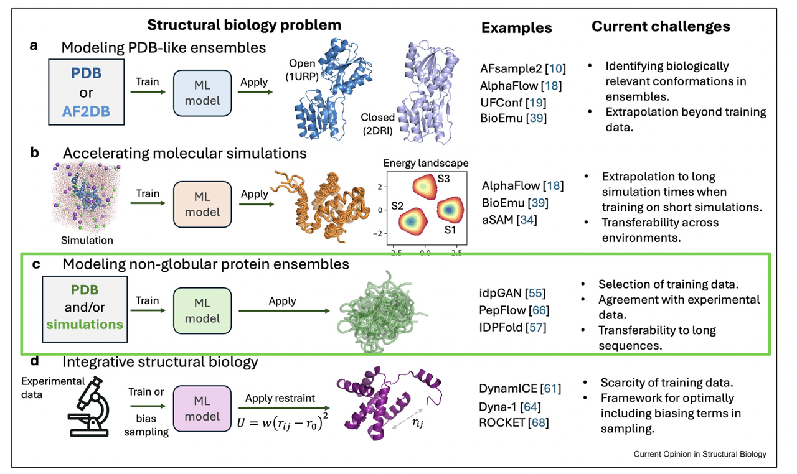

在过去几年，AlphaFold2 的横空出世几乎改变了整个结构生物学的研究格局。一个氨基酸序列，几乎可以“一键”得到对应的三维结构——这在十年前是难以想象的。

但是，结构预测的革命同时也暴露了一个新的问题：**蛋白质并不是一个固定不动的雕塑，而是一个在能量地形上不断“呼吸”、在多种构象之间切换的动态分子机器**。静态结构虽然能告诉我们“长什么样”，却往往难以揭示“怎么动、为什么动”。而这些动态，恰恰是催化、结合、信号转导等功能的关键所在。

今天要介绍的这篇综述文章（《***Generation of protein dynamics by machine learning**》）*&#x6B63;是聚焦于这个前沿问题：**如何用机器学习的方法，不仅预测蛋白质的单一构象，而是预测其动态构象集合（conformational ensembles）**。文章中的配图（Figure 1）非常直观地把研究方向总结为四条主线：

* 从单一结构到多态结构（PDB-like ensembles）；

* 加速分子动力学模拟（accelerating MD）；

* 非球状蛋白和无序区域的建模（non-globular proteins）；

* 融合实验约束的综合模型（integrating experimental data）。

接下来，我们就结合这张图，逐一解读这四个方向的研究亮点与挑战。

***

### 1. **PDB-like Ensembles：从“一个结构”到“多个状态”**

看 Figure 1(a)，我们可以直观感受到作者想传递的核心信息：**同一个蛋白质，并不是只有一个固定结构，而是可能存在多种功能相关的状态**。在 PDB 数据库里，其实早就能找到一些蛋白的多态结构——比如同一个蛋白在有配体（holo）和无配体（apo）条件下的不同状态，又或者激活/非激活状态的跨膜受体。

然而，AlphaFold2 的局限在这里就显现出来了。它的训练目标是 **“一条序列 → 一个最可能的结构”**，因此它很难自然地给出“一个序列 → 一组结构分布”。这也是为什么它在预测 holo/apo 或 fold-switching 蛋白时表现不佳。

研究者们于是开始尝试各种“曲线救国”的办法：

* **MSA 修改**：通过改变输入的多序列比对（MSA），可以诱导 AlphaFold 给出不同的构象。比如 AFsample2 会随机屏蔽 MSA 列，从而在开放/闭合状态的蛋白里得到多态结构。

* **聚类策略**：像 AF-cluster，通过对 MSA 做聚类，捕捉到大构象转换（如 KaiB 这种可折叠切换的蛋白）。

* **生成模型（Generative Models）**：这是更“根本”的方向，把 AlphaFold 从确定性回归模型转化为生成式模型。例如 AlphaFlow、UFConf 这样的 diffusion model，可以直接学到“同一序列对应多个可能构象”的分布。

这些方法的亮点在于，它们开始让计算机模型能够“想象”蛋白质的不同功能状态，而不是只锁定在唯一的静态解。但它们的瓶颈也很明显：

* 目前还难以保证不同状态的**相对概率是否正确**，也就是说，哪个构象更常见、哪个只是低概率事件，模型给不出准确答案。

* 对超出训练集的折叠切换蛋白，泛化性依旧不足。

> 总结来说，Panel (a) 展示的是整个领域的第一步跨越：**从单一结构预测，走向构象集合生成**。这一步虽然还不完美，但它让我们看到了用 AI 捕捉蛋白质“多态性”的可能。

***

### 2. **Accelerating Molecular Simulations：让分子动力学“加速跑”**

如果说 Panel (a) 的主题是“如何生成更多状态”，那么 Panel (b) 就回答了另一个问题：**如何更快地采样这些状态？**

看 Figure 1(b)，图示了能量地形（energy landscape），上面分布着不同的构象状态。传统上，我们依赖分子动力学模拟（MD）来探索这个能量地形，让蛋白质在时间轴上不断演化，逐步采样到不同状态。问题是，**MD 计算量极其庞大**，尤其是想要捕捉到大尺度的构象变化时，可能需要耗费几个月甚至更久的超级计算资源。

机器学习提供了几条加速思路：

1. **基于 MD 数据训练生成模型**

这些模型直接从 MD 数据中学习到统计分布，然后能快速生成彼此独立的构象样本。这样就像“跳过”了冗长的时间积分，直接拿到模拟结果。

* 代表：**AlphaFlow** 在 ATLAS 数据集上训练，能高效生成不同蛋白的结构集合。

* **神经网络粗粒化力场（CG force fields）**

通过神经网络拟合原子间作用力，把全原子的复杂系统压缩成简化模型，再进行模拟，既快又保留主要物理特征。

* **“时间跳跃”模型**

与其一步步积分时间，不如让生成模型学会直接预测“未来更远时间的状态”。这样就能跨越原本需要成千上万步积分才能到达的时间尺度。

* **混合增强采样**

比如 AlphaFold2-RAVE，把 AF2 生成的多态结构输入到 MD，再用机器学习方法学习反应坐标，帮助 MD 更高效地在构象空间里采样。

这些方法有各自的亮点与局限：

* 生成模型采样快，但通常只能给出**热力学分布**（各状态出现的概率），却不一定能还原动力学过程（不同状态之间的转换速率）。

* 时间跳跃模型能提供动力学信息，但对复杂能量地形（多稳态系统）还不够稳健。

* 混合方法能恢复多个状态，但普适性和可迁移性还不足，每个新体系都要重新训练。

> 总结来看，Panel (b) 告诉我们：**机器学习不是要取代分子动力学，而是让它“加速跑”**。通过生成模型和混合策略，我们或许能在保证物理真实性的同时，把过去几个月的模拟压缩到几小时甚至更短。

***

### 3. **Non-globular Proteins：让“无序”也有可预测性**

在前面，我们主要讨论了类似“球状”蛋白（globular proteins）在不同状态下的多态性。但在生物体内，还有一类蛋白更加棘手：**非球状、甚至完全无序的蛋白**。

看 Figure 1(c)，你会看到那些长链状、松散的构象，这就是 **IDRs（intrinsically disordered regions）** 的典型特征。它们不像球状蛋白那样有稳定折叠的三维结构，却在调控、信号传导、相分离等过程中发挥关键作用。问题是：

* **实验测不到清晰结构**，因为它们本身就是一堆不同构象的混合。

* **AF2 给不出合理预测**，虽然能识别出哪些片段是无序的（通过低置信度分数），但预测出来的构象往往过于“理想化”，和真实的动态集合相差甚远。

于是，研究者们开始尝试开发专门的 ML 方法来应对这类系统：

* **idpGAN**：用 coarse-grained 模拟数据训练生成模型，可以快速生成不同 IDR 的结构集合。

* **IDPFold**：采用“混合训练策略”，先用 PDB 和 NMR 的高分辨率数据预训练，再用低分辨率模拟数据微调，从而能捕捉到 IDR 的实验可观测特征（比如化学位移、半径分布）。

* **BioEmu**：虽然并没有针对 IDR 专门训练，但在测试时展现了“零样本”能力，能生成接近实验的构象集合。这说明“混合数据+生成模型”是一条很有前景的路线。

> 这些工作揭示了一个重要趋势：**未来的蛋白质建模，不仅仅是给出“一个漂亮的结构”，而是要能生成“一个构象集合”，并且让集合的统计特征尽量吻合实验观测。**

挑战也很现实：

* **数据稀缺**：无序蛋白在 PDB 里几乎没什么代表性结构。

* **泛化难题**：如何处理超长 IDR（>200 氨基酸），目前几乎只能依赖粗粒化模拟，精细度受限。

> 总结来说，Panel (c) 向我们展示了一个新前沿：**机器学习正在帮助我们用统计学的方式理解“无序中的秩序”**。这不仅有助于解释 IDR 的生物学功能，也可能为神经退行性疾病（如与 amyloid 相关的病理）带来新的研究工具。

***

### 4. **Integrating Experimental Data：用实验“校正”AI 的想象力**

到这里，大家可能会问：机器学习模型预测出来的这些构象集合，究竟有多接近真实？这正是 Panel (d) 想回答的问题。

看 Figure 1(d)，配图里展示了实验数据（比如 NMR、Cryo-EM、红外光谱等）与机器学习模型结合的过程。思路很简单：

* **单靠 AI**，它可能生成一些“看起来合理”的构象，但未必反映真实概率分布。

* **单靠实验**，又往往捕捉不到完整的动力学集合，只能提供一些“投影信息”。

* **两者结合**，才能让预测既高效，又更贴近真实世界。

目前主要有两条策略：

1. **训练阶段引入实验约束**

   * **DynamICE**：在训练时直接用 NMR 数据对模型进行微调，让生成的构象集合符合实验观测。

   * **DEERFold**：在 AlphaFold 基础上引入双电子自旋共振（DEER）数据，得到更符合实验的结构。

   * **Dyna-1**：用大规模 NMR 弛豫数据训练，直接捕捉毫秒级的蛋白动力学。

* **推理阶段引入实验引导**

  * 不改变模型本身，而是在生成时给它“加偏置”。

  * 例如 **idpSAM** 在采样过程中引入 radius-of-gyration 约束，**IDPForge** 更进一步，能结合 NMR 数据、Rg 分布、甚至已有的折叠域信息。

  * 在球状蛋白里，也出现了类似思路：比如 **ROCKET 算法**，让 AlphaFold 生成的模型更好地贴合 X-ray 或 Cryo-EM 数据；**实验引导的 AlphaFold3** 则把电子密度直接融入扩散过程，使动态区域更接近实验结果。

这两种策略各有优势：

* 训练时引入约束，能让模型从根本上“学会”物理规律，但需要大量高质量实验数据。

* 推理时加入偏置，灵活性更高，也能针对不同实验条件快速适配。

> 总结来说，Panel (d) 向我们展示了一个未来愿景：**机器学习与实验不再是平行的两条路，而是互相补充的伙伴**。AI 提供速度与想象力，实验提供真实性与校正能力，两者结合有望让蛋白质动力学建模迈向真正的“精准预测”。

***

### **总结：从静态雕塑到动态生命**

回顾全文，我们可以看到一个清晰的趋势：

* AlphaFold2 解决了“**蛋白质长什么样**”的问题；

* 而新一代的机器学习方法，正在解决“**蛋白质是怎么动的**”这一更关键的问题。

无论是 Panel (a) 的多态生成，Panel (b) 的模拟加速，Panel (c) 的无序蛋白建模，还是 Panel (d) 的实验结合，它们都指向同一个未来：

> **AI 将帮助我们不仅看见蛋白质的“照片”，还将捕捉到它们的“电影”**。

对于蛋白质设计和药物研发来说，这意味着我们将更有可能预测并调控蛋白质的功能状态，为靶向设计和精确干预开辟全新道路。

🔗原文链接：https://doi.org/10.1016/j.sbi.2025.103115
