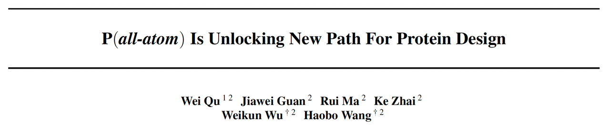
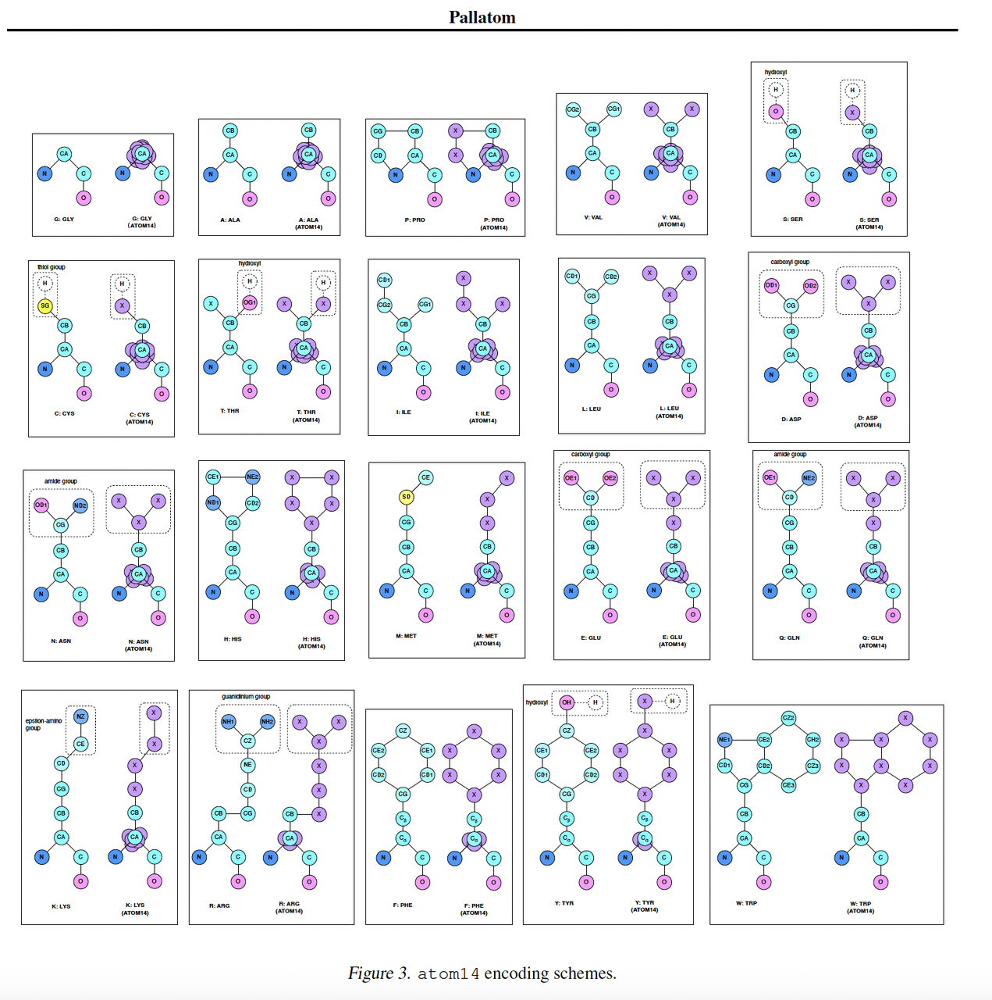
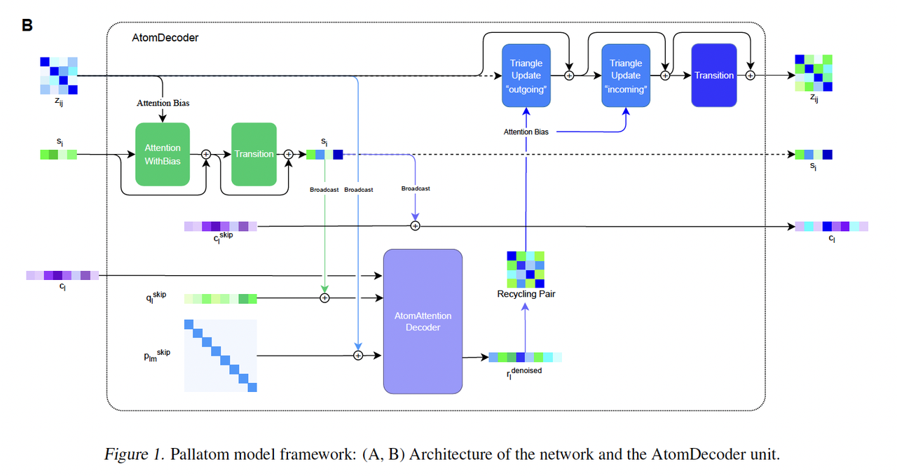
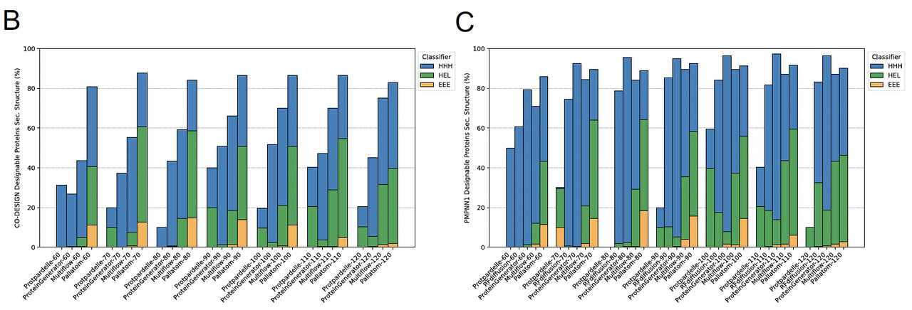
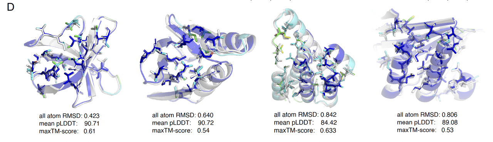
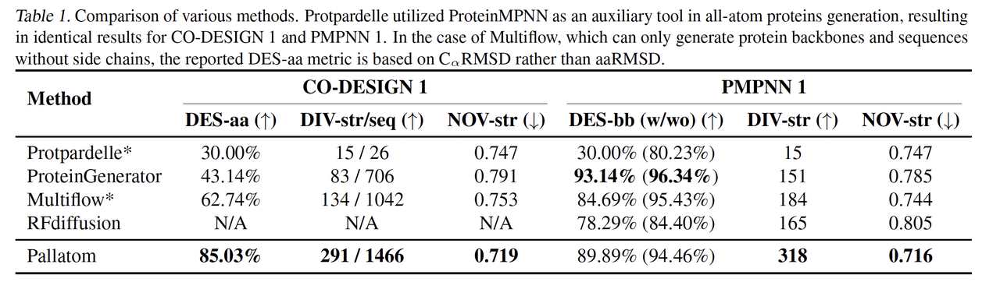

在前不久结束的 **ICML 2025**（国际机器学习大会）上，有一篇来自中国初创企业 **力文所（Levinthal）** 和复旦大学的合作论文引起了广泛关注。在这个以传统机器学习为主的顶会上，这篇做蛋白质设计的论文不仅入选，还被评为 **Spotlight 论文。**&#x4ECA;天就和大家分享一下这个值得关注的工作：**《*****P(all-atom) Is Unlocking New Path For Protein Design》**。*

为什么这篇文章值得我们细读？

* 因为它提出的 **Pallatom 模型**，开辟了一条全新的路径：**直接在全原子层面（all-atom）进行蛋白质生成**。

* 这意味着我们不再停留在“预测骨架”或“序列-结构分离”的阶段，而是真正走向 **原子级精度的蛋白设计**。

对于蛋白质设计这个快速发展的前沿领域而言，这是一件非常漂亮、也非常有意义的工作。在英伟达最新的技术博客中，在蛋白质基础模型中，**Pallatom 被放在了与这些巨头模型并列的位置**，也一方面证明了Pallatom的价值。

🔗Palatom原文链接：https://doi.org/10.1101/2024.08.16.608235

***

## 第一部分：背景介绍

在蛋白质设计领域，有一个核心问题：

> **怎样同时得到“序列”和“结构”？**

传统上，科学家们常走两条路：

* **从序列出发**：预测出三维结构（P(structure | seq)），代表成果是 AlphaFold 系列。

* **从骨架出发**：在给定 backbone 上寻找能折叠成该结构的序列（P(seq | backbone)），代表工具是 ProteinMPNN 等。

这两种思路极大推动了蛋白设计的发展，但它们都有一个共同的缺陷：**都没有真正把“全原子（all-atom）层面的信息”建模进来。**

在蛋白质里，侧链的朝向、氢键的网络、疏水/亲水分布，这些都决定了最终的稳定性和功能。如果只停留在 backbone 层面，或者单纯关注序列与骨架匹配，很多精细的物理化学特征会被忽略。

***

## **第二部分：Pallatom 的核心理念**

Pallatom 的核心创新在于：**直接学习 P(all-atom)** ——也就是说，模型直接在全原子坐标空间中建模，把结构与序列的关系一次性捕捉。

这和以往方法的区别在哪里？

* 过去的方法往往是“拆开建模”：先生成 backbone，再去补序列；或者先从序列出发，再通过语言模型或能量函数去优化。

* Pallatom 的观点是：蛋白质的**全原子坐标本身**，已经同时包含了序列和结构信息。只要我们能在原子层面正确建模，就不需要再额外拼接其他模块。

📌 **配图对应（Figure 1A）**：这里展示了 Pallatom 的整体架构。它采用了一个 **dual-track 框架**：

* **Residue-level track**：在残基层面建模，关注全局信息。

* **Atom-level track**：在原子层面建模，关注局部几何与化学细节。

这两条轨道并不是平行工作的，而是通过 **AtomDecoder 单元**不断交互：

* 残基级别的表示会“广播”到原子层面；

* 原子级别的特征再被“回收”，反馈到残基层面；

* 经过多层迭代，结构和序列的特征逐步融合。

这&#x79CD;**“往返式”**&#x66F4;新的思路，保证了 backbone 和 sidechain 都能被精细建模，避免了传统方法里“结构与序列脱节”的问题。

> Pallatom 不再把蛋白质拆分成骨架和序列两个独立问题，而是**通过全原子建模，把两者真正地绑在了一起。**

***

## **第三部分：关键技术亮点**

在 Pallatom 的框架下，有三个关键技术点值得特别强调。

### **1.** **atom14 表示法：统一全原子表示**

在蛋白质生成任务中，一个最大难题是：**在序列未知之前，你根本不知道系统到底有多少原子。**

不同的氨基酸侧链差别很大，比如丙氨酸 (Ala) 只有一个甲基侧链，而色氨酸 (Trp) 的侧链则庞大复杂。

Pallatom 提出了一个巧妙的解决方案：**atom14 表示法**。

* 它为每个残基固定分配 14 个“虚拟原子位置”，无论真实氨基酸是什么。

* 当序列确定后，才会丢弃多余的虚拟原子，只保留真实的化学结构。

* 这样一来，模型在一开始就能用统一的点云来学习，避免了“原子数随序列变化”的麻烦。

***

### **2.** **Dual-track 框架与 AtomDecoder：往返交互的秘密武器**

Pallatom 的 backbone 在 **残基层面**和**原子层面**同时建模，但真正的关键是 **AtomDecoder 单元**。

* 在解码过程中，**残基层面**的特征&#x4F1A;**“广播”（broadcast)**&#x5230;**原子层面**；

* 原子层面的几何特征再&#x88AB;**“回收”(recycle)**，反馈给残基层面；

* 通过多次迭代，这种往返交互不断细化了坐标预测。

这种机制保证了 backbone 和 sidechain 的耦合建模，避免了传统方法里“**骨架正确但侧链乱**”的问题。

***

### **3.** **SeqHead 模块：从几何到序列的桥梁**

即使有了 atom14 表示法，模型生成的还是一团“坐标云”，要把它转化为生物学意义上的氨基酸序列，还需要一个关键步骤。

这就是 **SeqHead 模块**：

* 它从每个残基的原子嵌入中提取信息；

* 通过一个分类层预测 20 种氨基酸的分布；

* 最终实现“几何 → 序列”的映射，让模型既能生成结构，也能生成对应的序列。

> 一句话总结：
>
> **atom14** 解决了**输入表示的问题**，**AtomDecoder** 解决了**结构建模**的问题，**SeqHead** 解决了**序列输出**的问题。三者结合，让 Pallatom 真正做到了**全原子、端到端**的蛋白质生成。

***

## **第四部分：实验结果与性能对比**

一个模型再有创意，最终还是要看能不能“打得过”现有方法。研究团队对 Pallatom 做了系统评估，结果相当亮眼。

### **1.** **设计性（Designability）显著提升**

* Pallatom 在 **CO-DESIGN 模式**下的设计成功率（DES-aa）高达 **85%+**，远超 Protpardelle（30%）、ProteinGenerator（43%）、Multiflow（62%）。

* 这说明 Pallatom 生成的序列与全原子结构是高度一致的，不需要额外的“修修补补”。

***

### **2.** **多样性（Diversity）全面领先**

* Pallatom 在结构和序列的多样性上，都远远超过其他方法。

* 具体来说，生成的结构数量更多、分布更均匀，序列也展现了更广的组合空间。

***

### **3.** **新颖性（Novelty）更高**

* Pallatom 生成的结构与天然蛋白（PDB 中的已知结构）的相似度更低（NOV-str 较小）。

* 这意味着它不仅能“复刻”自然界的蛋白，还能探索新的 fold 空间。

***

### **4.** **对比结果一览**

在 Table 1 的对比中，Pallatom 在三大维度（**设计性、多样性、新颖性**）几乎全面领先，甚至超越了专门为 backbone 设计优化的 RFdiffusion。

> 一句话总结：
>
> Pallatom 不是“只在某一维度强”，而是做到了全方位平衡——既能设计成功率高，又能保证多样性，还能探索真正新颖的结构空间。

***

## **第五部分：消融实验——为什么 Pallatom 有效？**

研究团队专门做了消融实验，逐一去掉 Pallatom 的核心组件，来看看性能会发生什么变化。结果很有意思。

### **1.** **atom14 表示法的必要性**

* 如果把 atom14 替换成传统的 **hybrid14**（即对 20 种可能的侧链坐标做叠加），设计性（DES-aa）从 **87% 降到 5%**！

* 说明 hybrid14 的“序列驱动”思路在扩散建模中并不适用，反而导致序列和结构严重脱节。

> **结论**：**atom14 是 Pallatom 的根基**，它保证了生成过程中序列与结构能自然耦合。

***

### **2.** **回收机制（Recycling）的重要性**

* 如果去掉 **recycling 机制**（woRC），backbone 的指标变化不大，但全原子设计性（DES-aa）从 **87% 掉到 21%**。

> 说明 recycling 对 backbone 影响有限，但对 **序列生成**至关重要。它让残基层面和原子层面的信息能够往返流动，保证生成的序列和几何结构相互匹配。

***

### **3.** **结论：架构设计的必要性**

这些消融结果表明，Pallatom 的成功不是靠“大模型堆料”获得的，而是 **核心设计点（atom14 + recycling）共同作用的结果**。

* atom14 解决了“如何统一表示”的难题；

* recycling 确保了“序列与结构的耦合”。

> Pallatom 的架构设计具有高度的针对性和必要性，这也是它能全面超越现有方法的根本原因。

***

## **第六部分：影响与展望**

Pallatom 并不仅仅是一个“模型性能更好”的工作，它更重要的是：**开启了全原子层面蛋白质生成的新范式**。

### **1.** **对科学研究的意义**

* 过去的 backbone 级方法虽然能设计出稳定骨架，但对侧链的处理往往粗糙。

* Pallatom 直接在全原子层面工作，这意味着它能捕捉到 **氢键网络、疏水/亲水分布、电荷相互作用** 等精细物理化学特征。

* 这让生成的蛋白不仅在几何上合理，更在能量学和功能上具备真实性。

***

### **2.** **对应用的价值**

* **酶设计**：催化位点的活性依赖于原子级别的精确定位，Pallatom 的 all-atom 能力正好契合。

* **药物结合口袋设计**：小分子结合需要原子尺度的空间匹配和电荷补偿，全原子生成模型可以直接生成带有功能性 pocket 的蛋白。

* **复杂体系设计**：例如蛋白-蛋白相互作用界面、纳米材料构建，Pallatom 的思路都能拓展。

***

### **3.** **未来方向**

论文最后也提到，未来 Pallatom 的潜力在于：

* **扩展到更大规模、更复杂的体系**，比如多聚体或膜蛋白；

* **改进架构**，让模型更加通用和高效；

* **结合实验验证**，推动生成结果走向真正的 wet-lab 应用。

> Pallatom 不只是一个模型，而是**一种全新的蛋白设计范式**，它让我们离“原子级别的精准蛋白工程”更近了一步。

### **蓝极点评：**

在蛋白质设计这条路上，我们已经走过了从 **序列到结构**、从 **骨架到序列** 的阶段。

但只有当我们进入 **全原子层面（all-atom）**，蛋白质的真实物理和功能才真正浮现。

Pallatom 的意义，就在于它首次证明：

> **通过直接建模 P(all-atom)，可以一步到位生成既有结构又有序列的高质量蛋白。**

它不仅在指标上全面超越现有方法，更重要的是开辟了新的研究方向——让蛋白设计从“近似”走向“原子级精度”。

无论是酶工程、药物设计，还是全新的蛋白折叠空间探索，Pallatom 都展示了巨大的潜力。

或许不久的将来，我们会看到更多这样的 all-atom 模型，真正把“设计蛋白质”变成一门精细可控的工程学科。

