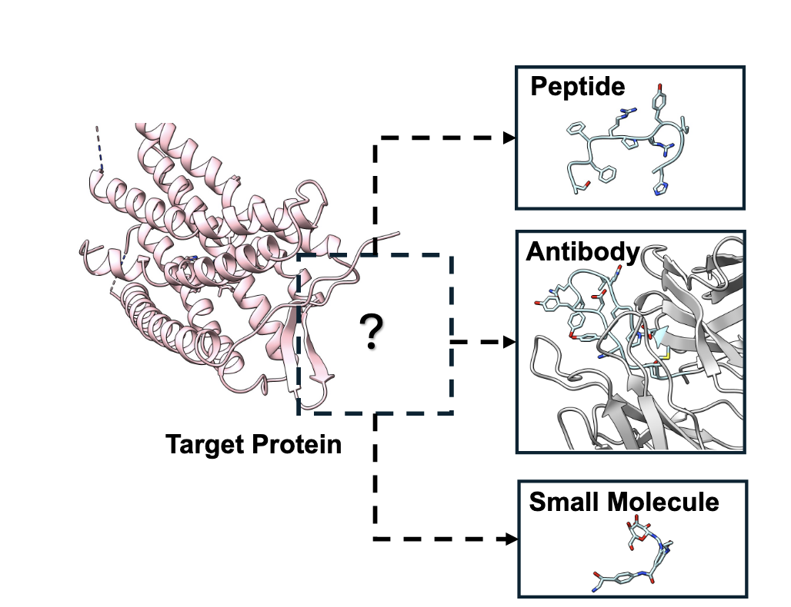
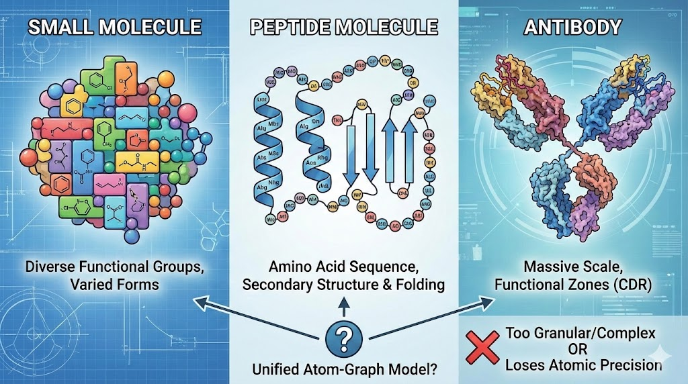
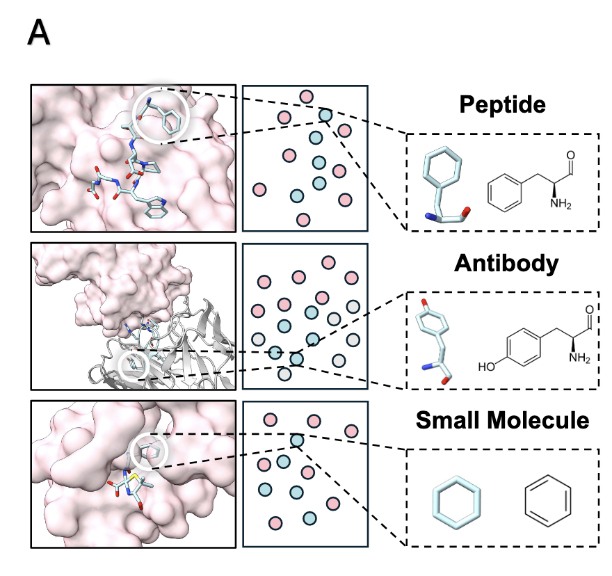
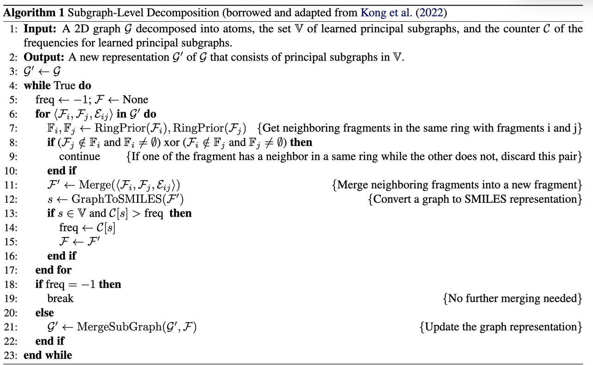
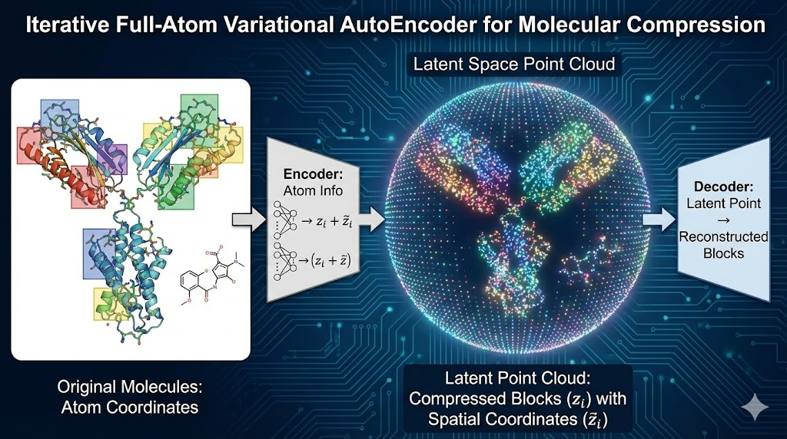
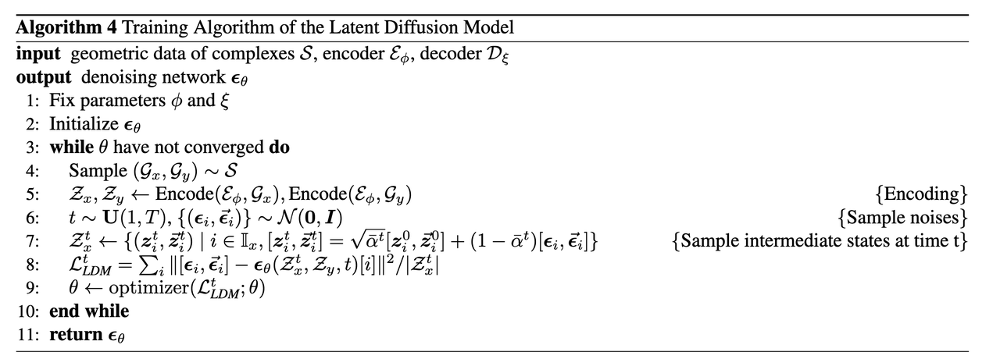
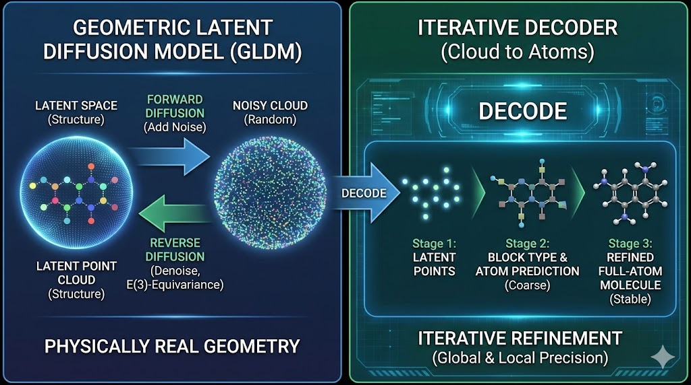
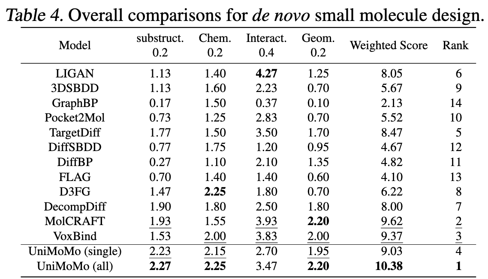
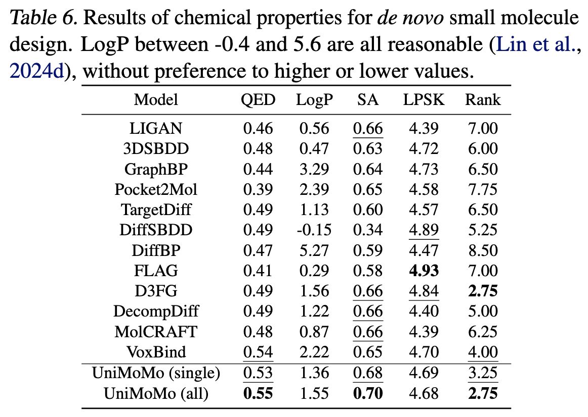

> **蓝极说：**
>
> 今天要分享的是一篇今年ICML 2025的关于多肽、小分子、抗体设计的工作，来自清华大学与字节跳动合作团队：
>
> **《UniMoMo: Unified Generative Modeling of 3D Molecules for De Novo Binder Design》，第一作者为 Xiangzhe Kong（清华大学）。**
>
> 
>
> 这篇论文提出了一个可以同时设计 **小分子、肽和抗体结合体** 的统一生成框架——**UniMoMo**，在多个任务上超越现有专用模型，被认为是跨分子类型生成的一次重要突破。

***

## 一、一个模型，设计所有分子？——UniMoMo的野心

在分子设计领域，不同类型的药物通常意味着**完全不同的模型体系**。

设计小分子药物，需要关注官能团的组合与几何约束；

设计肽药物，要考虑链式序列的折叠；

而抗体设计，又是一整套全新的结构逻辑与能量规则。

于是我们习惯性地认为——**小分子、肽、抗体是三条平行的“AI 赛道”。**&#x6BCF;个赛道都有自己的生成模型、数据集和评估体系。

### **但如果我们能打破这三道墙呢？**

这正是UniMoMo这篇文章中提出的设想：

> **能否用一个统一的生成框架，设计出不同类型的结合分子？**

它能在给定同一个蛋白靶点时，**同时生成肽、抗体、小分子**三种类型的结合体。

在图 1 中，作者清晰地展示了 UniMoMo 的核心能力：

同一个靶蛋白的结合口袋（Target Protein），可以分别对接**小分子、肽和抗体**。

传统上，这三种分子的生成模型是彼此独立的；而在 UniMoMo 中，它们由同一个生成模型统一完成。

这种“多模态绑定生成”（multi-domain binder generation）不仅意味着技术整合，更暗示着**药物发现范式的转变**：

> 从“为每类分子造模型”，到“一个模型探索所有分子空间”。

***

## **二、为什么“统一”如此困难？**

乍一看，“一个模型生成所有类型的分子”听起来只是把任务并到一起。但对分子设计来说，这几乎是一个**跨物种级别的挑战**。

### **三类分子，三种世界**

每种分子类型都有自己的语言和逻辑：

* **小分子**：由多种官能团拼接而成，形态千变万化；

* **肽分子**：由氨基酸顺序线性排列而成，更强调二级结构与折叠规律；

* **抗体**：不仅包含氨基酸主链，还分布着功能分区（如 CDR 区域），结构规模庞大。

如果用同一种表示方法（例如“原子图”）去建模它们，就会出现两个极端问题：

> 要么过于细碎、计算复杂；要么失去原子层级的几何精度。

*图片生成于Nano Banana*

简单来说，小分子和抗体的“构造方式”完全不在一个维度上。

想用一套生成模型同时处理这两种结构，**几乎就像让语言模型同时写英语诗和化学方程式**。

***

### **⚙️ 挑战背后：层级结构与几何约束的冲突**

分子结构遵循一套通用的物理化学规则——键长、键角、空间排斥、氢键方向性……这些规律跨越分子类型而存在。

但它们在不同的结构层级上表现得截然不同。

> 小分子里，规则约束在局部官能团上；
>
> 抗体中，这些约束分布在成百上千个原子组成的模块内。

所以，真正的挑战是：**如何在同一个框架下既保留原子级细节，又捕捉分子间的层次结构。**

***

### **从“原子”到“块”：UniMoMo 的核心思想**

作者的关键洞察是：

> “不同类型的分子，其实都可以拆解为若干个可复用的结构单元（blocks）。”

于是，UniMoMo 引入了一个全新的分子表示方式——**Graph of Blocks**。

* 每个分子被拆分为多个“块”：

  * 如果是肽或抗体，每个“块”就是一个标准氨基酸；

  * 如果是小分子，则用算法自动提取常见的官能团或环状结构，如苯环、吲哚等。

* 然后将这些“块”拼接成一个**统一的图结构**。

这样的设计同时满足了两种需求：

1. 在宏观层面保留了结构的层级性；

2. 在微观层面保留了每个块的原子细节。

这正是 UniMoMo 统一建模的基础，也为后文的**几何扩散生成（Geometric Latent Diffusion）**&#x63D0;供了表示支撑。

***

## **三、从“原子云”到“积木图”：UniMoMo 的统一语言**

在前一节，我们讲到不同分子类型有着各自的“结构语言”。小分子用官能团在说话，肽和抗体则用氨基酸在表达。

如果 AI 想同时理解这三种语言，第一步就得找到**一种通用的表达方式**。

这正是 UniMoMo 的第一项关键创新——

> **用“Graph of Blocks”重新定义分子表示。**

***

### **一种跨分子通用的表示法**

论文中的 **Figure 2A** 给出了这个思想的视觉化解释：小分子、肽、抗体——都被拆分成一个个“Block”。

每一个 Block 代表一个**局部结构单元**，可以是：

* 一个标准氨基酸（对肽或抗体）；

* 一个常见分子片段，如苯环、吲哚环、酰胺基（对小分子）。

这些 Block 再通过化学键（bond）相互连接，

于是无论是复杂的抗体，还是微小的小分子，都能被统一地表示为一个**由 Block 组成的图（Graph）**。

> 简而言之：**肽是由氨基酸 Block 拼起来的“小分子”，小分子是由官能团 Block 拼起来的“肽”。**

***

### **关键算法：Principal Subgraph 分解**

那问题来了——AI 怎么知道哪些部分可以当作“Block”？

作者在2022年的NeurIPS提出了一个自动化的结构分解算法：

**Principal Subgraph Mining（主子图提取）**。

它会在海量分子结构中寻找出现频率最高的局部结构（例如苯环、咪唑环、酰胺键），并将它们定义为标准化 Block 词汇。

最终，模型拥有一个“分子词典（Vocabulary）”，里面既包括 20 种氨基酸，也包含常见的化学基团。

每个分子被分解后，AI 就能用统一的“Block 词汇表”来描述所有类型的分子。

> 这一步的意义，就像自然语言处理中的“分词”：
>
> 它把连续的原子结构，切分成有化学意义的片段单元。

***

### **表示优势：兼顾层次与精度**

这种 **Block Graph 表示** 带来了两个决定性的优势：

1. **保留原子精度**：

每个 Block 内部仍然存有完整的原子坐标、键长、键角等信息，因此模型可以在后续阶段恢复出全原子级几何结构。

* **降低复杂度，提升泛化**：

对抗体这样的庞大体系，直接处理原子图几乎不可能；而用 Block 级表示后，模型只需学习模块间的组合规律，就能在不同分子类型之间迁移学习。

***

## **四、从“潜空间粒子”到“立体分子”：UniMoMo 的生成之心**

当我们用 Block Graph 统一了分子语言后，下一步的问题是——AI 如何“说”出新的分子？

在 UniMoMo 中，这个“说话”的过程被分为两步完成：

1. 先把所有 Block 压缩成**潜空间粒子（latent points）**；

2. 再通过一个**几何扩散过程（geometric diffusion）**，在三维空间中生成并还原出完整分子。

这一整套机制在论文的 **Figure 2B** 中有非常直观的图示——

左边是编码压缩（Encoder），中间是扩散生成（Diffusion），右边是逐步还原结构（Decoder）。

***

### **第一步：AutoEncoder 压缩——让分子“隐入潜空间”**

在传统分子生成模型中，AI 直接操作原子坐标，这不仅计算量庞大，还难以处理复杂体系（尤其是抗体）。

UniMoMo 采用了一个名为 **Iterative Full-Atom Variational AutoEncoder** 的机制。

这个模块的任务是：

> 把每个 Block 压缩成一个带空间坐标的小点（latent point）。

具体来说：

* **Encoder** 将 Block 的原子信息（类型 + 坐标）映射到一个隐向量 $$z_{i}$$和一个三维位置 $$\vec{z}_i$$；

* 这些隐点构成了一个“潜空间点云（latent point cloud）”，

* 它的几何分布依然反映了原始分子的空间结构。

图片来源：Nano Banana

可以把这一步想象成：

> “每个分子被压缩成一团粒子云，每个粒子代表一个局部结构单元。”

***

### **第二步：扩散生成——在潜空间中“呼吸”出新分子**

一旦模型把真实分子压缩到了潜空间，就能在这个空间里学会生成新的点云分布。

这一步使用的是一种 **几何潜空间扩散模型（Geometric Latent Diffusion Model, GLDM）**。

它的工作原理类似于“呼吸”：

* 正向扩散（Forward Diffusion）：往潜空间点云中逐步加入噪声，直到一切变成随机云团；

* 反向扩散（Reverse Diffusion）：AI 学会一步步去噪，还原出符合化学约束的点云结构。

与传统的扩散模型不同，UniMoMo 的扩散过程具有 **E(3)-等变性（E(3)-Equivariance）**：

> 也就是说，无论整个分子在三维空间中如何旋转或平移，
>
> 模型生成结果的几何关系都不会被破坏。

这点非常关键——它保证了生成的分子在几何上是“物理真实”的，而不是数学伪像。

***

### **第三步：Decoder 还原——从点云到全原子结构**

当潜空间中的点云被扩散模型生成完毕，模型就需要重新“展开”成原子的层级。

UniMoMo 的 Decoder 是一个**迭代重建器（Iterative Decoder）**：

1. 先根据潜点的隐向量预测每个 Block 的类型（如苯环、亮氨酸等）；

2. 再一步步预测每个原子的坐标与化学键。

这个过程并非一次性完成，而是多轮递进式的“细化”：

每一轮都修正坐标、预测化学键、优化几何关系，直到生成一个稳定的三维分子。

这让模型能够在**保留全局构型的同时，兼顾原子级局部精度**。

> 就像艺术家先画出骨架，再逐层上色，最后雕刻出化学细节。

图片来源：Nano banana

***

### **为什么这套机制高效又强大？**

这套“AutoEncoder + Diffusion”的设计有两个显著优点：

1. **降维带来高效**

Diffusion 不再在原子层级运行，而是在压缩后的潜空间进行，大大降低了计算量，让抗体级别的分子生成成为可能。

* **局部精细，整体合理**

Decoder 负责细化每个 Block 的原子结构，而 Diffusion 专注于全局布局，二者分工明确，互相补强。

***

## **五、一个模型打三场仗：UniMoMo 的全领域表现**

UniMoMo 不止是“能同时生成三类分子”，更关键的是——**它在每一类任务上都更强。**

作者在三条典型任务上进行了系统评测：

肽设计、抗体设计、小分子设计。

结果显示，这个统一模型不仅性能全面超越专用模型，还展现出跨领域迁移带来的几何与能量优势。

***

### **实验一：肽设计（Peptide Design）**

&#x20;&#x20;

在肽任务上，UniMoMo 被测试于多个 benchmark（PepBench、ProtFrag、LNR 等）。

研究者关注几个关键指标：

* **C-RMSD / L-RMSD**：生成肽结构与真实肽的偏差；

* **ΔG（自由能）与 IMP（能量优越率）**：生成肽与蛋白结合的能量；

* **Clash rate 与 JSD**：几何冲突率与二面角分布一致性。

在表格 **Table 1** 中可以看到：

* UniMoMo 的 **binding energy（-34.35 kcal/mol）** 远低于所有对照模型（如 PepFlow、PepGLAD）；

* 同时结构 RMSD 下降到 **仅 2.19 Å**，意味着它能生成更贴近天然肽构象的结合体；

* 更有趣的是，模型的 **Clashout**（肽与蛋白原子冲突率）低至 0.45%，比以往模型减少了数倍。

> 换句话说，UniMoMo 生成的不只是“像样”的肽，而是真正**能稳稳贴合靶点表面**的肽。

***

### **实验二：抗体设计（Antibody Design）**

抗体的挑战在于 CDR（互补决定区）结构的复杂性。

传统模型往往只能生成 backbone 框架，而无法稳定预测侧链几何。

在 **Table 2–3** 中，UniMoMo 的表现非常突出：

* 当生成 100 个候选抗体时，**AAR（氨基酸恢复率）达到 52.3%**，远超 DiffAb（49.7%）和 GeoAB（45.9%）；

* 其 **RMSD（结构偏差）仅 1.04 Å**，已接近实验结构精度；

* 更关键的是，**65% 的生成抗体在结合能上优于原始天然抗体**。

几何质量同样令人印象深刻：

UniMoMo 的 **Clashin / Clashout** 比例极低（0.18% / 0.03%），说明生成的结构在原子层面几乎没有无效碰撞。

> 这意味着模型不仅能“生成抗体”，还真的在学习“免疫几何”。

***

### **⚗️ 实验三：小分子设计（Small Molecule Design）**

小分子设计的评测最全面。

作者采用了 CBGBench 框架，从四个维度评估模型：

1. **Substructure**（结构单元一致性）

2. **Chemical property**（药物理化性质）

3. **Geometry**（几何合理性）

4. **Interaction**（蛋白结合模式）

在 **Table 4** 中，UniMoMo 拿下了总分第一名。

具体亮点包括：

* 在“结构子单元一致性”上（Table 5），UniMoMo 的 JSD 仅 0.028，说明它生成的原子与环结构分布几乎完美匹配真实分子；

* 在“药物可合成性”指标（SA 值）上，它也超越所有模型；

* 在“几何合理性”部分（Table 7），生成分子几乎**无原子重叠**（Clash ratio 仅 0.004）。

> 在这一领域，UniMoMo 不只是一个“通才”，而是一个能打的“全能冠军”。

***

### **Figure 3：同一个靶点，三种分子，三种策略**

为了展示模型的“跨域迁移”能力，作者选取了一个**GPCR（G 蛋白偶联受体）**，PDB ID: 8U4R。

UniMoMo 在同一个结合口袋上分别生成了三类分子：

* **肽**：自由能 ΔG = -27.49 kcal/mol；

* **抗体**：ΔG = -65.75 kcal/mol；

* **小分子**：Vina 打分 = -6.04 kcal/mol。

更有意思的是，论文指出两个令人惊喜的观察：

1. 小分子中出现了**模仿氨基酸侧链（如精氨酸）的结构**；

2. 生成的骨架还出现了类似抗体肽链的**酰胺连接片段**。

> 换句话说，模型在“不同分子类型之间学会了借鉴”。
>
> 它能从抗体中学到空间布局，再把这种“几何知识”迁移到小分子设计中。

这正是 UniMoMo 真正“统一生成”的核心意义。

***

### **小结**

通过三类任务的系统对比，UniMoMo 展示出一个清晰的趋势：

> “统一建模”并不是在三种任务之间妥协，而是在三种任务之间形成协同。

多域数据训练让模型**学到更通用的分子几何规律**，进而反哺到每一个子任务的生成质量。

## **六、从多域生成到通用分子智能**

当我们重新回看这篇论文，会发现它的意义远不止“性能更强”。

UniMoMo 的真正突破在于，它第一次证明了：

> 分子设计的通用生成模型是可行的。

过去我们习惯让模型在各自的“生态位”内训练——

小分子学有机化学，肽模型学蛋白折叠，抗体模型学免疫几何。

而 UniMoMo 则在同一个潜空间中，让这三种分子**共享几何知识**、**互相迁移结构经验**。

这种“跨域共学”的设计，不仅让模型在多种任务上表现更好，也暗示着一个更深的科学图景：

AI 可能正在学习分子世界的**共同语法**。

UniMoMo 给我们提供的不仅是一个算法框架，更是一种新的思维方式：

> **让模型自己去发现分子世界的共性。**

当 AI 具备这样的能力，它将不只是加速药物研发，而是改变我们理解生物体系的方式。

原文链接：https://openreview.net/pdf?id=KUN7A7Okb6

