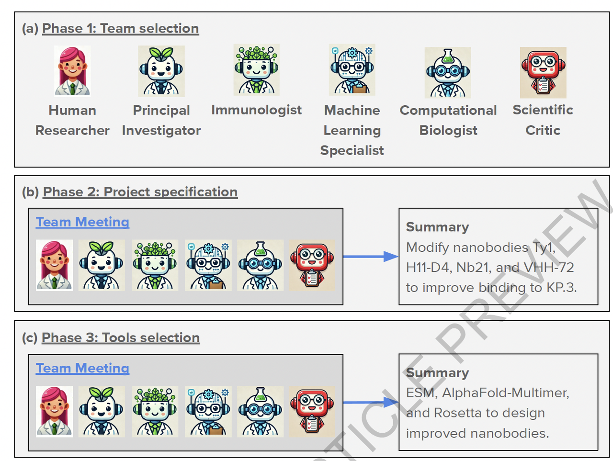
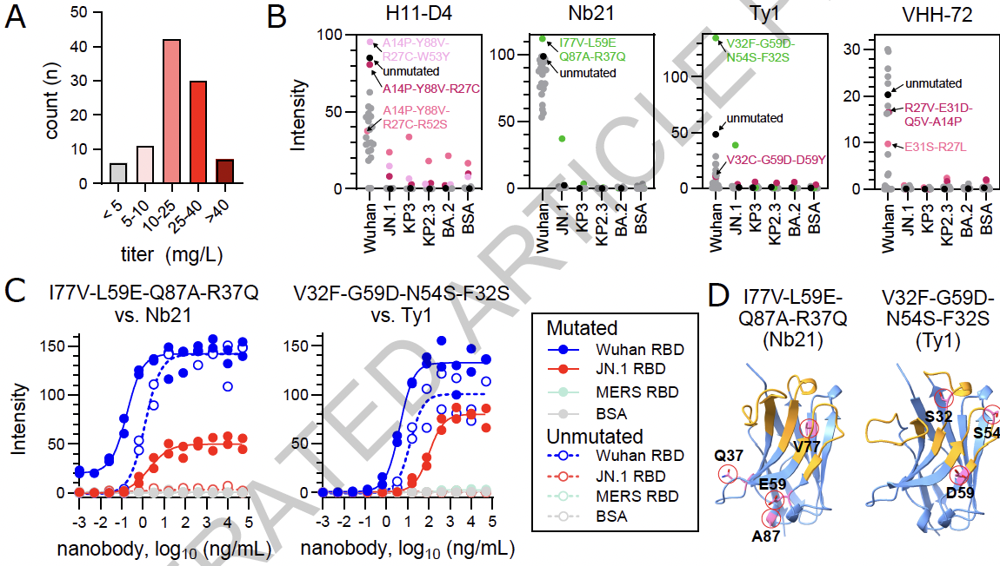

最近刷到一篇 *Nature* 的论文，名字是：《The Virtual Lab of AI agents designs new SARS-CoV-2 nanobodies》。简单说，这是一群大语言模型（LLM）自组团队，开了个“虚拟实验室”，然后真的设计出了抗击新冠变异株的**纳米抗体**，而且还实验验证了有效性。

你没看错，不是人类研究者用LLM辅助，而是**LLM之间开会讨论怎么做科研，人类只是指导一下方向**，最后结果还挺靠谱的。

今天就来和大家唠唠这篇论文，为什么值得关注，它到底做了啥，又给我们带来了哪些启发👇

***

## 1. **背景：AI做科研，到底能走多远？**

过去，大语言模型在科研中常被用来：

* 回答科学问题；

* 总结文献；

* 写代码、做数据分析。

这些功能虽然强，但本质上还是“工具”角色。真正的科研，尤其是**跨学科、需要推理和决策的任务**，AI很少能独立胜任。

### **那怎么办？**

> 这篇论文提出了一个新概念：“**虚拟实验室（Virtual Lab）**”。

***

## 2. **什么是虚拟实验室？AI版本的PI带队搞科研！**

这个Virtual Lab就是一个高度拟人的科研团队系统，但成员全是AI Agent。

### **核心结构👇**

* **PI Agent**：像课题组长，负责研究方向、团队组织；

* **科学家 Agents**：有免疫学家、计算生物学家、ML专家等；

* **科学批评家 Agent**：负责提出反对意见、审查逻辑；

* **人类研究者**：提供整体研究议题、实验限制，但只写了不到2%的文字！

团队以“开会”的形式推进研究，会议有两种：

* **团队会议**：确定研究方向、选工具；

* **个体会议**：写代码、调工具、实验设计等。

像极了真实课题组的运作流程！

这张图展示了虚拟实验室的运作方式：

* **上（图1a）**：人类研究者设定课题后，定义一个“PI” Agent，由它去组建团队，生成“科学家”和“批评家”Agent。

* **中（图1b）**：团队会议形式，所有AI成员围绕议题进行多轮讨论、互相批评、集体决策。

* **下（图1c）**：个体会议形式，某个Agent完成具体任务，比如写代码，另一个Agent进行审阅。

> 整体结构高度仿真了人类课题组的组织方式，而现在主角换成了AI。

***

## 3.  项目实战：从零设计能抗新冠新毒株的抗体

为了验证这套系统是不是真的能搞科研，作者让Virtual Lab挑战一个现实任务：

**设计能结合新冠变异株（KP.3、JN.1）的纳米抗体，并实验验证其有效性。**

听起来像是生物+计算+机器学习的交叉大项目，对吧？

虚拟实验室在实际任务中是这样推进项目的：

* **a**：人类研究者先设定了 PI 和科学批评家 Agent，由 PI 决定要组建哪些科学家角色（比如免疫学家、计算专家）。

* **b**：团队开会决定研究目标（是用纳米抗体？还是标准抗体？用已有的还是新设计？）。

* **c**：选出执行工具——ESM 语言模型、AlphaFold-Multimer 结构预测器、Rosetta 能量计算器。

* **d**：每个工具由 Agent 编程实现，科学批评家Agent负责审查代码逻辑。

* **e**：最终由 PI Agent 组合成完整的设计流程。

> 整个过程就像“科研项目从立项、开组会、写代码，到实现”的全过程——只是这一次，几乎都是 AI 在做。

***

## 4.  实验结果咋样？真有抗体能结合新毒株！

作者实打实地做了实验验证👇

* 92个设计的抗体里，有90%可表达、可溶；

* 2个抗体对变异株（JN.1 或 KP.3）表现出显著结合能力；

* 很多抗体保留了对原始Wuhan株的结合力；

* 整个设计和讨论流程只用了 $20 Token费 + 几天时间；

* 同样pipeline人类写要几周甚至更久

### **抗体设计流程与逐轮优化效果**

虚拟实验室设计抗体的核心流程是多轮迭代突变，每一轮都用三个工具协同评估：

* **ESM**：语言模型预测每个突变位点的“自然合理性”；

* **AlphaFold-Multimer**：预测突变体和Spike蛋白结合的结构质量；

* **Rosetta**：计算结合能（打分越低越好）。

每轮突变都挑选Top序列进入下一轮，总共进行四轮，最终选出92个抗体候选。

* 图3b–d 展示了分数的逐步提升；

* 图3e–g 显示最终版本比原始抗体在三项指标上都表现更优；

* 图3g 是模型预测的突变抗体与病毒蛋白结合结构图。

### **实验验证——AI设计抗体能有效结合新冠变异株**

这张图展示了论文对虚拟实验室产出的抗体进行的**生物实验验证**，一共展示了四大类数据：

* **图4A**：展示92个设计抗体中绝大多数的表达量都很高（>25 mg/L），说明这些抗体是结构稳定且可制造的。

* **图4B**：ELISA检测四种原始抗体与其突变体（比如Nb21和Ty1）对不同变异株的结合力，结果显示突变体对KP.3等有了新增结合能力。

* **图4C**：剂量-反应曲线进一步量化突变抗体与不同RBD（Wuhan, JN.1, MERS等）的亲和力，蓝色为原始病毒，红色为新变体，两个突变体在新变体上表现出了显著的结合能力。

* **图4D**：突变位点在三维结构中的空间分布（粉色圈圈），可见它们集中在抗体-抗原界面附近，解释了功能增强的可能机制。

> 这些实验结果说明：虚拟实验室不仅能“合理设计”，而且真的能产出对现实病毒有功能作用的抗体！

***

## 5.&#x20;**&#x20;亮点与反思：这不只是科研工具，而是科研模式的创新**

### **🌟 亮点**

* **Agent完全独立决策、协作、写代码**；

* **科学批评家角色很重要，提升讨论质量**；

* **结构仿真人类科研团队，易于扩展**；

* **成本低、效率高，非常适合资源有限的实验室**。

***

### **虚拟实验室内部讨论的行为分析**

这张图对“虚拟实验室”的组织行为进行了量化分析，可以理解为一份 **AI课题组的组会记录统计**：

* **发言风格多样**：不同Agent之间的语言风格、用词长度、发言频率均不相同，体现出“虚拟团队”内部的个体性（图5a）。

* **角色分工明确**：PI负责发起任务、批评家负责挑战、专家Agent提供具体方案，每类角色有明显的职责倾向（图5b）。

* **讨论有深度**：随着批评家的加入，组会中问题解决的连贯性和准确率都显著提升（图5c–e），说明讨论不是“表面轮流说话”，而是有真实推进的科学归因。

> 总结一句话：这些Agent不只是模型，它们组成的“AI科研小组”，真的有那么点像回事！

***

## 点评：

1. AI agent这个概念在计算机领域已经非常火爆，之前大家总觉着生物科研领域需要精准，需要明确的知识，才能适配这个专业性很强的领域。但这篇文章说，我就说AI agent就算在科研中也有用吧！这个概念本身要比这篇文章的方法和设计的抗体重要的多（还是要会讲故事）

2. 整个筛选流程当中，起主要作用的还是AF的结构预测指标，ESM更像是特征提取，而Rosetta更像是结构验证，所以结构预测工具还是蛋白质设计领域的神。

3. 和之前ESM- IF的设计类似，在没有抗原的情况下，改进了抗体序列。

🔗原文链接：https://www.nature.com/articles/s41586-025-09442-9#article-info
