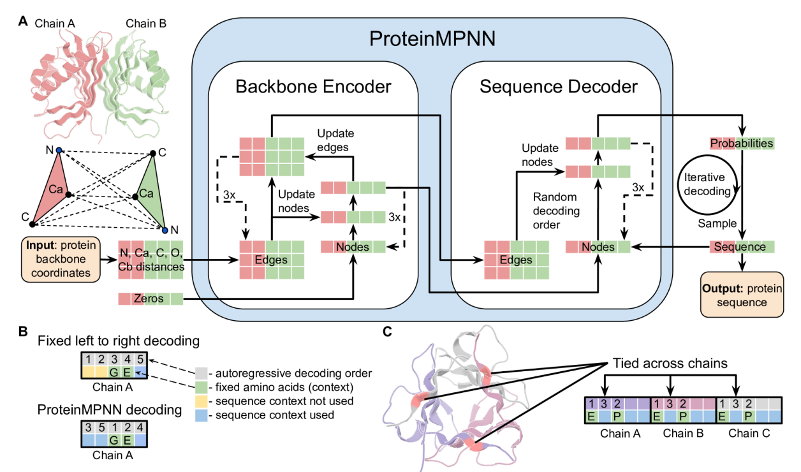
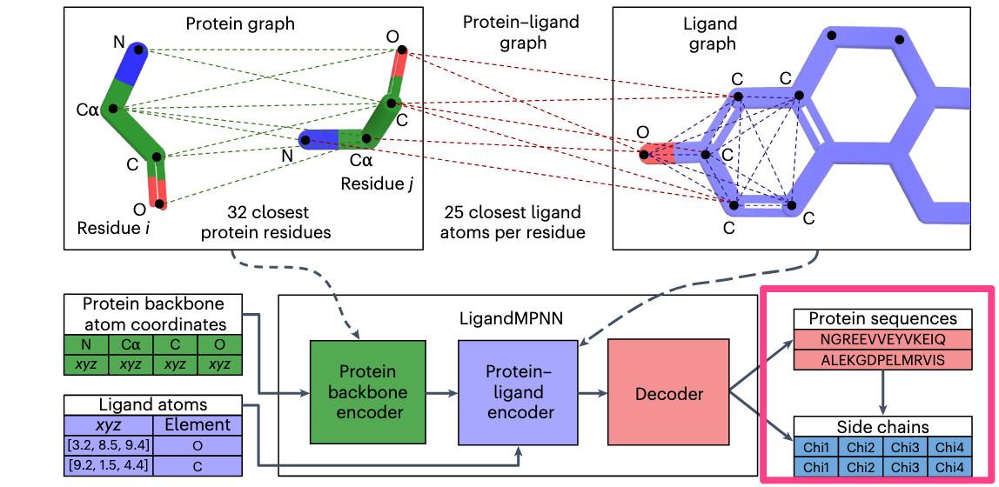
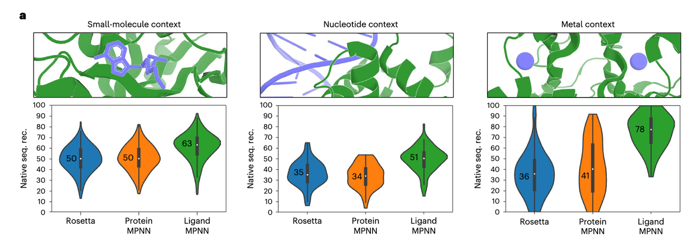
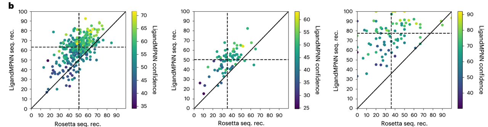
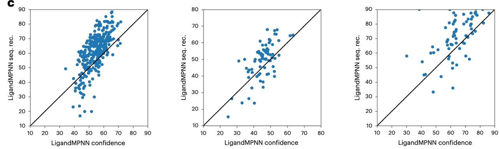
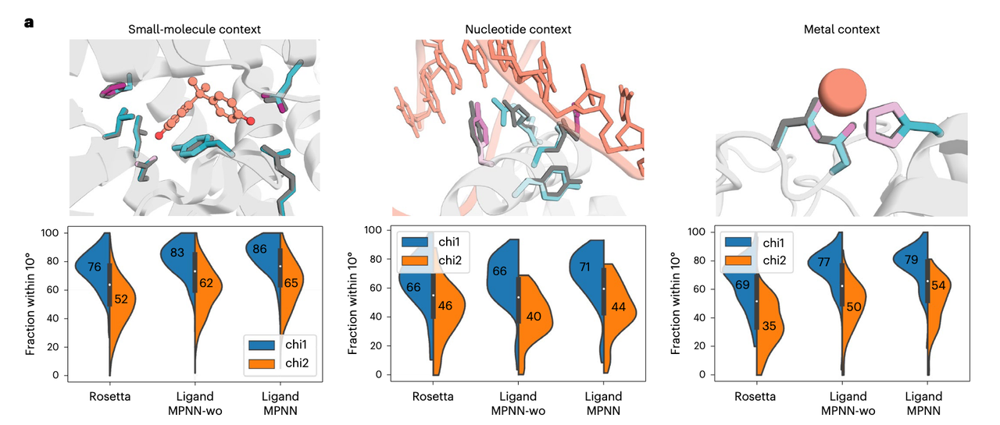

今天给大家介绍一下一篇在蛋白质设计领域很重要的一篇文章，ProteinMPNN的升级版——LigandMPNN。一作还是ProteinMPNN的作者，最后通讯还是David Baker，是一次对原有模型的升级。文章发表在Nature Methods上。

本研究的提出正处于蛋白质设计方法从“结构主导”向“功能导向”转型的关键阶段。在 AlphaFold 推动蛋白结构预测大突破之后，研究重心逐渐转向“如何设计能执行特定功能的蛋白”，而**功能往往依赖于蛋白与小分子、核酸或金属等非蛋白配体之间的相互作用**。

在这一背景下，LigandMPNN 的出现填补了长期以来蛋白设计工具**无法建模原子级配体上下文**的空白，为**药物靶点设计、酶活性位点工程、合成受体开发**等方向打开了新的可能性。

***

## 1.&#x20;**&#x20;背景：为什么要做 LigandMPNN？**

我们先从最基础的概念说起。

#### **&#x20;蛋白质设计的三步走（大多数方法流程）**

1. **设计骨架**：创建能完成特定功能的蛋白结构（比如结合小分子）。

2. **设计序列**：找到一条氨基酸序列，能折叠成上面那个骨架，并实现功能。

3. **结构验证**：用 AlphaFold 或其他工具预测结构，看看设计是否可靠。

LigandMPNN这篇文章关注的是第 2 步：**设计氨基酸序列**。

#### **以前是怎么做序列设计的？**

过去的方法分两类：

其中，**ProteinMPNN 是目前最流行的深度学习方法之一**。它基于图神经网络，输入蛋白质主链结构，输出一条最可能折叠成该结构的氨基酸序列。

#### **但是有个关键的“短板”：**

> **ProteinMPNN 只看蛋白主链（backbone）坐标！**

这意味着它在“设计结合功能”时会犯一个严重错误：

***

#### **假设你想设计一个能结合小分子的蛋白：**

* 小分子在哪儿？什么形状？带不带电？

* 哪些残基在旁边需要“贴合”它、形成氢键？

ProteinMPNN 完全不知道这些信息！

它就像是让人“**闭着眼睛去设计钥匙”，根本看不到门锁**。

***

#### **举个例子：设计结合胆酸的蛋白**

* Rosetta 设计一个蛋白想结合胆酸，但因为设计时不考虑胆酸的位置和形状，它设计出的氨基酸没办法与胆酸形成合适的结合位点，**实验中完全不结合**。

***

#### **所以，LigandMPNN 的动机很清楚：**

> **我们需要一个“知道配体上下文”的模型，来更精确地设计蛋白序列。**

也就是说，我们要让模型不仅知道“我这个蛋白结构长啥样”，还知道：

* 旁边有个什么小分子

* 那个小分子原子分布在哪

* 哪些残基需要去和它互动

只有这样，才能设计出真正功能性的结合蛋白、酶、传感器等。

#### **总结一下背景部分的核心问题：**

## 2. **LigandMPNN 是怎么做的？（方法拆解）**

### **总体思路**

> 把蛋白和配体都看作“图结构”（Graph），用**图神经网络**（GNN）来学习它们之间的相互关系，从而设计出合适的氨基酸序列和侧链构象。

### **看图从左到右、从上到下讲起：**

#### **🔷 1. 输入是什么？**

##### **🔹（左下）蛋白主链坐标：**

* 每个残基的原子位置：**N, Cα, C, O**（这4个原子是主链的“骨架”）

##### **🔹（左下）配体原子信息：**

* 每个原子的坐标 (xyz)

* 它是什么元素（如 O、C）

👉 这些构成了 LigandMPNN 的输入。

***

#### **🔷 2. 三种图结构：关键创新！**

##### **🟩 （左上）Protein Graph 蛋白图**

* 节点是残基（i, j）

* 边是残基之间的距离（绿色虚线，基于 Cα–Cα 距离）

* 这类似于 ProteinMPNN 的输入方式

##### **🟦 （右上）Ligand Graph 配体图**

* 节点是配体中的每个原子

* 边是原子间的距离（蓝色虚线）

* 表示配体原子之间的“内部联系”

##### **🟥 （中上）Protein–Ligand Graph 蛋白-配体图**

* 将每个蛋白残基与**最近的 25 个配体原子**连接（红色虚线）

* 表示残基与附近小分子原子的空间关系

📌 这三张图**共同描述了蛋白+配体的空间环境和相互作用**。

***

#### **🔷 3. 网络结构（下方中部）LigandMPNN 由三块组成：**

##### **🟩 Protein backbone encoder**

* 首先处理蛋白主链图，提取蛋白的空间结构信息

##### **🟦 Protein–Ligand encoder**

* 融合蛋白和配体之间的图关系，学习谁靠近谁、谁可能要互动

✅ 这是最重要的模块，**让模型知道“哪个残基需要和哪个配体原子互动”**

##### **🟥** **Decoder**

* 结合前面提取的信息

* 预测每个位置应该放哪个氨基酸（输出的是一段序列）

* 还会预测侧链的四个 Chi 角（Chi1–Chi4），来还原出完整结构

***

#### **🔷 4. 输出是什么？**

* 一段氨基酸序列（比如 NGREEVVEYVKEIQ）

* 每个残基的侧链构象（Chi1, Chi2, Chi3, Chi4）

也就是说，LigandMPNN 不是只输出“字母序列”，而是给出一个“**几乎完整的蛋白结构**”，特别是在**结合位点的区域特别准确**。

***

### **🧠 总结一句话：**

> LigandMPNN 用图神经网络处理蛋白 + 配体的“空间上下文”，从而更智能地设计出能够结合配体的蛋白序列和三维结构。

## 3. LigandMPNN的实验效果如何？真的有效吗？

### 3.1 **LigandMPNN 的整体性能比对（每个上下文）**

这是最直接的比较图！

#### **图解说明：**

* 分成三列，对应三种上下文：

  * **左：小分子（small molecule）**

  * **中：核苷酸（nucleotide）**

  * **右：金属离子（metal）**

* 每列下方是三个模型的表现对比：

  * 蓝色：Rosetta

  * 橙色：ProteinMPNN

  * 绿色：LigandMPNN

* Y 轴表示的是 **native sequence recovery（序列恢复率）**：

  * 即预测的氨基酸序列有多少与真实结构一致，越高越好！

✅ 明显看到：**LigandMPNN 在所有上下文下表现都最强，尤其是在金属离子上下文提升最大**。

***

### 3.2 **LigandMPNN vs Rosetta 每个蛋白的对比**

这三张图是**逐个蛋白的点对点比较**（每一个点是一个蛋白）：

* 横轴是 Rosetta 的表现（序列恢复率）

* 纵轴是 LigandMPNN 的表现

* 点的颜色表示 LigandMPNN 的预测置信度（越黄越有信心）

**观察：**

* **大多数点都在对角线的上方**：意味着 LigandMPNN 在大多数蛋白上比 Rosetta 好。

* 颜色越黄的点，越靠近图的右上角 → **说明模型对自己“表现好”的地方也更有信心**。

* 不同上下文中（小分子、核酸、金属）都有类似趋势。

***

### 3.3 **置信度 vs 实际准确率**

这三张图展示了一个非常实用的指标：

> 模型自己预测的“置信度”值（横轴）是否真的和“预测准确率”成正比？

结果是——✅ **是的！**

* 点基本都排在一条“向上走的对角线”附近

* 越自信的预测（右边的点），序列恢复率越高（上边的点）

这意味着：

> LigandMPNN 不仅能“预测得好”，而且能“知道自己有没有把握”

### 3.4 **最重要的结论：LigandMPNN 真正有效吗？**

是的，非常有效！

* **相比旧方法有明显性能提升**

  * 不论是序列预测，还是侧链构象

* **更适用于与配体（小分子、DNA、金属）结合的场景**

* **预测结果有置信度评分 → 更易筛选可靠设计**

### 3.5 **小结这张图的三句话：**

1. LigandMPNN 在小分子、核酸、金属场景中，序列设计效果全面领先。

2. 它对大多数蛋白的设计都优于 Rosetta，特别是在功能位点附近。

3. 它知道自己哪儿预测得准，帮助你挑选更可靠的设计结果。

## 4. LigandMPNN对侧链恢复效果如何？

LigandMPNN 的另一个重要能力：

> ✅ **不仅能预测氨基酸序列，还能预测残基侧链的构象（特别是 Chi1 和 Chi2 角）**。

这在功能位点非常关键 —— 因为是否能和配体“卡得住”很大程度上依赖于侧链的摆放方向。

这一章节的目标：**评估 LigandMPNN 的侧链构象预测精度**，并和 Rosetta 做比较。

***

### 4.1 **不同上下文下的 chi1 / chi2 准确率比较**

分成三列，表示三种不同的配体环境：

每列下方是 3 个模型在预测侧链构象的表现：

* **Rosetta**：传统物理模拟方法

* **LigandMPNN-wo**：只用蛋白图，不考虑配体上下文（ablation test）

* **LigandMPNN**：完整版，考虑了配体信息

**关键指标：**

Y轴：预测角度在10°以内的比例（越高越好）

颜色：

* 蓝色：Chi1 角

* 橙色：Chi2 角

**总结图 a 结论：**

* **LigandMPNN 在所有环境下都比 Rosetta 表现更好**

* 考虑配体上下文后（LigandMPNN vs LigandMPNN-wo），性能进一步提升

* Chi1 预测普遍比 Chi2 准确（这是侧链预测中的普遍现象）

* 小分子结合位点提升尤为明显（尤其 Chi2 角）

### 4.2 **逐蛋白的对比分析（Chi1）**

这三个散点图，每一个点表示一个蛋白：

* 横轴：Rosetta 的 chi1 精度

* 纵轴：LigandMPNN 的 chi1 精度

* 越多点落在对角线上方 → LigandMPNN 表现更好

**📊 观察：**

* **绝大多数点都在对角线之上** → 说明 LigandMPNN 在侧链角度预测上优于 Rosetta

* 尤其在 Chi1 预测上，表现稳定，提升幅度大

### 4.3 **小结：LigandMPNN 侧链预测准确性如何？**

非常好，原因包括：

1. **精度高**：Chi1 和 Chi2 的预测精度显著超过 Rosetta 和无配体模型

2. **配体信息有用**：加入上下文后预测更精确，尤其是功能位点

3. **泛化性强**：在不同类型的配体（小分子、DNA、金属）中都表现良好

## 5. LigandMPNN 工作的**实验验证**

这一部分是 LigandMPNN 工作的**实验验证部分**，展示了它在实际蛋白—配体结合设计中的有效性。

这一部分采用**功能实验和结构建模双重手段**，验证 LigandMPNN 是否能设计出真正有功能的结合蛋白。

### 5.1 **Rocuronium 结合蛋白的设计实验**

**✅ 背景：**

Rocuronium 是一种临床肌肉松弛剂（小分子药物）。目标是设计一个蛋白能够**高亲和力地结合 Rocuronium**。

***

**🔬 左侧结构图：**

* 左图：**Rosetta设计的非结合蛋白（nonbinder）**

  * H106 位点是组氨酸（His），未能与 Rocuronium 形成有效配位

  * 预测信心低（红色表示）

* 右图：**LigandMPNN 重新设计的结合蛋白**

  * 同一位置改为酪氨酸（Y106），与配体形成明确的极性接触

  * 配体处残基显示高置信度（深蓝色）

> 说明 LigandMPNN 能有效识别关键结合残基，并精确构建结合位点的几何环境。

***

**📈 右侧柱状图：流式细胞术绑定实验**

* 测量蛋白与带荧光标记 Rocuronium 的结合能力

* X轴：荧光强度（代表结合信号）

* Y轴：细胞数

结果：

* **LigandMPNN 设计（红色）出现明显右移** → 结合能力更强

* Rosetta 设计的蛋白结合弱（蓝色靠左）

> 实验验证 LigandMPNN 能设计出实际功能性更强的蛋白。

### 5.2 **胆酸（Cholic acid）结合蛋白的实验验证**

**✅ 背景：**

胆酸是一种类固醇分子，这个任务更加挑战，因为它结构复杂、疏水性强。

***

**🔬 左侧结构图：**

* Rosetta 重新设计的蛋白（左）：F8 位置为苯丙氨酸（Phe），未形成稳定接触

* LigandMPNN 设计的蛋白（右）：改为酪氨酸（Y8），形成氢键和疏水接触

侧链布局更合理，结合口袋更“贴合”胆酸形状

***

**📈 右侧图：荧光偏振实验测定结合亲和力**

* Y轴：荧光偏振（代表结合程度）

* X轴：log(\[胆酸结合蛋白]浓度)

* 红色曲线（LigandMPNN）：

  * 显示出清晰的结合饱和曲线

  * 拟合出的 Kd = 331.3 nM（即纳摩尔级亲和力）

* 蓝色曲线（Rosetta）：几乎无结合信号

> 说明 LigandMPNN 设计出的胆酸结合蛋白不仅结构合理，而且**功能显著增强**，Kd 达到生物学可用水平。

***

**🧠 专业总结（Figure 4）：**

1. **功能验证结果表明 LigandMPNN 可用于构建高亲和力蛋白—配体结合界面**；

2. **相比 Rosetta，其预测更贴合实际结构，绑定位点残基布局更优化**；

3. **设计成功率和功能活性在多个模型体系中均显著提升**。

## 6.&#x20;**&#x20;讨论与总结（Discussion & Conclusion）**

### 6.1 **方法创新与主要贡献**

LigandMPNN 是一种将蛋白质设计任务与原子级配体上下文信息相结合的通用深度学习框架，拓展了传统 backbone-only 方法（如 ProteinMPNN）的能力边界。其主要创新体现在：

1. **多图结构编码机制**：通过分别构建蛋白骨架图、配体原子图以及蛋白–配体交互图，LigandMPNN 能够捕捉结合位点的精细结构特征与物理环境，显著提升序列与构象预测准确性。

2. **上下文感知序列设计**：与只看蛋白自身结构的模型不同，LigandMPNN 能够“看到”配体，自动调整结合位点残基类型与侧链朝向，从而优化相互作用界面。

3. **高效端到端预测能力**：模型不仅生成氨基酸序列，还能同时输出侧链旋转角（chi angles），使得设计结果更接近真实三维结构。

***

### 6.2 **实验与评估表现**

在系统评估中，LigandMPNN 显著优于 Rosetta 和 ProteinMPNN，尤其在涉及小分子、核酸、金属等非蛋白组分的结合场景下，具有以下优势：

* **序列恢复率提升**：平均提升 10–40%，在金属结合场景中提升尤为显著（Rosetta 36% → LigandMPNN 78%）。

* **侧链构象更精确**：chi1 和 chi2 的角度预测准确率全面领先，尤其在功能位点周围精度更高。

* **功能验证有效**：多项结合实验表明，LigandMPNN 所设计的蛋白在现实中具有实际结合能力（如 rocuronium、胆酸结合蛋白），且 Kd 达到纳摩尔级别。

***

### 6.3 **研究意义与应用前景**

LigandMPNN 具备良好的泛化能力，可用于多种类型的配体蛋白设计任务。这意味着：

* 对药物研发、酶工程、合成生物学等领域具有直接推动作用；

* 其高效的设计能力有望配合 AlphaFold 等工具，形成端到端的“结构到功能”设计工作流；

* 支持大规模、高通量的配体导向蛋白筛选与优化流程。

***

### 6.4 **局限性与未来方向**

尽管 LigandMPNN 展现出优越性能，作者也指出一些值得关注的局限与改进空间：

* **输入结构质量敏感**：如果蛋白–配体复合物结构来源不准确（如对接预测），模型性能可能下降；

* **尚未显式考虑结合能量或动力学信息**，未来可结合物理能量函数或分子动力学增强模型物理可解释性；

* **当前模型仍是结构到序列方向，逆向的“从功能到结构”设计能力仍待探索**。

***

### 6.5 **总结：**

> LigandMPNN 提供了一种上下文感知的蛋白序列设计方法，首次在结合位点级别实现了结构–配体联合建模，显著提升了功能蛋白的设计准确率与适用性。该方法为多组分蛋白设计（multi-component protein design）奠定了基础，代表了结构生物设计进入“原子级配体感知”时代的关键一步

