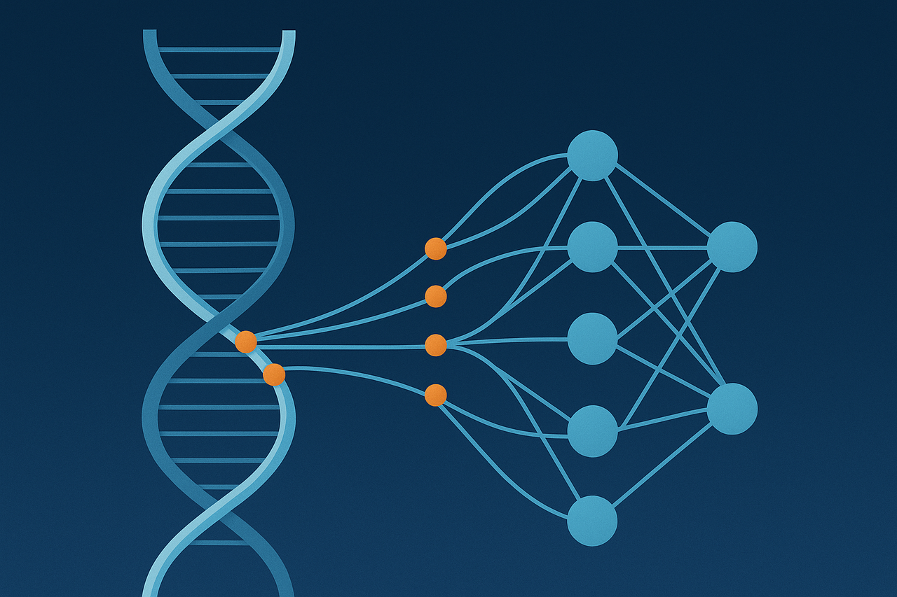
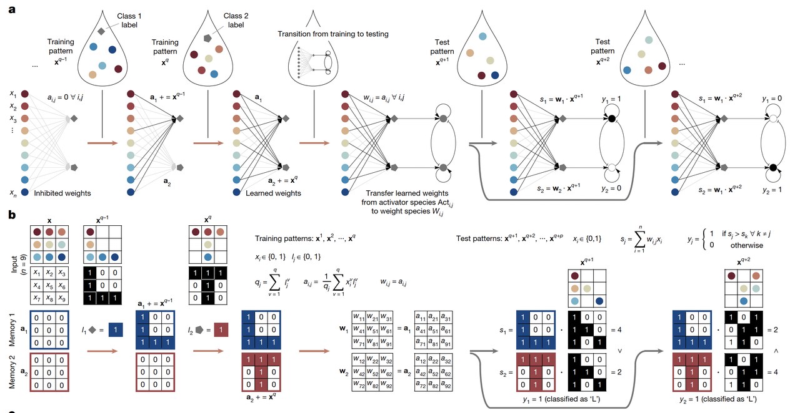
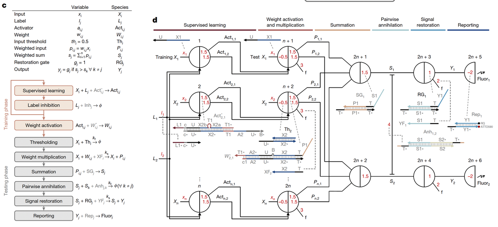
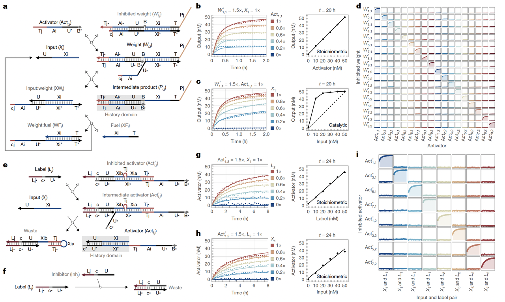
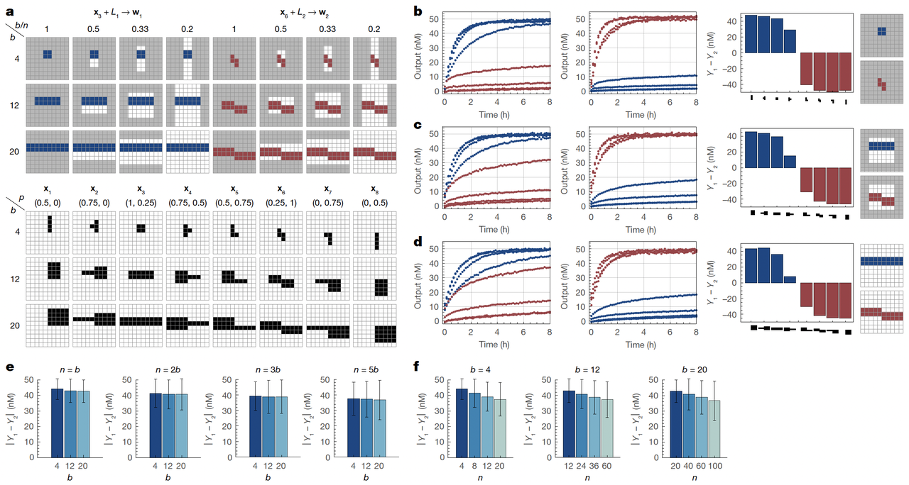

> **蓝极说：**
>
> *这周的Nature* 上出现了一篇让我眼前一亮的文章。它不是在讲深度学习的新模型，也不是在讲蛋白质设计的新算法，而是更疯狂的一件事：**研究者真的用 DNA 分子，在试管里搭建了一个可以“学习”的神经网络**。
>
>
>
> 为什么要分享这篇文章？因为它代表着一个跨越：我们平时说的“神经网络”，都存在于计算机里，而这一次，它被移植到了分子世界。DNA 不再只是遗传物质，它成了可以学习、记忆、决策的“分子智能体”。这不仅是分子计算的一次突破，也为未来的合成生物学、智能药物和可编程材料打开了全新的可能性。

***

## 一、背景介绍

在过去几十年里，人工神经网络的概念已经彻底改变了计算机科学。但一个更加大胆的问题始终萦绕在科学家的脑海里：**如果让分子本身像神经元一样学习，会发生什么？**

这篇刚刚（2025.09.03）发表在 *Nature* 的文章，正是给出了一个突破性的答案：

> **研究团队首次用 DNA 分子在试管中实现了监督学习（supervised learning）**。

换句话说，他们让 DNA 组成的“分子网络”自己看训练样本、自己调整参数，然后在面对全新的测试数据时，能独立做出分类决策。

与以往的 DNA 电路不同，这项工作不是靠计算机“预先设计好”分子参数（相当于死板的硬件），而是真正让 DNA 网络在实验过程中一步步学会任务，像一个不断积累经验的智能体。这一跨越，意味着分子系统已经从“能算”迈向了“能学”。

***

## **二、核心概念图解：DNA如何学习？**

文章的 **Figure 1** 是整篇的核心示意图，它展示了 DNA 神经网络如何完成从“学习”到“分类”的全过程。

1. **训练阶段（Training）**

在图 1a–b 中，我们可以看到输入的“分子图案”（比如 9 位的 0 和 1）和对应的“标签分子”一起进入系统。DNA 分子网络会把这些信息逐步“写入记忆”，相当于在液滴里生长出属于不同类别的“分子记忆”。

> 可以把它类比为：学生抄写单词时不断加深印象，DNA 网络则是通过分子浓度的累积，把训练样本存下来。

* **记忆的形成（Memory）**

当所有样本都呈现过之后，系统就“记住”了不同类别的特征模式。这些记忆不是存在硬盘里，而是以分子浓度的形式稳定储存在试管中（图 1a）。

* **测试阶段（Testing）**

在测试时，新输入的分子图案会和之前存下的“分子记忆”进行比较（图 1b）。DNA 网络会计算每一类的相似度，然后通过“赢家通吃”的机制（winner-take-all）选出最接近的类别。

> 例如：它能把一个有噪声或缺损的“L”或“T”图案正确归类。

* **分子实现（Fig.1c–d）**

图 1c 把抽象的数学运算翻译成化学反应网络，而图 1d 则展示了用 DNA 链置换（strand displacement）来具体实现这些反应。

> 这一步非常关键，因为它说明：**神经网络的计算不再只是数字，而是真实的分子反应。**

***

这一部分的亮点是：

> **DNA 网络不仅能“算”，还能“学”，而且训练和测试用的是同一种分子“语言”，完全不需要计算机做中间翻译。**

***

## **三、关键分子机制：两个“学习门”的秘密**

如果说 **Figure 1** 是整体架构蓝图，那么 **Figure 2** 就是告诉我们：DNA 分子是怎么一步步完成“学习”的。核心就在于两个特别设计的分子“门”（motifs）：

1. **加权门（Weight Gate）**

* 这个门的作用是把“输入信息”和“类别标签”结合起来，转化为某个权重。

* 在 DNA 语言里，这就是一个带有特殊结构的 DNA 链，只有当输入和标签都匹配时，它才会被激活。

* 配图 2b–c 的实验结果显示：当给定的输入或激活浓度增加时，输出信号能够准确跟随变化，还能实现信号放大。这就像是在“把分子印象抄得更深”。

* **学习门（Learning Gate）**

- 学习门负责把样本真正写进记忆，而且是**不可逆**的。

- 这一步非常关键，因为如果学习是可逆的，系统可能会“忘掉”之前的例子。研究团队通过设计一个能形成稳定发卡结构的 DNA 区段，让反应一旦完成就无法回头（见 Fig.2e–h）。

- 实验显示，学习门的特异性非常高：正确的输入–标签组合能得到接近 100% 的信号，而错误组合基本没有响应（Fig.2i）。这意味着系统能“精准记忆”，不会乱串。

***

### **为什么这很重要？**

在传统机器学习里，权重更新靠数学公式和优化算法；在 DNA 网络里，权重更新靠的是分子门的激活和抑制。

> **这让学习过程直接发生在分子层面，而不是在计算机里模拟。**

换句话说，这两个“学习门”是让 DNA 网络能真正“从例子中学习”的核心分子机制。

***

## **四、DNA记忆的呈现：分子里“长”出数字**

文章的 **Figure 3 和 Figure 4**，展示了 DNA 神经网络如何把“学习过的东西”真正存到分子记忆里，并且在测试中用上这些记忆。

1. **激活的分子记忆（Fig.3）**

研究团队先让 DNA 网络接受一些经过**计算机训练好**的权重（相当于给它“预置的记忆”），然后去分类手写数字。

* 图 3a–c 显示了三组任务（如 0 vs 1、3 vs 4、6 vs 7），每一类数字由 100 位二进制比特表示。

* 网络成功地将测试样本分类出来，荧光读数能清晰分辨出不同类别（图 3d–i）。

> 这证明 DNA 网络在实验条件下，确实可以作为一个“分子可编程分类器”。

* **自主学习的分子记忆（Fig.4）**

接下来是最精彩的：研究团队让 DNA 网络直接从**分子训练样本**里学习，而不是预置。

* 他们把“0”和“1”的手写数字样本（各 10 个）以 DNA 分子形式输入系统。

* 训练结束后，读取 DNA 记忆矩阵时，结果居然在荧光数据里直接显现出“0”和“1”的轮廓！

* 更重要的是，不管先输入 0 还是先输入 1，系统都能正确存储，并且记忆不互相干扰（图 4c–e）。

* **可视化的震撼**

在 Fig.4 的热图中，你能直接看到两个数字的形状——这是分子记忆“长”出来的图案。

> 这意味着：DNA 网络不仅能存下复杂的模式，而且能把它们稳定保留下来，像大脑记忆一样。

***

> **小结**
>
> 如果说前面的部分证明了“DNA能学”，这一部分则让我们**亲眼看到 DNA 在分子层面记住了数字**。这不只是概念验证，而是直观地告诉我们：DNA 确实能作为学习机器。

***

## **五、从学习到测试：迈向100位任务**

前面我们看到 DNA 网络能“记住”9 位图案、能学会手写的 0 和 1。那它能不能处理更大规模的任务？文章的 **Figure 5 和 Figure 6** 给出了答案。

1. **向更复杂模式扩展（Fig.5）**

研究团队逐步增加任务复杂度：从 4 位、36 位，一直到 100 位。

* **Fig.5a**：上半部分显示 DNA 网络学到的“权重矩阵”，下半部分是对应的测试图案。

* 实验结果（Fig.5b–d）表明，DNA 网络确实能在不同规模下完成分类。

* 但也发现了一个关键规律：**性能和“未用比特”的比例强相关**。

  * 如果训练样本里只有少数比特被激活，大量比特空闲，就容易带来噪音和串扰，降低分类精度。

  * 反过来，如果被激活的比特比例适中，性能就更稳定。

> 这就像在教一个学生时，如果知识点太零散、不成体系，他就很难掌握重点。DNA 网络也需要“合适密度”的训练信号。

* **100位任务的突破（Fig.6）**

**Fig.6 是全篇文章的高潮。**

* 研究团队最终实现了一个由 100 位构成的两类分类任务。

* 图 6c 显示了训练前后，DNA 网络从“空白记忆”到“部分比特被激活”的过程。

* 图 6d 给出了 72 个代表性测试案例的结果：DNA 网络成功做出了正确分类。

> 要知道，这个系统里涉及超过 **700 种不同的 DNA 分子、1200 多条独立链**，全部在同一个试管中协同完成！

* **关键挑战与启示**

* **挑战**：随着规模增大，未用分子带来的噪音、反应速率差异等问题会累积，限制进一步扩展。

* **启示**：这项工作虽然还没达到电子计算机或大脑的复杂度，但它已经证明了——**DNA 分子网络可以在实验里进行真正的监督学习，并成功扩展到百位级别的复杂任务。**

> **小结：**
>
> 这一部分告诉我们：DNA 学习网络并不是只能做玩具实验，而是能逐步扩展到更复杂的分类任务。虽然仍有挑战，但它已经是“分子智能”的雏形。

***

## **六、意义与前景：DNA网络的未来之路**

这篇工作的重要性，可以用一句话概括：**DNA 分子首次实现了真正的监督学习**。

1. **科学意义**

* **突破了 DNA 电路的传统定位**：以往的分子计算器更像是“硬编码的逻辑门”，只能完成预先设定的运算，而这次的 DNA 神经网络能自己看样本、自己形成记忆。

* **四大特征的体现**：文章强调系统具备独立性（independence）、整合性（integration）、普适性（generality）、稳定性（stability）。这让 DNA 网络不只是短暂的反应器，而是真正的“学习机器”。

* **方法上的普适性**：DNA 链置换作为化学反应网络的通用实现方式，意味着这套框架不仅限于图案分类，还可能被扩展到更多信息处理任务。

* **潜在应用**

* **生物医学**：想象一下，未来的“智能药物”可以在体内学习并记住患者的生物标志物特征，从而在第二次遇到时反应更精准。

* **软材料**：材料能通过 DNA 电路控制膨胀、收缩，如果再加上学习能力，它们就能根据历史刺激进行适应性调整。

* **合成生物学与人工细胞**：这项技术为打造能学习、能决策的人工细胞提供了原型。

* **下一步挑战**

* **可重复使用性**：目前的 DNA 学习网络属于“用一次就消耗”，未来要想实现长期运行，还需要发展可逆或可持续的分子电路。

* **复杂度提升**：文章讨论了空间组织（如 DNA 凝聚体、反应–扩散系统）可能是突破规模限制的关键。

* **无监督学习**：当前依赖“老师”给标签，未来如果能实现自主从环境中归纳规律，那将真正接近生命系统的学习方式。

> **总结**
>
> 这篇工作让我们第一次看到：在一个小小的试管里，DNA 分子们像神经元一样互相作用，最终学会了如何识别复杂的图案。它不仅是分子计算的一次跨越，更是迈&#x5411;**“分子智能”**&#x7684;一大步。

***

> **蓝极点评：**
>
>
>
> 在这项研究中，科学家们让 DNA 分子突破了“计算”的边界，真正踏入了“学习”的领域。分子世界里的信息处理，不再是冷冰冰的逻辑门，而是能记住过去、理解现在、并预测未来的“智能网络”。
>
>
>
> 或许在不久的将来，**最小的学习机器，不是硅芯片，而是一管 DNA**。

