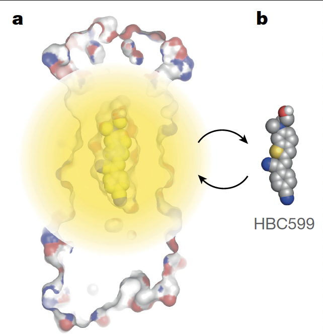
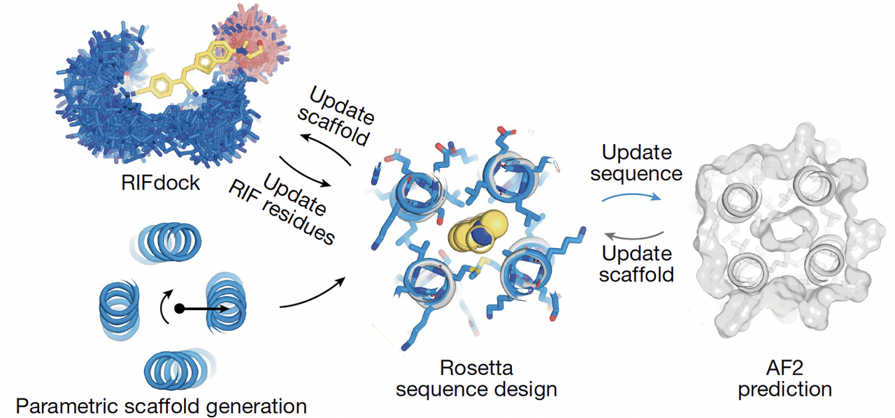
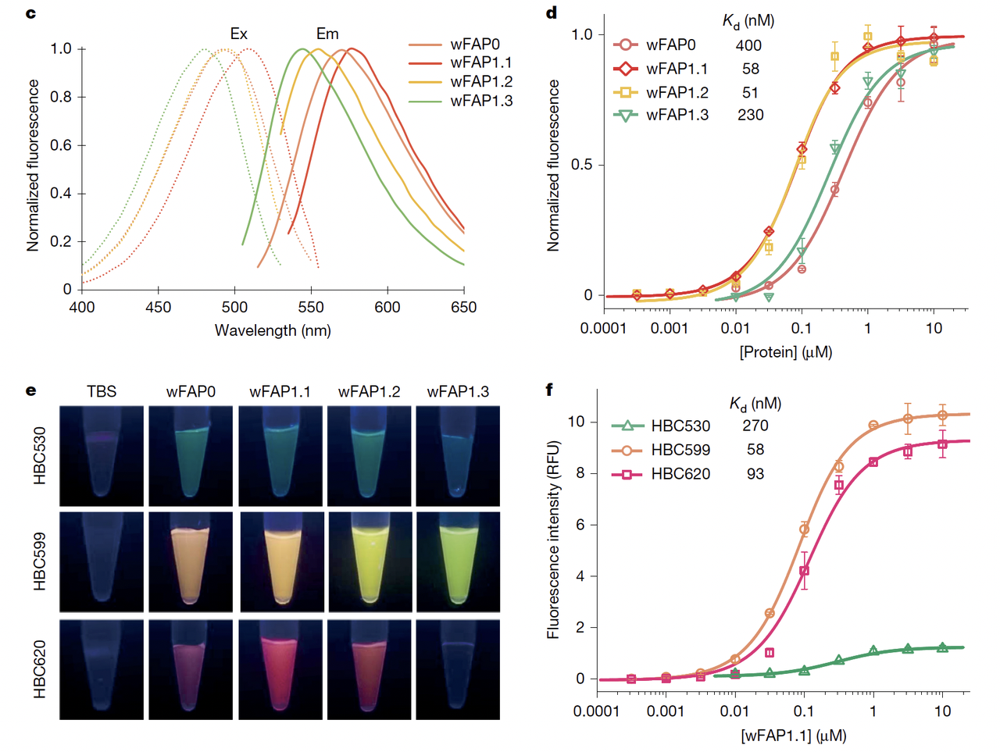
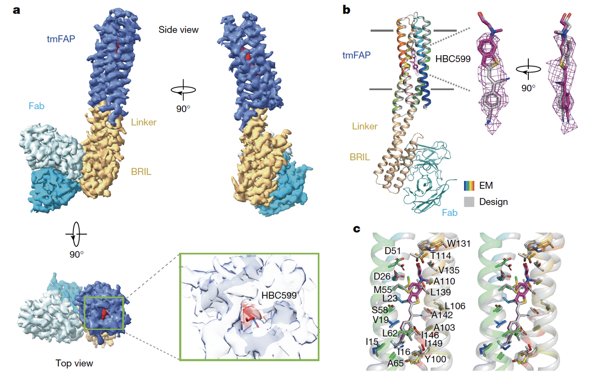
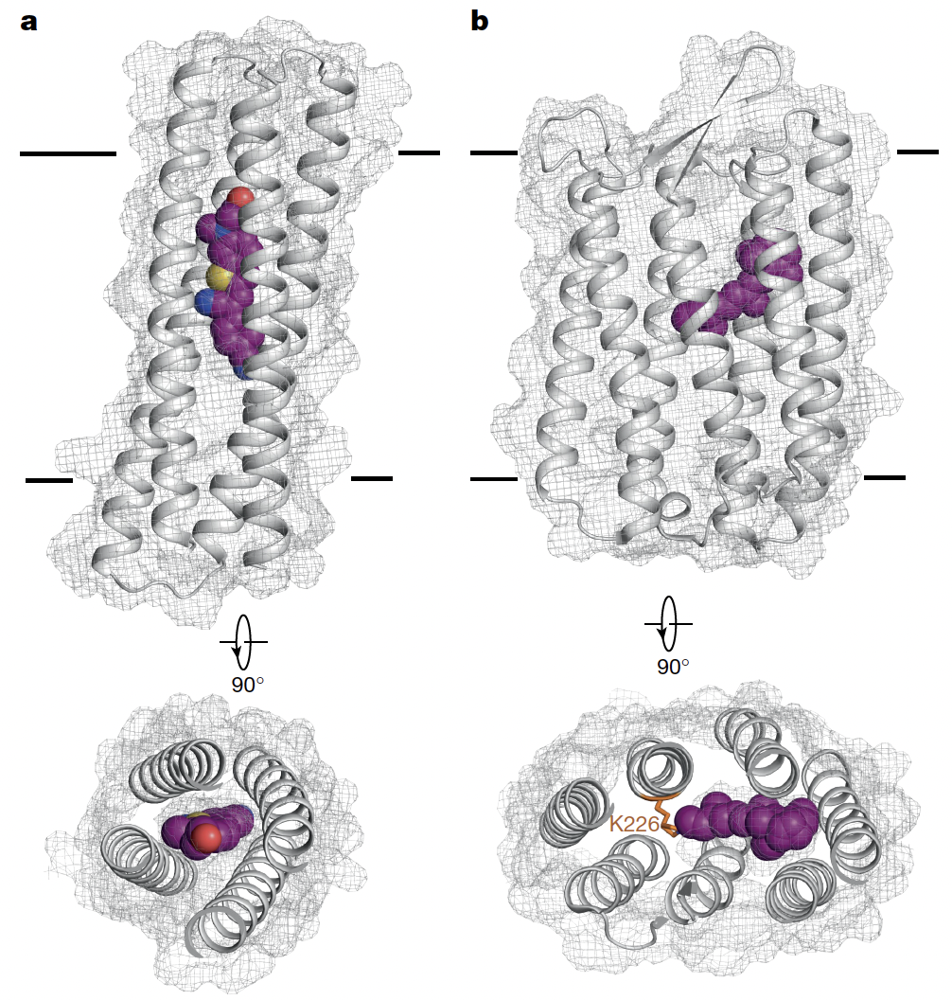

> **蓝极说**：
>
>
> 在蛋白质设计的世界里，水溶性蛋白早已被频频攻克，但**跨膜蛋白**一直是个“硬骨头”——结构复杂、难以稳定、几乎无法自由设计。
>
>
>
> 这次，我想和大家分享的是卢培龙老师团队今年年初发表在 *Nature* 上的一篇重磅成果：**他们不仅成功设计出能点亮荧光的小分子结合蛋白，还让它们稳定地“扎根”在细胞膜里，功能甚至超过了天然膜蛋白**。
>
>
>
> 为什么要读这篇文章？因为它不仅是蛋白质设计的一次技术突破，更像是打开了一扇新大门：**未来我们或许可以自由定制跨膜探针、传感器，甚至人工通道和受体。**

🔗原文链接：https://www.nature.com/articles/s41586-025-08598-8

***

# 1. **为什么这项工作重要？**

跨膜蛋白是生命活动中最重要的一类分子之一。它们镶嵌在细胞膜上，负责物质运输、能量转换和信号传递，几乎&#x662F;**“生命的闸门”**。如果没有跨膜蛋白，细胞就像一个密不透风的气泡，既无法与外界沟通，也无法维持内部稳态。

但在蛋白质设计领域，跨膜蛋白一直是“硬骨头”。原因在于：

1. 天然跨膜蛋白种类有限，已知结构远少于可溶性蛋白；

2. 在疏水性膜环境中要形成稳定折叠已经很难，更别提在其中“精准凿出”一个能识别小分子的结合口袋；

3. 过去的 *de novo* 设计尝试，大多只能做到简单的金属离子结合（如血红素），而对**小分子非共价识别**几乎无人问津。

正因如此，西湖大学卢培龙团队这篇今年发表在Nature的工作才显得格外突破。他们不仅设计出**能结合荧光小分子**的**水溶性蛋白**，还进一步把它“**跨膜化**”，让它在细胞膜中也能稳定工作，并且实现了精准的荧光激活。

这意味着什么？意味着研究者可以像“拼乐高”一样，自主构建一类全新的跨膜传感器，用来成像、检测，甚至未来作为人工通道和受体的基础。

在文章的配图 **Fig.1a** （上图）中，作者用一张非常直观的示意图告诉我们：他们选择的荧光小分子 HBC，在溶液里是“黑的”，只有当被蛋白紧紧固定成平面构象时才会发光。于是，蛋白设计的挑战就被清晰定义为：**如何在一个人工构建的口袋里，把 HBC 分子卡到合适的形状，从而点亮它？**

这一张图，就奠定了整篇文章的核心逻辑：**从分子识别出发，通过设计实现点亮。**

***

# 2. **从水溶性 FAP (wFAP) 开始**

既然目标是跨膜蛋白，那为什么研究团队没有直接一开始就去设计跨膜蛋白呢？

因为难度太大。于是他们选择了一条“曲线救国”的路线：**先在水溶性环境下设计出能点亮荧光分子的蛋白——water-soluble FAP (wFAP)，再逐步跨膜化**。

### 2.1 **设计路线：迭代式的“人机协同”**

在 **Fig.1b** 里，作者画出了一个复杂但清晰的设计循环：

1. **骨架生成**：先用参数方程生成一系列**四螺旋束**骨架；

2. **口袋初步对接**：把荧光分子 HBC 放入骨架，&#x7528;**&#x20;RIFdock&#x20;**&#x6765;寻找可能的相互作用；

3. **序列优化**：用 **Rosetta** 优化口袋周围氨基酸的排布；

4. **模型评估**：丢给 **AlphaFold2** 去预测，看看它能否稳定折叠成预期的结构；

5. **反馈修正**：如果 AlphaFold2 预测结果和设计不一致，就继续**调整**序列和骨架，直到收敛。

这一点非常关键：团队没有把深度学习当成“最后的检查”，而是把它**嵌入整个循环**，形成了 **能量函数（Rosetta）+ 深度学习（AF2）双引擎驱动** 的设计框架。

### 2.2 **逐步优化：从弱到强**

实验结果显示：第一批 wFAP（wFAP0）虽然能点亮 HBC 分子，但效果太弱，不足以在复杂环境下使用。

于是研究者对其进行**定向进化**和**口袋微调**，最终得到更优的 **wFAP1.1 和 wFAP1.2**。

在 **Fig.1c–f** 中可以直观看到改进的效果：

* **荧光光谱**：wFAP1.1 和 wFAP1.2 在 495 nm 激发、570 nm 发射下表现出极高亮度；

* **结合常数 (Kd)**：wFAP1.1 对 HBC 的结合达到 **58 nM**，比 wFAP0 提升了一个数量级；

* **亮度**：wFAP1.1–HBC599 复合物的亮度，已经超过了经典的 GFP。

### 2.3 **科学亮点**

* 这是首次用纯设计手段，构建出一个比 GFP 更亮的人工荧光蛋白；

* 蛋白的口袋结构和分子对接方式与 AF2 预测高度吻合，说明**人工设计真的能和自然折叠“对上号”**；

* 这为跨膜化奠定了坚实基础：先证明口袋能精确设计，再把它迁移到膜环境中。

> 换句话说，这一步是整个工作的“**打地基**”：如果没有一个足够稳定、足够亮的 wFAP，后续的跨膜化几乎不可能成功。

***

# 3. **跨膜化 → tmFAP 的设计与优化**

在水溶性环境里，wFAP 已经表现出强大性能，那么接下来的挑战就是：**能不能把它“植入”膜中？**

这一步远比想象中困难。

### 3.1 **难点：为什么跨膜这么难？**

研究团队首先尝试了一个“直觉方案”：

把 wFAP 的表面氨基酸替换成疏水残基，让它能够镶嵌在膜里。

结果却失败了。原因有二：

1. 跨膜环境要求蛋白表面必须高度疏水，这样的改造往往会破坏原本的四螺旋堆积；

2. 更致命的是，口袋的预组织结构在“表面换肤”后塌陷，无法再稳定结合小分子。

> 换句话说，**直接跨膜化，就像强行把一只金鱼丢进沙漠，它根本活不下去**。

### 3.2 **突破：深度学习的“幻觉”方法**

于是研究团队转向了更激进的思路——利用 **ColabDesign 的 hallucination（幻觉）策略**。

这一方法的核心在于：

* 把 wFAP 的口袋核心固定住，

* 让深度学习网络去“幻觉”出合适的跨膜序列，

* 在满足跨膜条件的同时，确保口袋结构不被破坏。

在 **Fig.2a–b** 中可以直观看到这种思路：

* a图左侧是水溶性的 wFAP（表面带电）；

* a图右侧是跨膜化后的 tmFAP（表面一圈黑色的疏水带，约 30 Å 跨膜跨度）；

* b图则展示了 hallucination 的工作流：输入骨架，冻结口袋，剩下的交给网络生成。

### 3.3 **成果：点亮 tmFAP**

经过这一流程，研究者获得了多个候选 tmFAP，其中 **tmFAP1.1 和 tmFAP1.2** 表现最出色。

* tmFAP1.1 在膜环境下能稳定表达，并与 HBC 分子结合，初步 Kd \~ 230 nM；

* tmFAP1.2 通过进一步优化，亲和力提升到 **18 nM**，量子产率高达 **0.84**，几乎与天然 RNA aptamer Pepper 持平；

* 更重要的是，tmFAP 对目标分子 HBC599 表现出高度特异性，几乎不与其他类似分子结合（**Fig.2e–f**）。

### 3.4 **科学亮点**

* **第一次** 在跨膜蛋白中实现了非共价小分子识别，并且亲和力达到纳摩尔级；

* 跨膜口袋的设计不是“运气撞上”，而是通过深度学习幻觉精准生成，这标志着 AI 在跨膜蛋白设计中真正发挥了“创造力”；

* tmFAP 的亮度和性能，已经不再是“概念验证”，而是完全有潜力应用于活细胞成像。

> 用一句话总结：**这一部分是把金鱼变成了会在沙漠里游泳的“沙漠鱼”——它们真的能在跨膜环境里稳定存在，还能点亮荧光。**

***

# 4. **结构验证：设计与现实高度吻合**

在蛋白质设计领域，最常见的质疑是：**设计出来的模型和现实中折叠的蛋白，真的一样吗？**

很多时候，计算机模型看似完美，但一到实验就“翻车”。

卢老师团队的厉害之处在于，他们不仅让 wFAP 和 tmFAP 在功能上表现优异，还通过高分辨率结构学手段证明：**设计与现实几乎一模一样**。

### 4.1 **wFAP 的晶体结构：模型与现实重叠**

在 **Fig.3a–d** 中，作者展示了 wFAP1.1 的晶体结构（分辨率 2.3 Å，空口袋）和与 HBC599 结合后的结构（分辨率 2.1 Å）。

结果令人惊讶：

* 口袋的 Cα RMSD 仅 **0.4–0.6 Å**，几乎和设计模型重合；

* HBC599 分子紧紧嵌在口袋里，与预测的结合方式完全一致；

* 关键氨基酸（如 D51、D26）和 HBC 的相互作用，在实验结构中被清晰捕捉到。

> 这意味着：**wFAP 的口袋并不是实验偶然形成，而是设计驱动下的稳定构象。**

### 4.2 **tmFAP 的 cryo-EM 结构：小蛋白的“硬核考验”**

跨膜蛋白更难解析，尤其是这种只有四根螺旋的小蛋白。

作者采用了巧妙的“**BRIL 融合 + Fab**”策略，把 tmFAP1.1 稳定化后进行冷冻电镜解析（**Fig.4a–c**）。

结果依旧惊艳：

* 分辨率 2.79 Å，四螺旋束完整呈现；

* HBC599 的密度清晰可见，被完全包裹在螺旋核心中；

* 口袋残基的位置与设计模型高度吻合，RMSD 仅 **0.74 Å**。

更有意思的是，作者还通过点突变实验进一步验证：

只要改动几个口袋关键残基（如 D26A、W131A），荧光信号就完全消失。

这和结构信息完全对应，再次说明设计口袋确实是“按图施工”的。

### 4.3 **科学亮点**

* 这是 *de novo* 蛋白设计少有的“全链闭环”：从**计算模型 → 功能验证 → 高分辨率结构 → 与模型重叠**；

* 结构学结果让这项工作从“好像有效”变成了“确实精确”，奠定了设计方法的可靠性；

* 尤其是 tmFAP 的 cryo-EM 成功解析，说明即使是人工设计的跨膜小蛋白，也能达到天然蛋白的结构稳定度。

> 一句话总结：**结构验证这一步把文章从“功能演示”提升到“原子级精确”，是整个工作最硬的证据。**

***

# 5. **在活细胞中的表现**

蛋白设计如果只在纯化的体系里好用，其实价值有限。真正的考验是：**能不能在活细胞中稳定表达，并且完成它的功能？**

卢老师团队在这一点上同样给出了漂亮的答案。

### 5.1 **wFAP：自由分布，甚至可定位线粒体**

在 **Fig.5a–b** 中，作者展示了大肠杆菌和 CHO 细胞的成像结果：

* 在细胞质中表达的 **wFAP1.1**，遇到 HBC599 分子后，全细胞均匀亮起红色荧光；

* 当 wFAP1.1 融合上线粒体定位信号（SYNJ2BP）时，荧光就清晰地只出现在线粒体位置。

这说明：**设计的蛋白不仅能点亮分子，还能作为“分子灯泡”被精准安放到细胞器。**

### 5.2 **tmFAP：镶嵌在膜上，点亮边界**

相比之下，跨膜版本的 **tmFAP1.2 和 tmFAP3**，则在细胞膜或内膜系统中“点亮边界”。

* 在大肠杆菌中，tmFAP1.2 的荧光信号清晰地环绕在细胞周边，而细胞质是暗的；

* 在哺乳动物 CHO 细胞中，tmFAP1.1 分布于内膜系统，而 **tmFAP3** 经过进一步优化后，可以定位到质膜，并在膜上产生明亮荧光（**Fig.5c**）。

更酷的是，在非哺乳动物的 *Xenopus* 卵母细胞里，tmFAP3 同样能成功镶嵌到质膜，并点亮大面积的荧光区域。这说明它的适用性不受细胞种类限制。

### 5.3 **科学亮点**

* wFAP 和 tmFAP 在活细胞中的荧光信号强烈、背景极低，说明设计具有高度特异性；

* 跨膜版本的 tmFAP 可以直接作为膜标记工具，甚至为未来的电生理和膜动力学研究打开了可能性；

* 设计蛋白能够在不同细胞环境中正确折叠、定位和工作，这一点极大提升了它们作为“通用工具”的潜力。

> **这些设计出来的蛋白，不是实验室里的“摆设”，而是能在真正的生命系统中工作、发光的工具**

***

# 6. **结论与展望**

这项工作最震撼的地方在于：**它不仅证明了“跨膜蛋白–小分子非共价结合”是可设计的，而且做得比天然体系更好。**

### 6.1 **和天然荧光膜蛋白的对比**

在 **Fig.6** 中，作者把他们设计的 tmFAP 和经典的天然膜蛋白 **archaerhodopsin-3** 放在一起比较：

* **体积更小**：tmFAP 只有四根跨膜螺旋，而 rhodopsin 有七根；

* **结合方式不同**：tmFAP 与 HBC599 是非共价结合，灵活可替换；而 rhodopsin 必须依赖共价固定的视黄醛分子；

* **亮度更高**：tmFAP1.2 的亮度几乎比 archaerhodopsin-3 高出一千倍，甚至超过了迄今最亮的天然 rhodopsin（NeoR）。

> 这意味着：设计出的蛋白已经不是“模仿自然”，而是**超越自然**。

### 6.2 **应用前景**

* **成像工具**：tmFAP 可以作为新一代膜定位探针，结合不同的人工荧光分子，扩展成多色工具箱；

* **传感器开发**：通过替换荧光分子或优化口袋，可以设计成 pH、膜电位甚至代谢物的传感器；

* **分子机器的基石**：这类高精度的跨膜口袋，未来可能被拓展为人工受体、转运体或离子通道。

更进一步，tmFAP 的结合是非共价的，这意味着染料在光漂白后可以被溶液中的新分子替换，从而实现**长时间成像不中断**——这是天然荧光蛋白难以企及的优势。

### 6.3 **总结**

从 **水溶性设计 → 跨膜化 → 结构验证 → 细胞应用 → 对比天然体系**，卢培龙团队展示了一条完整的、可复制的“设计路线”。

这不仅是一次 *de novo* 蛋白设计的突破，更像是在为未来的“人工膜蛋白学”奠基。

> **他们让我们看到了一个未来——跨膜蛋白不再是自然的恩赐，而是人类可以自由设计、定制和超越的分子机器。**

