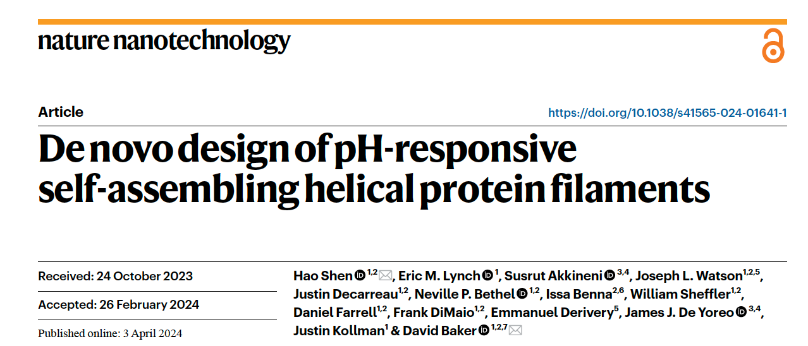
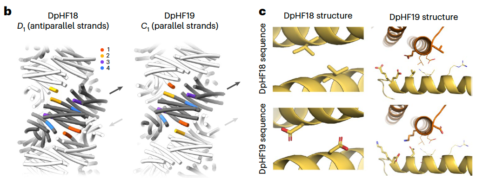
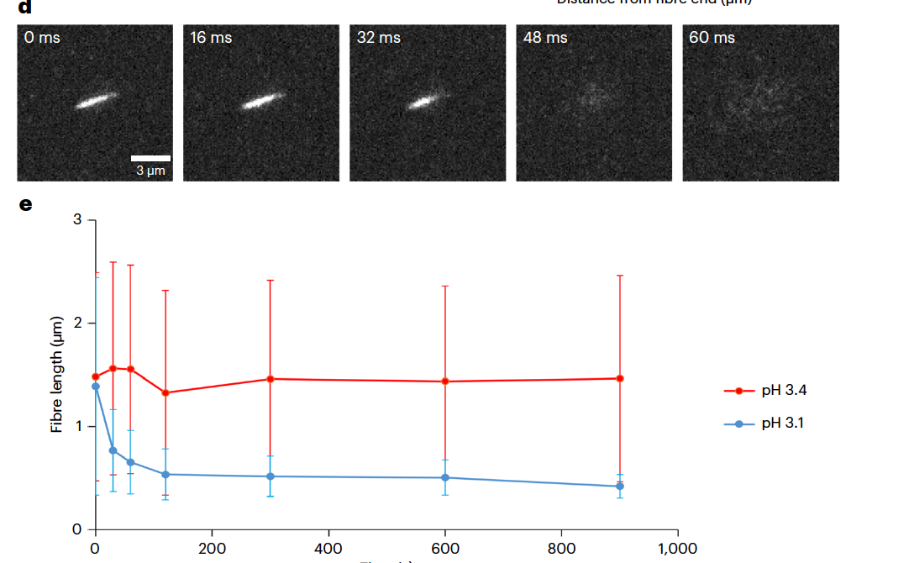
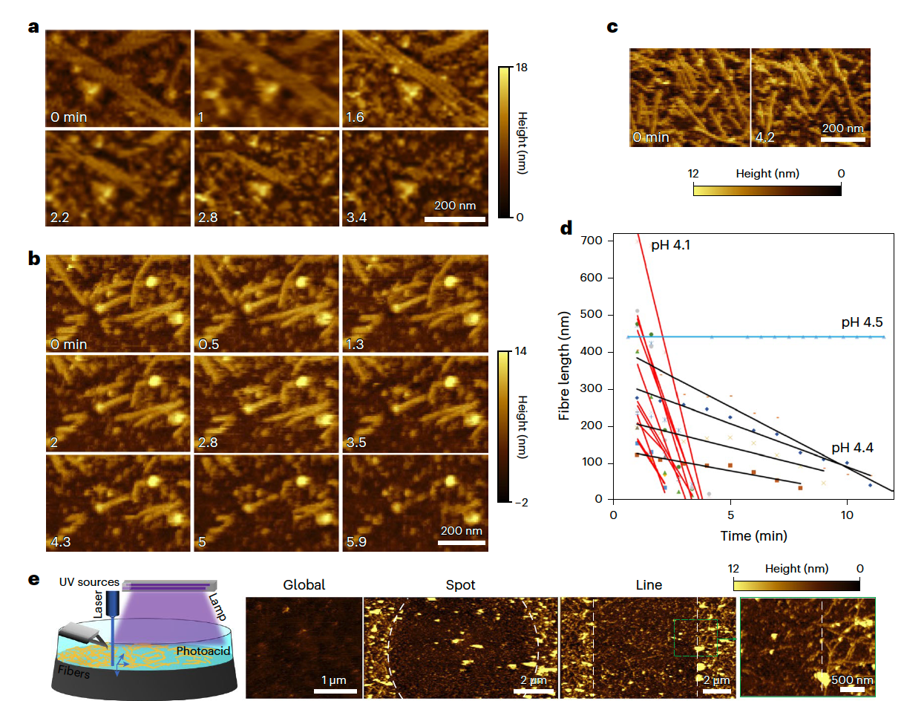

今天要和大家分享一篇来自华盛顿大学（University of Washington）蛋白设计研究所（Institute for Protein Design, IPD）的文章，发表在 *Nature Nanotechnology*（2024 年 7 月刊）上，题为：

**《De novo design of pH-responsive self-assembling helical protein filaments》**

（**“从头设计可对 pH 响应的自组装螺旋蛋白丝”**）

这篇论文的通讯作者是蛋白设计领域的标志性人物 **David Baker 教授**，第一作者为 **沈浩（Hao Shen）博士** —— 他是 Baker 团队的重要成员，长期从事“蛋白质自组装体系的计算设计”。这项工作由华盛顿大学、剑桥大学、以及太平洋西北国家实验室多方合作完成。

这篇文章的核心问题是：

> “我们能否**用计算机设计出一类能感知环境变化、并像天然材料一样自发重构的蛋白质结构？**”

简单来说，研究团队成功地 **从头设计（de novo design）了一种在 pH 改变时能自行组装或解组的螺旋蛋白纤维。**&#x800C;且这种响应极为灵敏——仅仅 **0.3 个 pH 单位的变化**，就能让纤维在几百毫秒内“瞬间消失”；当 pH 恢复时，它们又会重新长回去。

在接下来的内容中，我们将带大家一起从图文角度出发，看看 Baker 团队是如何一步步实现这个看似“自然界才会做的事”：

1. 他们如何在计算机中设计这种 **pH 响应的自组装单元**；

2. 如何通过 **冷冻电镜（Cryo-EM）验证原子级精度的结构一致性**；

3. 以及如何用显微镜和 AFM 动态观察 **纳米级“丝的生与灭”**。

***

## **一、从自然界的智慧到计算机的设计**

自然界早已在分子层面玩出了“环境响应材料”的巅峰操作。

当蜘蛛在吐丝时，丝蛋白在腺体内会经历一个**从中性到酸性**的微小 pH 变化——这种变化就像一个分子开关，使蛋白质链自发组装成坚韧的丝纤维。

在酵母中，**CTP 合酶**在低 pH 条件下聚合成丝状结构，帮助细胞在饥饿时维持代谢平衡；而某些细菌的 **R bodies**，则能在酸性环境下“伸展爆裂”，突破宿主膜释放物质。

这些例子共同说明了一件事：**pH 变化可以被生物系统精准地“编程”成结构变化的信号。**

但是，**要从零开始设计一种能像天然体系那样精准响应的人工蛋白丝，却非常困难。**

天然系统依赖数百万年的演化优化，而人工设计需要计算机在原子层级上同时考虑折叠稳定性、组装几何、以及响应性残基的网络效应——这几乎是“分子工程中的珠穆朗玛峰”。

***

### 1. **Baker 团队的构想：从 pH 响应三聚体出发**

研究团队选择以一个已经验证过的 **pH 响应三聚体结构（pRO-2.3）** 为基础。

这个三聚体内部埋藏着 **六个组氨酸（His）残基**，它们通过氢键网络稳定整个结构。

当 pH 降低、组氨酸被质子化时，氢键网络被破坏，三聚体就会解体——这正是一个“天然的分子开关”。

在图 1a 的上半部分，可以看到研究者通过添加短 **连接肽环（loop）** 把这三个亚基连成了一个**单链结构单元（monomer）**。

这样一来，他们打破了原本的三重对称性，为后续设计“非对称界面”创造了空间。

而在图 1a 的下半部分标出了那些关键的氢键网络——其中每个组氨酸都像一个敏感的触点，决定着结构何时会“开”与“关”。

***

### 2. **从单体到纤维：计算设计的螺旋装配**

接下来，研究团队利用 **Rosetta 设计平台**，探索了 **45,000 种可能的螺旋堆叠方式**。

他们像搭积木一样，让这些单体沿着不同的旋转角度与上升距离组合成各种螺旋模型（Fig. 1b）。

每种构型都经过能量评估、形状互补性和界面面积的筛选，最终选出了 18 种能量最低、理论上最稳定的方案。

在图 1c 中，每个亚基用不同颜色的棒状螺旋表示，之间的红色棒状结构就是 pH 敏感的氢键网络。

这些“带有敏感神经的模块”堆叠在一起，就构成了一根可以**对环境微小变化迅速响应的蛋白质丝**。

最终，18 种候选设计在 *E. coli* 中表达后，只有两个设计成功形成丝状结构——**DpHF7 与 DpHF18**。

这意味着，计算预测的能量最低模型，确实能在实验中自组装成纤维，验证了设计逻辑的可行性。

***

## &#x20;**二、从计算机到显微镜：原子级别的“精准复刻”**

当设计完成后，最关键的问题是：

> “计算机画出来的蛋白丝，真的能在实验中按照那个形状自组装吗？”

这正是 Fig. 2 要回答的核心问题。研究团队通过 **冷冻电镜（Cryo-EM）**，分别解析了两种设计的结构：

早期版本 **DpHF18** 和优化后的 **DpHF19**。

1. **结构验证：从模型到真实结构**

在 Fig. 2a 的第一列，是计算机预测的设计模型；第二列，是冷冻电镜拍到的纤维照片；第三、第四列分别展示了 DpHF18 和 DpHF19 的三维密度图。

可以清楚地看到：

* **DpHF18** 虽然能形成纤维，但实际装配方式略有偏差；

* **DpHF19** 经过五个关键位点突变后，结构与模型几乎**完美重合**（界面残基 RMSD 仅 1.4 Å！）。

这意味着，**Baker 团队在原子层面实现了结构设计与实验结果的对齐**。

这在“从头蛋白设计（de novo design）”领域是极其罕见的成就。

***

### **2. 从反平行到完美对称：五个突变的艺术**

在早期版本 DpHF18 中，纤维的亚基以一种“**反平行排列（D1 对称性）**”方式堆叠，这会导致纤维内部出现“非设计的界面”，造成结构偏差。

研究团队发现这个问题后，通过对界面残基的精准改造——仅仅**五个氨基酸替换**，就让结构转变为他们原本设计的“**平行螺旋（C1 对称性）**”。

在 Fig. 2b 中，左侧是 DpHF18 的反平行结构，右侧是优化后的 DpHF19 的平行结构；方向箭头标出了两者完全不同的对称性。而 Fig. 2c 展示的，就是那几个至关重要的突变位点：两个突变（V29D 和 L82D）破坏了非目标界面，另外三个突变（E32D、E33K、E87K）强化了目标界面的氢键网络。

可以说，这一轮微调让整个体系从“能装”变成了“精准装”。

***

### **3. 一致性验证：原子级“重合”**

在 Fig. 2d–e 中，研究者将 DpHF19 的 cryo-EM 结构（青色）与计算模型（灰色）叠合，

结果几乎无法分辨差异——这意味着模型中的每一圈旋转、每一个氨基酸朝向、每一个亚基的相对位移，

都与实验观测一致。

这不仅是一次设计成功，更是一次**理论可预测性的证明**：

> “我们可以在计算机中精确地设计出一个会自组装、可响应的蛋白纳米结构。”

***

## **三、在 1 秒之间：蛋白丝的“呼吸”**

当这些设计好的蛋白丝真正组装起来后，研究团队开始测试它们对 pH 的响应。

结果令人震撼——**只要溶液的 pH 略微下降 0.3 个单位，丝就会瞬间解体；而当 pH 恢复，它们又能在几秒内重新组装成形。**

就像自然界的丝蛋白在腺体里由液体变为固体，这些“人造丝”也在实验室中展现出同样的灵敏性与可逆性。

***

### **1. 分步降 pH：纤维的“呼吸周期”**

研究者首先用负染电镜观察了三种设计：

**DpHF18、DpHF19 和 DpHF19\_9his**（后者含 9 个埋藏组氨酸）。他们逐步调节溶液 pH（从 8 降到 6、5、4.2、3.5、3），然后再升回中性（pH 8），观察纤维长度的变化。

从 Fig. 3a 的箱线图中可以看到：

* 在中性条件（pH 8）下，纤维整齐而延展；

* 当 pH 降到临界点时，纤维长度骤减至零；

* 当 pH 再度升高，纤维又重新出现。

更令人印象深刻的是：

**不同设计的解装 pH 点不同**，

* DpHF18 在 **pH 3.5** 解装；

* DpHF19 在 **pH 3.0** 解装；

* DpHF19\_9his（9 个组氨酸）在 **pH 4.2** 解装。

* 这说明 **通过调节组氨酸数量，就能精确“调节响应阈值”**。

* 这在蛋白设计领域是一个极其重要的控制能力。

可以把这幅图理解成分子的“呼吸曲线”：

pH 降低——蛋白丝呼出一口气（解装）；pH 回升——它又吸气复位（重组）。

***

### **2. 分子显微镜下的“丝的生长”**

接下来，团队用 **全内反射荧光显微镜（TIRFM）** 拍摄了纤维的组装过程。他们将红色荧光（Cy5）标记的“老纤维”与绿色荧光（Oregon488）标记的“新单体”混合，结果看到：绿色的荧光信号**只在红色纤维的两端延伸**，意味着这些蛋白丝的生长是从“末端”延伸的，就像细胞骨架微管那样有极性。

这说明这些人造丝不仅能组装，还能**动态延伸与修复**，具备天然蛋白聚合体系才有的方向性装配行为。

***

### **3. 毫秒级解装：一个真正的“分子开关”**

团队在流动池中让溶液 pH 从 8 快速降低到 3，并实时拍摄 DpHF18–Cy5 纤维的变化。

结果几乎令人不敢相信：**不到 1 秒钟，整根纤维就完全解体**（见 Fig. 3d）。

在 Fig. 3e 的折线图中可以看到——当 pH 仅从 3.4 降到 3.1，纤维长度曲线瞬间坍塌；而在 3.4 时却依然稳定存在。

换句话说，这个体系对 pH 的响应**锐度达到 0.3 个 pH 单位以内**，

是一个真正意义上的“分子级数字开关（molecular digital switch）”。

***

### **4. 总结：分子层级的灵敏与可逆**

这组实验揭示出几个极具启发性的结论：

* 设计的蛋白丝可在中性 pH 下稳定存在，在酸性下完全解装；

* 响应过程**极快（<1 秒）且完全可逆**；

* 增加埋藏组氨酸的数量，可**精确调节开关的触发点**；

* 自组装与解组过程都遵循高度协同性，体现出精细的能量调控。

***

## **四、在显微镜下“看见”分子的解体**

前一节我们看到了这些蛋白丝能在宏观层面上实现可逆组装。

但 Baker 团队想更进一步——

> “这一切到底是怎么发生的？
>
> 一根丝，在解体时，会从哪里开始崩解？
>
> 解装是瞬间碎裂，还是从端点一点点消融？”

为了回答这些问题，他们使用了**液相原子力显微镜（AFM）**——一种能够在溶液中实时观察纳米结构表面动态变化的技术。

***

### **1. pH 下降时的“融化电影”**

在实验中，研究者将 DpHF19\_9his（含 9 个组氨酸）的纤维轻轻铺在云母片上，然后缓缓将溶液 pH 从 8 降到 4.5、4.4、4.1。

接着，他们连续拍摄了每一分钟的形貌变化（如 Fig. 4a–c 所示）。

画面中，我们看到的场景是这样的：

* 在 pH 4.5 时，丝还纹理清晰、几乎不动；

* 当降到 pH 4.4，丝的末端开始轻微塌陷，局部变短；

* 再到 pH 4.1，整条丝快速“融化”消失，仿佛被酸轻轻“抹去”。

AFM 的高度曲线显示，**丝的平均长度缩短速率在 pH 4.1 时达到 108 nm/min，而在 4.4 时仅为 21 nm/min**。

短短 0.3 个 pH 单位的差异，就能带来五倍的速度变化。

这再次证明：这些丝的响应是**高度协同、超灵敏的**。

***

### **2. 解装机制：从两端开始的“分子消解”**

进一步的单丝追踪分析表明：

* 大多数纤维在两端同时解体，长度对称地缩短；

* 但也有一些纤维因为一端吸附在表面上，只从另一端“融化”；

* 有时，纤维会先**断裂成几个短段**，再从各段两端继续分解。

这些现象说明，丝的解体并非单一模式，而是一种多机制协同过程。

每一根丝都像有“自己的命运”，但总体规律却非常一致。

***

### **3. 光控酸触发：用光“写图案”的分子艺术**

Baker 团队在这一节做了一个非常酷的实验 ——

他们往溶液里加入一种叫 **2-硝基苯甲醛（2-nitrobenzaldehyde）** 的**光酸分子（photoacid）**。

当光酸被紫外光照射后，会释放质子，使局部 pH 降低。

于是他们有了一个大胆的设想：

> “如果我们用光照局部区域，能不能只让那一块的丝解体，而其他区域保持完整？”

实验结果堪称艺术品。

如 Fig. 4e 所示：

* 当用 **405 nm 激光点照**时，纤维只在照射区域内消失，形成精确的“点”或“线”图案；

* 当用 **364 nm 灯光全局照射**时，整个样品表面的纤维都被同时“溶解”；

* 而未照光或光酸耗尽的对照组中，纤维完好无损。

研究者相当于实现了一&#x4E2A;**“光控分子橡皮擦”**：

通过紫外光的照射，就能在纳米尺度上精准地擦除、重构这些蛋白丝的分布。

这是一个非常未来感的概念——

> **用光操控分子结构，实现空间可编程的纳米装配。**

***

### **4. 意义总结：从“响应”到“可控响应”**

这一系列实验揭示出三个关键科学突破：

1. **时间分辨率**：首次在液相中实时捕捉到蛋白丝逐步解体的全过程；

2. **灵敏度极高**：pH 仅改变 0.1–0.3 即可触发显著动力学变化；

3. **外部可控性**：通过光酸实现局部、可逆、空间精准的响应。

这意味着，**Baker 团队设计的体系不仅会“响应环境”，还可以被“人类控制”。**

从此，“蛋白质材料”的设计不再只是被动的结构模仿，而开始走向**主动的分子编程（programmable molecular engineering）**。

***

## **五、总结与展望**

这项工作展示了 **de novo 蛋白设计** 在构建环境响应性材料方面的最新进展。

研究团队通过理性设计，实现了一个能够在极窄 pH 范围内可逆组装的螺旋蛋白丝体系，并在原子层级上验证了设计与实验的一致性。

该体系的几个关键特征值得强调：

1. **结构精度高** —— cryo-EM 结构与设计模型几乎完全一致（界面 RMSD 仅 1.4 Å）；

2. **响应极为灵敏** —— 仅 0.3 个 pH 单位的变化即可触发丝的快速解装（<1 s）；

3. **可逆且可控** —— 通过改变组氨酸数量或引入光酸，可实现对响应点与空间分布的精确调控。

这些成果说明，蛋白设计已从“稳定结构的构建”迈向“动态功能的控制”。

通过结合计算设计与实验验证，研究者实现了**对自组装蛋白体系响应行为的定量可编程化**。

未来，这类体系有潜力应用于：

* **智能药物递送与可控释放**，利用 pH 或光信号实现空间与时间选择性；

* **可逆水凝胶或生物复合材料**，在组织工程与再生医学中提供环境敏感的结构支撑；

* **纳米级信号响应组件**，作为合成生物系统或分子机器人中的动态模块。

总体来看，这篇工作为“可预测、可调控的蛋白自组装材料”**提供了清晰的设计路线，也标志着计算蛋白设计正从结构可控进入**功能可控的新阶段。

