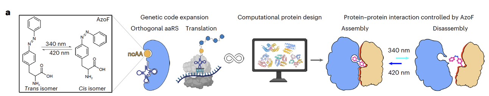
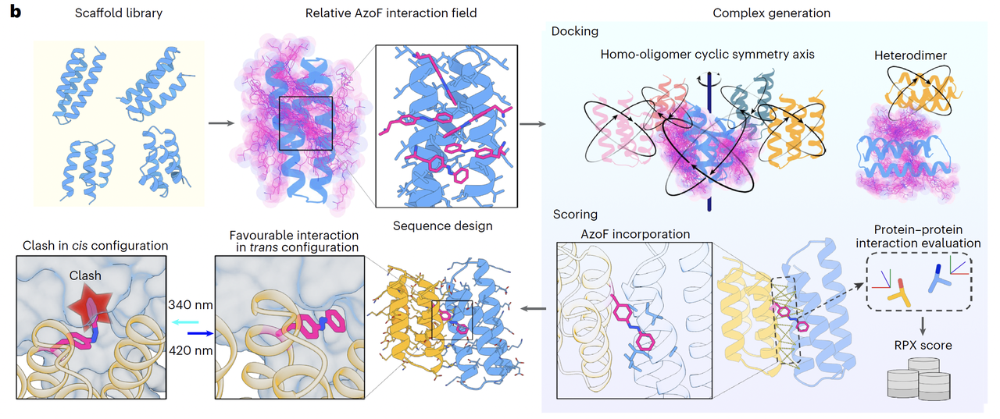
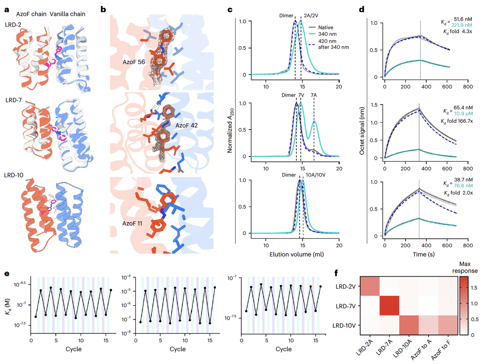
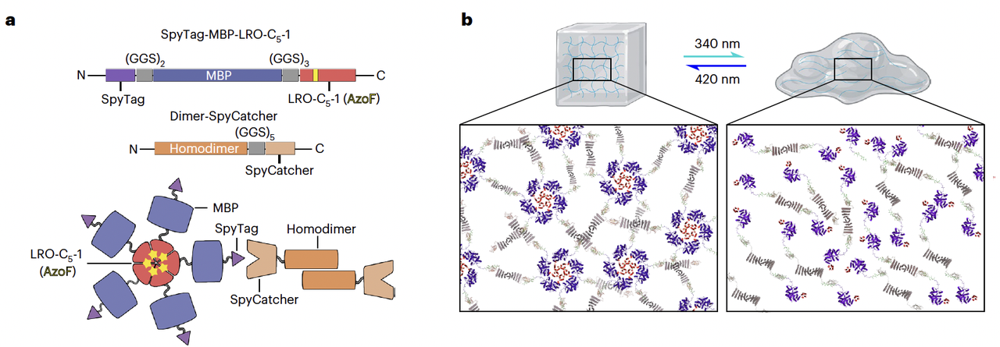
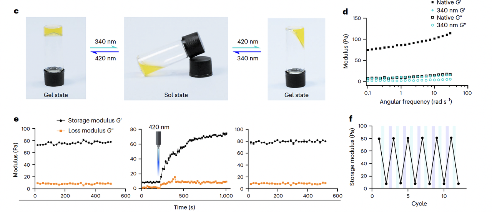
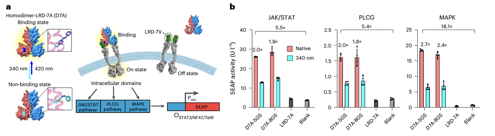

## **蓝极说：**

在生命世界里，光不仅仅是能量的来源，更是一种无处不在的信息信号。植物通过光来判断昼夜、季节；动物的视觉系统依赖光来感知环境；甚至细菌也能利用光来调控行为。支撑这一切的，就是 **光响应蛋白** ——它们能够感知光照，发生构象变化，并进一步触发一系列生命过程。

近年来，科学家们发现，如果能把光当作“开关”，用它来控制蛋白功能，就能实现对生命活动的 **精准、可逆、无创调节**。这也是光遗传学（optogenetics）兴起的根源。比如常用的 LOV 域、phytochrome，都已经成为光控工具箱里的明星分子。

但是，这些天然光受体有一个共性：**它们的架构和机制，受限于进化赋予的天然功能**。这意味着，如果我们想要设计出结构更小、更稳定，或者可以执行全新任务的光控蛋白，仅仅改造天然蛋白远远不够。

于是，问题来了：能否**从零开始（de novo）设计一种全新的光响应蛋白**，既能在特定光照下组装，又能在另一波长光照下解离？

这正是曹龙兴老师团队在刚发表（2025.08.28）在**Nature Chemistry**上的《**De novo design of light-responsive protein–protein interactions enables reversible formation of protein assemblies**》这篇文章中要回答的核心问题。

***

## **第二部分：设计策略（核心创新）**

如果说第一部分是提出问题，那么这一部分就是作者团队给出的“解题思路”。

> **关键词有三个：非天然氨基酸 AzoF、遗传密码扩展、计算机设计。**

首先，作者团队选择了一种“光开关”——**phenylalanine-4′-azobenzene（AzoF）**。

AzoF 的特别之处在于，它的分子里有一个 **偶氮苯基团**，在 340 nm 紫外光下会从稳定的 **trans 构象**翻转成 **cis 构象**，而在 420 nm 光照或加热时，又能恢复到 trans 状态。这就好比是一个分子级别的“开关按钮”。

接着，研究团队借助 **遗传密码扩展技术**，把 AzoF 精确地嵌入蛋白界面上。这样，蛋白的组装和解离就完全取决于 AzoF 的构象：

* **trans 构象**：AzoF 体积小巧，能与邻近残基形成紧密疏水作用，帮助蛋白界面“咬合”在一起；

* **cis 构象**：AzoF 变得弯折，产生空间冲突（steric clash），迫使蛋白界面解离。

最后，为了确保这一策略能够真正奏效，团队开发了一整套 **计算机辅助设计流程**（Fig. 1b）：

1. 先生成一批三、四螺旋束的蛋白骨架（scaffold）；

2. 再在界面位置尝试“植入”AzoF，并快速评估它在 trans 和 cis 构象下的能量与空间匹配情况；

3. 通过蒙特卡洛搜索 + Rosetta + ProteinMPNN 等工具，优化氨基酸序列，确保在 trans 下界面稳定，在 cis 下则产生强烈冲突。

这套流程有一个很巧妙的点：他们不是随意把 AzoF 放进去，而是 **在设计阶段就让 AzoF 的空间需求参与“筛选”**。这样保证最终的蛋白既能在暗态下稳固组装，又能在光照下可逆解离。

> 换句话说，**这是一次真正意义上的“分子开关内置化”设计**。

***

## **第三部分：从设计到验证（homo-oligomer 的成果）**

设计只是第一步，能不能真的工作，才是检验的关键。

曹龙兴老师团队首先把他们的方法应用在了 **环状同源寡聚体（cyclic homo-oligomers）** 上，包括二聚体（C2）、三聚体（C3）、四聚体（C4）和五聚体（C5）。

他们一共设计并测试了 200 多个构型，最后有十几个表现出了 **明显的光响应特性**。

最典型的例子包括：

* **LRO-C2-5（二聚体）**

* **LRO-C3-7（三聚体）**

* **LRO-C4-13（四聚体）**

* 这些蛋白在 340 nm 光照下能够几乎完全解离成单体，而再照射 420 nm 光，就能恢复到原本的寡聚状态。

* 这种“可逆组装 ↔ 解离”的效果，就像是一个分子级别的“呼吸循环”。

更令人惊艳的是，团队对这些设计的晶体结构进行了测定（Fig. 2a–b）。

结果发现：实验解析的结构和计算机模型几乎 **原子级别吻合**，Cα 的均方根偏差（r.m.s.d.）在 1\~1.5 Å 左右。这说明，不仅思路可行，**设计的精度也达到了非常高的水平**。

在生物物理层面，他们用 **SEC（凝胶过滤色谱）**&#x548C; **AUC（分析超速离心）**&#x8FDB;一步验证了光响应行为（Fig. 2c–d）：

* 在 trans 构象下，蛋白维持在设计好的多聚体状态；

* 在 cis 构象下，蛋白解离为单体；

* 重复光照循环依然能保持稳定的可逆性。

其中一个例子，**LRO-C5-1（五聚体）**，在解离后会部分聚成不规则的复合物。作者分析这是因为它的界面太疏水，解离后容易自发结合。但整体来说，这也揭示了 **设计界面疏水性与光响应效率之间的联系**。

> 总结来说，这部分验证了两个关键点：
>
> 1. **从头设计的光控蛋白是真的能工作**；
>
> 2. **设计模型与实际结构高度一致**，证明计算设计的可靠性。

***

## **第四部分：异源二聚体的突破（heterodimer）**

在生物学研究和合成生物学应用中，不同蛋白之间的 **特异性结合** 往往比同源寡聚更有用。比如，研究者常常需要在细胞内精确地把两个不同的功能模块拉到一起。

为此，曹龙兴老师团队将他们的策略扩展到了 **异源二聚体（heterodimer）** 的设计。

设计思路是这样的：

* 其中一条链携带 **AzoF（记作 LRD-XA）**，负责光响应；

* 另一条链则是普通氨基酸序列（记作 LRD-XV），提供配对界面。

* 这对组合就像“钥匙和锁”，但开锁与否完全取决于光照。

经过实验筛选，他们得到了几个表现优异的设计，例如 **LRD-2、LRD-7、LRD-10**。

实验结果显示（Fig. 3c）：

* 在暗态（trans 构象）下，异源二聚体结合紧密；

* 在 340 nm 光照后，二聚体迅速解离；

* 再用 420 nm 光，就能恢复原本的结合状态。

更关键的是，团队用 **生物层干涉技术（BLI）** 测量了亲和力（Fig. 3d–e）：

* 这些异源二聚体在暗态下亲和力高（纳摩尔级）；

* 光照后，亲和力下降最高可达 **167 倍（LRD-7）**；

* 这种变化完全可逆，可以在多轮光照循环中稳定重复。

晶体结构进一步证实了 AzoF 的关键作用（Fig. 3a–b）。

比如在 **LRD-7** 的结构中，偶氮苯的两个苯环甚至能在电子密度图中被清晰分辨出来，和设计模型高度吻合。

另外，团队还测试了特异性（Fig. 3f）：

* 每个 AzoF 链只与对应的 vanilla 链结合；

* 不会“串门”结合到其他设计。

* 这种“只认自己对象”的特性，使得这些光控异源二聚体 **堪比天然蛋白的特异性**。

总结来说，异源二聚体的设计展示了：

1. 光控作用可以精确调节两条不同链的相互作用；

2. 结合力的光控调节幅度可以达到两位数以上；

3. 特异性媲美天然蛋白，为未来的细胞内应用打下了基础。

***

## **第五部分：应用展示（从材料到细胞信号）**

到这里，前面几部分已经证明：

* 光控蛋白可以从头设计出来；

* 它们不仅能组装/解离，还能做到异源二聚体的特异性。

那么，这些分子“开关”能做些什么？

团队给出了两个非常直观的应用展示：**材料工程（光控水凝胶）** 和 **细胞信号调控（光控受体系统）**。

***

1. **光控水凝胶 ——“固 ↔ 液”的可逆切换**

研究团队用 **五聚体 LRO-C5-1** 作为关键构件，通过 SpyTag/SpyCatcher 技术把它和一个同源二聚体交联，构建成蛋白质水凝胶（Fig. 4a–b）。

实验现象非常直观（Fig. 4c）：

* 在 340 nm 光下，五聚体解离，凝胶塌陷成液体；

* 在 420 nm 光下，五聚体重组，液体又迅速恢复成凝胶。

流变学测试（Fig. 4d–f）进一步证明，这个水凝胶的机械性能可以被光照可逆调节，至少能稳定循环 12 次以上。

这意味着研究者们可以用光来控制材料的 **流动性和硬度**，非常适合在 **药物释放、组织工程** 等领域应用。

***

* **光控受体系统 ——精准操纵细胞信号**

在合成生物学中，如果能用光来控制细胞信号通路，就能实现对细胞行为的时空精准调控。

作者团队基于他们设计的 **异源二聚体 LRD-7**，构建了一个合成的 **配体–受体对**（Fig. 5a）：

* 把 “vanilla 链” 融合到 GEMS（Generalized Extracellular Molecule Sensor）受体的胞外部分；

* 把 “AzoF 链” 设计成二聚化配体。

实验结果非常亮眼（Fig. 5b–e）：

* 在暗态下，配体能触发受体二聚化，激活下游 **JAK/STAT、MAPK、PLCG** 等信号通路；

* 在 340 nm 光下，配体解离，信号关闭；

* 再用 420 nm 光，就能恢复信号；

* 甚至还能精确控制 **信号恢复的时间点**，真正实现了“分子开关”对细胞命运的操纵。

***

### **小结**

通过这两个例子，作者团队展示了 **从材料到细胞的跨层次应用潜力**：

* 光控水凝胶，证明了这种设计能用于生物材料与医用材料；

* 光控受体系统，展示了其在合成生物学和光遗传学中的应用前景。

***

## **第六部分：总结与展望**

这篇工作展示了一条完整的路线：

* 从零开始，借助计算设计与遗传密码扩展，把 **光响应的非天然氨基酸 AzoF** 精确嵌入蛋白界面；

* 实现了 **可逆的、可控的蛋白组装与解离**；

* 验证了同源寡聚体和异源二聚体两种构型，晶体结构与设计几乎原子级吻合；

* 进一步展示了在 **材料（光控水凝胶）** 和 **合成生物学（光控受体信号）** 中的实际应用。

这项研究的意义在于，它不仅仅是“多了一个光控蛋白”，而是提出了一种 **新的设计范式**：

> 在分子设计阶段就内置一个可控的“光开关”。

这与过去改造天然光受体的方式完全不同，它为未来打开了更广阔的想象空间。

展望未来，有几个方向尤其值得期待：

1. **扩展非天然氨基酸的种类**：不仅限于 AzoF，还可以设计对金属离子、pH、甚至其他小分子敏感的“开关”。

2. **优化光谱特性**：通过化学修饰偶氮苯，可以拓展到红光、近红外光等波长，更加适合深层组织应用。

3. **构建复杂的分子机器**：将这种光控开关嵌入到更大规模的蛋白复合体中，或许能实现真正意义上的 **光驱动纳米机械**。

> **蓝极总结：**
>
> 这篇文章不仅解决了一个长期存在的挑战（如何从头设计光响应蛋白），还为 **光控生物学、合成生物学和生物材料学** 打开了新的大门。

