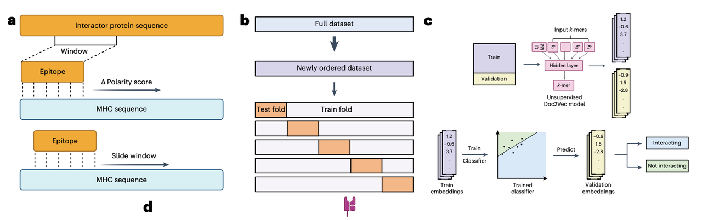
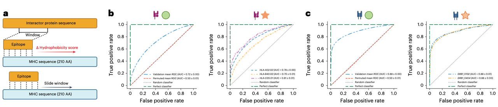
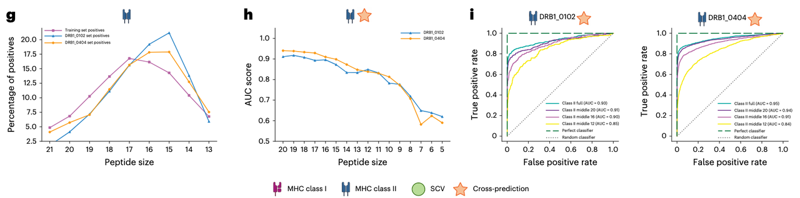
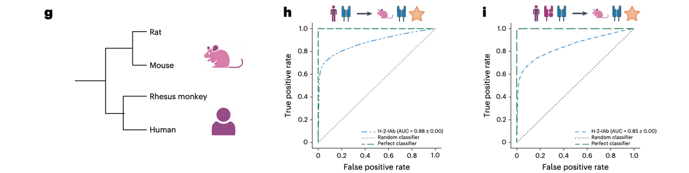
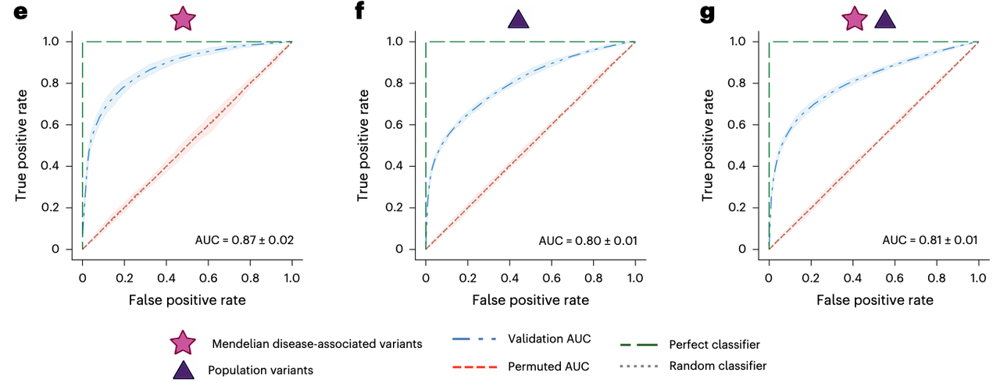
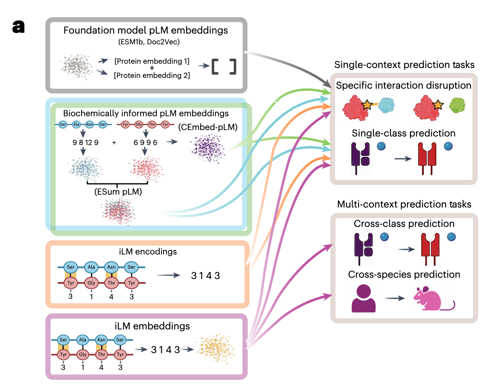

今天要和大家分享一篇刚刚发表在 *Nature Methods*（2025 年 8 月）的重磅工作——**Sliding Window Interaction Grammar (SWING)**。

这是由匹兹堡大学团队提出的一种全新**蛋白–蛋白/蛋白–肽段互作语言模型**，它不仅在免疫学核心任务——pMHC 结合预测中表现出色，还展现了跨等位基因、跨 MHC 类别、跨物种的惊人泛化能力，甚至能识别氨基酸变异导致的特异性互作破坏。

为什么值得关注？

* **方法创新**：它并没有依赖更深更复杂的网络，而是换了一个“视角”——先用生化差异把互作编码成一种“语言”，再让模型去学。

* **应用广度**：从疫苗设计、疾病表位预测，到蛋白互作网络中的变异致病机制研究，都有直接落地价值。

* **泛化能力**：在完全零样本的场景下（未见等位基因、跨 MHC 类别、跨物种），依然保持高精度，这对蛋白设计与免疫组学来说是非常罕见的能力。

接下来，我们就结合文章配图，一步步拆解 SWING 是如何从“氨基酸序列”读懂“蛋白对话”，并在多个领域实现全能预测的。

***

### 1. **引言：为什么需要新的“蛋白互作语言模型”**

在蛋白质科学里，我们常说“结构决定功能”，但更准确的说法可能是“互作决定功能”(虽然结构决定互作）。绝大多数蛋白并不是孤立发挥作用，而是依赖与其他蛋白或肽段的精确结合。然而，即便有了 AlphaFold 这样的结构预测神器，现有的**蛋白语言模型（protein language models, pLMs）**&#x5728;“读懂”蛋白互作上依然存在短板。

**为什么？**

答案如下图所示：

* 传统 pLM 通常会分别对两条蛋白序列做 embedding（序列编码），然后把结果拼在一起预测互作可能性。

* 问题是，这样的编码方式忽略了真正发生结合的局部残基（residue contact points），相当于把两篇文章直接合并，而不去关注它们交互的那几句对话。

* 结果是模型能捕捉到单条序列的特征，却对互作的“语法”理解不深。

这篇文章提出了一个全新的思路：

**把蛋白互作当作一种语言，把每一次残基配对当作一个“单词”，用滑动窗口的方式读出整段“对话”。**

这个模型被作者命名为 **Sliding Window Interaction Grammar（SWING）**——字面意思就是“滑动窗口交互语法”。它的核心创新是直接在 embedding 前，把两条序列的配对信息转换成一个“生化词汇表”（interaction vocabulary），再交给语言模型去学习。

换句话说，如果说传统 pLM 是在学习“蛋白的自我独白”，那么 SWING 学的是“蛋白之间的对话脚本”。

***

### 2. **SWING 核心机制拆解——从生化差异到交互语法**

SWING 的核心思想是：**在建模前，将两条互作序列的局部配对信息编码为“交互语言”，再让语言模型去学习其统计规律。** 这一点在 **Fig. 1b–d** 中有清晰展示。

**（1）滑动窗口匹配（Sliding Window）**

* 设定一个窗口长度 *n*（例如与肽段长度相同），将该窗口依次滑动匹配到互作伙伴的每一个可能位置。

* 在每个位置，对窗口内的氨基酸逐一配对，计算它们在某一生化尺度上的差异（如极性、疏水性等）。

* 得到的差异值是绝对值，经离散化（rounding + ordinal encoding）后，形成一个整数序列——这就是“交互语言”的基础符号。

**（2）生成 k-mer 词汇（Vocabulary Generation）**

* 将上述整数序列进一步分割成长度为 *k* 的重叠子序列（k-mers），每个 k-mer 对应一个“词（word）”，而整段滑动窗口配对结果就像是一篇“文档（document）”。

* 在 SWING 的语境中，每一次蛋白-蛋白或肽-蛋白互作就是一篇文档，k-mers 则是文档的词汇。

**（3）Doc2Vec 嵌入（Embedding）**

* 这些“交互文档”被输入到 **Doc2Vec** 架构中（Fig. 1c），生成固定维度的向量表示（interaction embedding）。

* 与直接用 pLM 对单条序列编码不同，这里的 embedding 是对**配对关系本身**进行建模，不再依赖对每条序列独立建模的结果。

**（4）下游分类（Supervised Learning）**

* 嵌入向量被输入到一个监督学习模型（文中使用 **XGBoost**）进行任务预测，如 pMHC 结合预测、变异致病机制解析等。

* 这种分离式架构的好处是，Doc2Vec 提供的交互嵌入具有高度的任务泛化能力，可以被任意分类器复用。

**（5）关键创新（Fig. 1d）**

* **长度无关性（length-agnostic）**：不受序列长度限制，适用于跨物种和不同 MHC 类别。

* **跨上下文泛化（cross-context generalization）**：能在 Class I 与 Class II pMHC、甚至跨物种任务中保持高预测性能。

* **无依赖特定等位基因训练集（allele-independent）**：相比依赖等位基因特异性实验数据的方法，SWING 能对未见过的等位基因直接推断。

用更形象的比喻来说，传统方法是在“各说各话”后再猜测两个人会不会合作，而 SWING 则是**直接分析他们在每一次眼神、每一句对话中的化学反应**，从而精确建模互作模式。

***

### 3. **pMHC 预测能力：从 Class I 到 Class II 再到跨类迁移**

#### **3.1 从已知到未知：泛化能力验证**

在 **Fig. 2b–g** 中，作者首先在 **人类 MHC Class I 数据集**上评估 SWING。

* **标准交叉验证（SCV）**：训练集与测试集共享部分等位基因，但 pMHC 配对不重叠。SWING 在这一设置下的 AUC 为 **0.72**（P < 0.001），显著高于随机水平（Fig. 2e）。

* **跨预测（Cross-prediction）**：训练集与测试集的等位基因完全不同，模拟真实“零样本”推断场景。SWING 依然在功能上差异较大的未见等位基因（如 HLA-A32:01、HLA-B38:01、HLA-C03:03）上取得 **0.63–0.70** 的 AUC（Fig. 2g）。

相似实验在 **Class II** 中重复（Fig. 2h–j），AUC 更高：

* SCV 下为 **0.90**（P < 0.001）

* 未见 Class II 等位基因（DRB1\_0102、DRB1\_0404）上依旧保持 **0.93–0.95**

这说明 SWING 学到的是跨等位基因的“互作语法”，而不是死记某个特定 HLA 的结合模式。

***

#### **3.2 生化尺度的可替换性**

在 **Fig. 3a–c**，作者将编码时的生化指标从**极性（polarity）替换为疏水性（hydrophobicity）**，结果性能几乎不变（Class I: 0.72 → 0.72，Class II: 0.90 → 0.88）。

这表明 SWING 对生化指标具有鲁棒性，本质上是在学习相对生化差异的模式，而非依赖某个特定物理量。

***

#### **3.3 免疫学机制的生物学解释**

**Fig. 3g–i** 给出了一个重要的免疫学验证：

* 对于 Class II，肽段的 **9-AA 核心**决定结合特异性，其两端的延伸区域（flanking residues）也会影响结合稳定性。

* 当作者逐步截短肽段（从 21 AA 到 5 AA），AUC 在长度低于 9 AA 时出现明显断崖式下降（Fig. 3h）。

* 这说明 SWING **自动学会了核心区的决定性作用**，而不是依赖人工定义的 motif。

这种“数据驱动学到免疫规则”的特性，使 SWING 有潜力在没有结构信息的情况下，推断未知等位基因或异常长度肽段的结合能力。

***

### 4. **Zero-shot 与跨领域泛化**

SWING 不仅能在单一 MHC 类别内部泛化，还展现了**跨类别（Class I ↔ Class II）**、\*\*跨物种（人 ↔ 小鼠）\*\*的零样本预测能力。这一部分在 **Fig. 4a–i** 中有系统展示。

***

#### **4.1 Class I 模型预测 Class II（跨类别零样本）**

* **结构挑战**：Class I 和 Class II MHC 的肽结合槽（binding groove）结构显著不同（Fig. 4a），前者两端封闭、限制肽长（8–12 AA），后者两端开放、允许更长肽段（14–25 AA）。

* **零样本结果**：即便如此，**只用 Class I 数据训练的 SWING 模型**，在预测 Class II pMHC 时依然有 **AUC = 0.74–0.77**（Fig. 4b）。

* 对比：NetMHCpan（Class I 模型）在该任务上接近随机，而 SWING 保持稳定预测性能（Fig. 4c）。这说明 SWING 嵌入捕捉到的是**互作共性**，而非单一类别特征。

***

#### **4.2 混合模型的联合预测能力**

* 作者训练了一个 **混合模型**（Class I + Class II 数据同时训练），用于预测两类任务（Fig. 4d–f）。

* 结果显示，该模型在 Class I（AUC = 0.70–0.83）和 Class II（AUC = 0.88–0.93）上的表现，与单类别模型持平甚至更优。

* 这对于需要同时分析 CD8+（Class I）与 CD4+（Class II）免疫应答的研究场景尤为重要，例如综合性疫苗设计或免疫病理机制研究。

***

#### **4.3 跨物种泛化（人类模型 → 小鼠）**

* 人和小鼠的 MHC（HLA vs. H-2）在序列和结构上均有显著差异（Fig. 4g），这对于大多数基于 motif 的方法来说是巨大挑战。

* **零样本结果**：

  * 人类 Class II 模型预测小鼠 Class II（H-2-IAb）时，AUC = 0.88（Fig. 4h）

  * 混合模型预测同一任务，AUC = 0.85（Fig. 4i）

* 这一跨物种能力意味着，SWING 训练集可以完全基于人类数据，却能直接迁移到动物模型中进行免疫预测，大幅减少实验需求。

***

#### **4.4 疾病相关应用案例：SLE 与 T1D**

* **系统性红斑狼疮（SLE）**：小鼠 H-2-IEk 等位基因与狼疮性肾炎相关。SWING 在零样本条件下预测已知免疫渗透肽组（immunopeptidome），在各肽长上 recall 均优于 MixMHC2pred 和 NetMHCIIpan（Fig. 4j）。

* **1 型糖尿病（T1D）**：小鼠 H-2-IAg7（人类 HLA-DQ8 同源物）是高风险等位基因。SWING 未经该等位基因训练即可达到最高准确率（Fig. 4k），且对肽长无偏倚（Fig. 4l）。

***

这一部分的结果说明，SWING 不仅是一个“特定任务高性能”模型，更是一个具备**跨类别、跨物种、跨等位基因的统一互作语言框架**。它的嵌入向量包含了互作的生化本质，因此在缺乏针对性数据的情形下，依然能做出可靠预测。

***

### 5. **从免疫预测到变异致病机制解析**

除了 pMHC 预测，SWING 还被扩展到**预测氨基酸变异（missense mutation）是否破坏特定蛋白互作**这一更普适的任务。这一功能在 **Fig. 5a–l** 中有详细展示。

***

#### **5.1 现有方法的局限**

* 主流的变异效应预测（Variant Effect Prediction, VEP）工具，如 **AlphaMissense（AM）**、**EVE**、**ESM1b**，更多关注**蛋白整体功能或致病性**（organism-level pathogenicity），而非互作层面的特异性破坏（interaction-specific disruption）。

* 这些方法在区分**结合界面变异**与**非结合界面变异**时表现良好（Fig. 5a），但在预测**是否破坏特定 PPI**时，性能显著下降（Fig. 5b–c）。

***

#### **5.2 SWING 的适配与训练策略**

* 在互作预测中，SWING 将滑动窗口对准**包含变异的局部片段**，与互作伙伴的序列进行生化差异编码（Fig. 5d）。

* 每个变异样本同时包含其野生型（wild-type）版本作为“未破坏互作”对照，从而让模型学习破坏性与非破坏性模式的差异。

***

#### **5.3 性能评估**

* **孟德尔病相关变异**（Mendelian mutations）：AUC = **0.87**（P < 0.0001）（Fig. 5e）

* **人群常见与罕见变异**（population variants）：AUC = **0.80**（P < 0.0001）（Fig. 5f）

* **混合数据集**（来源无关）：AUC = **0.81**（P < 0.0001）（Fig. 5g）

* 模型在\*\*跨序列簇（cluster hold-out）\*\*验证中依旧保持 AUC \~0.71（Fig. 5i），说明没有过拟合到特定序列背景。

相比之下，AM、EVE、ESM1b 在相同任务中表现显著逊色（Fig. 5j）。

***

#### **5.4 生物学解释与案例分析**

作者展示了两个 SWING 预测的**互作破坏变异**实例（Fig. 5l）：

1. **PRKCH–BANP**：

   * 变异 rs2230500（Val374Ile）位于 PRKCH ATP 结合位点，同时也是 BANP 结合界面的一部分。

   * 该变异已知与类风湿关节炎及脑小血管病相关，可能通过改变自磷酸化水平及与 TP53 的间接互作，影响细胞增殖与肿瘤抑制通路。

2. **HPX–GLUD1**：

   * 变异 rs12117（Arg83Trp）位于 HPX 远离结合界面的区域，但 AlphaFold3 建模显示其导致构象变化，进而影响与 GLUD1 的结合。

   * AM 将其预测为良性，而 SWING 能识别出该种“远距构象效应”。

***

这一部分的意义在于，SWING 从免疫学的 pMHC 特殊互作场景，扩展到了**全局蛋白互作网络的变异致病机制预测**。它不仅能识别直接界面破坏，还能捕捉到通过构象变化导致的远程效应。

***

### 6. **与其他建模方法的全面对比**

为了验证 SWING 框架在不同任务和泛化场景下的优势，作者将其与多种主流互作建模方法进行了系统对比（**Fig. 6a–i**）。

***

#### **6.1 对比模型类型（Fig. 6a）**

* **基于 pLM 的方法**：

  * *ESM1b-embedding*（直接取预训练 pLM 的蛋白嵌入）

  * *CEmbed-pLM / ESum-pLM*（将配对序列的嵌入进行拼接或求和）

* **交互语言模型（iLM）变体**：

  * *CNN-iLM*：用卷积神经网络直接学习交互语言

  * *SWING-iLM*：本文提出的方法，基于 Doc2Vec 对交互语言建模

***

#### **6.2 在互作破坏预测任务中的表现（Fig. 6b）**

* 在“混合变异数据集（Mendelian + population）”的**标准交叉验证（SCV）**&#x8BBE;置中：

  * SWING-iLM AUC ≈ **0.81**，优于 CNN-iLM（\~0.77）和所有 pLM 基础方法（多数低于 0.75）

  * 随机分类器基线仅 0.5

* 这表明 SWING 对互作特异性模式的捕捉能力更强，而不是依赖单个序列特征。

***

#### **6.3 在 MHC 结合预测中的跨等位基因泛化（Fig. 6c–i）**

在多个 **cross-prediction** 场景下，SWING-iLM  consistently 领先：

* **混合等位基因模型 → 未见 Class II 等位基因**（Fig. 6d）：SWING \~0.93，高于 CNN-iLM (\~0.90) 和 pLM 方法（\~0.85）

* **混合等位基因模型 → 未见 Class I 等位基因**（Fig. 6e）：SWING \~0.82，对比 CNN-iLM (\~0.79)

* **Class I 模型 → 未见 Class II 等位基因 DRB1\_0102 / DRB1\_0404**（Fig. 6f–g）：SWING 分别保持 \~0.74 和 \~0.77

* **混合等位基因模型 → 小鼠等位基因 H-2-IEk / H-2-IAg7**（Fig. 6h–i）：SWING 分别达 0.84 和 0.91，明显优于其他方法（大部分低于 0.8）

***

#### **6.4 核心优势总结**

1. **生化差异驱动**：编码直接来自氨基酸理化性质差异，不依赖特定结构或 motif 数据。

2. **上下文无关性**：可在跨类别、跨物种的零样本场景中保持高性能。

3. **任务泛化性**：同一嵌入可复用在免疫预测、PPI 破坏预测等完全不同的任务上。

4. **长度无关性**：不受输入序列长度限制，适应各种互作尺度。

***

这部分的对比结果强调了一个结论：**SWING 不是在单一任务上“调优”出来的，而是一个可泛化到多类互作任务的统一框架**。

***

### 7. **总结与前景**

SWING（Sliding Window Interaction Grammar）通过一种全新的“交互语言”视角，将蛋白–蛋白及蛋白–肽段互作建模提升到新的高度。它的核心创新不在于更深的神经网络，而在于**如何在建模前就把互作信息转化为语言结构**：

* **方法论创新**：滑动窗口提取互作片段 → 生化差异编码 → k-mer 词汇化 → Doc2Vec 嵌入 → 下游预测

* **性能表现**：在 pMHC 结合预测中，SWING 能跨等位基因、跨类别（Class I ↔ Class II）、跨物种（人 ↔ 小鼠）实现零样本泛化

* **任务拓展**：不仅限于免疫学，在预测氨基酸变异导致的特定互作破坏上，SWING 也优于现有主流 VEP 工具

* **对比优势**：在多种 cross-prediction 场景下，SWING consistently 高于 CNN-iLM 及基于 pLM 的嵌入方法

**未来潜力**：

* **免疫学应用**：可辅助疫苗设计、稀有 MHC 等位基因免疫应答预测，以及疾病相关免疫表位的快速筛选

* **药物研发**：用于小分子–蛋白、抗体–抗原等互作的亲和力预测，缩短早期筛选周期

* **结构未知互作推断**：在缺乏高分辨率结构数据的情况下，利用序列级互作语言实现快速推断

* **大规模互作网络解析**：在系统生物学层面，帮助识别关键互作节点和致病变异靶点

一句话总结：

**SWING 不是一个“针对某个问题的专用模型”，而是一个能跨任务、跨类别、跨物种的通用互作语言框架**。它为蛋白质设计与功能预测提供了新的思路——先理解“对话”，再设计“角色”。

原文链接：https://doi.org/10.1038/s41592-025-02723-1
