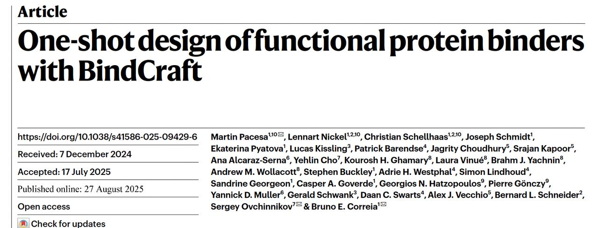
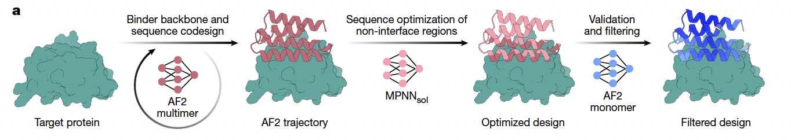
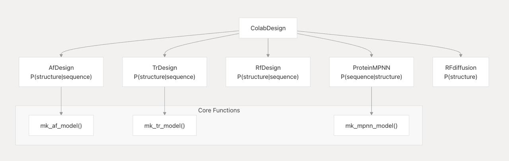

在药物开发领域，以原子级精度“命中”正确靶点从而实现治疗效果，依然是核心挑战。传统的研发流程往往依赖资源密集型的实验筛选，命中率却低得可怜。而越来越多的生物技术公司认为，**AI 引导的发现**，能够在计算机中提前锁定最佳候选分子，是缩短研发周期、节省成本的关键。

来自洛桑联邦理工学院（EPFL）的博士后 **Martin Pacesa** 专注于开发此类计算流程，从零开始设计全新的功能性蛋白。在传统方法里，这类设计的成功率往往不到 1%。他的愿景是打造一款 **“一键式”工具**，让没有计算背景的生物化学实验室研究人员也能轻松使用。

在 2024 年 10 月发布于 bioRxiv 的预印本中（我也解读过这篇文章），Pacesa 和 EPFL 的同事们推出了 **BindCraft**——一个全自动的去 novo 蛋白 binder 设计流程，成功率从过去的个位数提高到 **10–100%**，且能获得纳摩尔亲和力，而不需要高通量筛选或实验优化。与此同时，该模型以 **MIT 开源许可**发布，允许商业使用。

如今，这项工作已正式发表在 *Nature*，题为《**One-shot design of functional protein binders with BindCraft**》。论文第一作者为 Pacesa，通讯作者包括麻省理工学院的 **Sergey Ovchinnikov** 与 EPFL 的 **Bruno Correia**。

过去，设计一个能结合的蛋白需要成千上万次筛选；今天，BindCraft 把“**一次一设计**”的梦想拉近了。

今天我就少讲细节，多聊聊为什么BindCraft值得关注。

🔗原文链接：https://www.nature.com/articles/s41586-025-09429-6

***

> 详细信息请查看之前的推送，本文只对文章内容做简单介绍：

## **“一次成型”的设计**

### 方法概述：

&#x20;**BindCraft**是一个基于深度学习的自动化蛋白 binder 设计流程。核心思路是：

* **反向传播 AlphaFold2 网络**（AF2 hallucination）：直接在 AF2 模型里通过误差反向传播优化 binder 序列，让它与靶蛋白形成高质量结合界面。

* **多步优化与过滤**：

  * 初始设计用 **AF2 multimer** 生成候选 binder–target 复合物。

  * 用 **ProteinMPNNsol** 优化 binder 内部序列（保证折叠稳定性），同时保持界面不变。

  * 用 **AF2 monomer** 再预测，避免 multimer 过拟合，并通过 AF2 置信度指标与 Rosetta 打分过滤。

* 整个流程自动化，只需输入靶点结构，就能生成候选 binder，无需大规模实验筛选。

### **实验设计与验证**

作者在 **12 个具有挑战性的靶点** 上测试了 BindCraft，覆盖免疫受体、过敏原、核酸酶和人工设计蛋白。主要实验包括：

1. **免疫相关受体**

   * PD-1、PD-L1、IFNAR2、CD45。

   * 多个 binder 在表面等离子共振（SPR）或生物层干涉（BLI）中表现出纳摩尔级亲和力。

   * 通过竞争实验验证与天然配体/抗体结合位点的重叠。

* **膜蛋白与毒素**

  * 针对 Claudin-1 设计 binder，能竞争性阻断肠毒素 CpE 的结合，从而保护细胞免受毒性。

* **人工蛋白与高阶装配**

  * 针对去 novo 设计的 β-barrel (BBF-14) 和 centriole 相关蛋白 SAS-6，成功得到可结合的 binder，并通过晶体学或比对验证结构精度。

* **过敏原**

  * 对尘螨过敏原 Der f7、Der f21 和桦树花粉过敏原 Bet v1 设计 binder。

  * 得到的 binder 在晶体学中验证结合模式，并能在患者血清实验中部分阻断 IgE 结合。

* **核酸结合酶**

  * 针对 Cas9 REC1 区域设计 binder，表现出类似 anti-CRISPR 蛋白的功能，能降低 Cas9 编辑效率。

  * 针对 Argonaute (CbAgo) 设计 binder，部分抑制其 DNA 切割活性。

* **AAV 衍生病毒载体**

  * 在 AAV 衣壳蛋白上插入 binder，实现对 PD-L1 和 HER2 的定向转导。

  * 细胞实验表明，这些重新编程的 AAV 能特异性进入表达相应受体的细胞。

### **实验结果**

* 在所有 12 个靶点上都能设计出结合蛋白，成功率 **10–100%**。

* 多数 binder 的亲和力在 **纳摩尔级别**。

* 部分设计通过 **晶体学或冷冻电镜** 直接验证结构精度，r.m.s.d. 在 1–3 Å 范围内。

* 应用示范从 **免疫检查点调控** 到 **过敏原中和**，再到 **Cas9 抑制** 和 **病毒载体定向递送**，覆盖了科研和治疗多个方向。

> 该模型展示了“**一次成型（one-shot）**”的能力：只需少量设计（不超过 10 个），就能得到纳摩尔范围的高亲和力 binder。

宾夕法尼亚大学生物工程系助理教授 **Pranam Chatterjee** 表示，BindCraft 在该领域展现出极具前景的潜力：

> “数据涵盖的靶点非常多样，结果非常有说服力。BindCraft 足够简洁，几乎是‘开箱即用’，命中率却很高。”

Chatterjee 以“序列驱动”的蛋白设计方法著称，最近还发表了 **PepMLM**，这是一种蛋白语言模型，可以在无结构输入的情况下，设计长度达 50 个氨基酸的多肽，用于结合与亨廷顿病、病毒感染、白血病等相关的靶点，非常适合药物开发。

自 BindCraft 发布以来，Pacesa 表示，社区反馈“**极其热烈**”。Merck、Roche、Novo Nordisk、Novartis、AstraZeneca 等跨国药企，以及更多中小型公司都已采纳 BindCraft；学术界也将其扩展到高亲和力多肽的设计。

***

## **我看到的几个亮点**

1. **从“筛选”到“生成”的转折**

过去的 binder 设计都离不开 **高通量筛选**：做几千个、几万个，再从里面挑 hits。BindCraft 展示的是“**one design-one binder**”的雏形，通过严格的计算指标筛选，减少实验试错环节。

这一点如果未来成熟，会极大降低新药发现的门槛。

* **实战成绩已被验证**

BindCraft 在之前的 **EGFR binder 社区竞赛中的Round1拿到第一名**，已经证明了它不仅是个漂亮的理论，而是真能在真实的设计任务里产出高质量的 binder。

* **来自 ColabDesign 的延伸**

它的核心思路，其实是基于 Sergey Ovchinnikov 之前提出的 **ColabDesign hallucination 方法**。BindCraft 把这个思路进一步扩展，把 binder 的生成流程彻底自动化：结构、序列、界面同时生成。

这不仅降低了使用门槛，还让实验成功率显著提升。

* **应用面之广，超出预期**

作者不仅在免疫受体、过敏原上做了示范，还把 Cas9 当作“新型 Acr”去抑制，还试了 AAV 的靶向递送。

这说明 BindCraft **不是单点突破，而是真正的平台型工具**。

* **生态价值突出**

* **开源生态**：代码、流程全都对学界开放，降低了社区使用门槛。

* **产业生态**：据我了解，Merck、Roche、AZ 等国际药企已经把 BindCraft 纳入自己的工具箱，说明它在产业界也很快得到了认可。

* **领域地位的确立**

在预印本阶段，很多人觉得这只是 AF2-hallucination 的一个变体。但 Nature 的接收，意味着它已经被看作是 **新一代 binder 设计的代表作**。

这也让 BindCraft 和 RFdiffusion、AlphaProteo 等 pipeline 形成了新的格局。

***

## **也要看到的挑战**

* **计算成本高**：反向传播 AF2 很吃 GPU。

* **AF2 的局限**：对点突变不敏感，界面精度可能有盲区。

* **应用转化难点**：binder 尺寸偏大（60–240 aa），在体内的免疫原性和递送问题仍需解决。

> 换句话说，BindCraft 并不是“一键即用的药物工厂”，但它让我们看到了这种可能性。

***

## **小结**

BindCraft 的意义在于，它第一次让我们认真相信：**蛋白 binder 真的可以做到“设计即所得”**。

凭借自动化流程、开源精神和产业落地，它很可能会成为未来实验室和药企的常规工具。

当然，真正走向临床还有距离，但这不妨碍它成为 **binder 设计新范式的里程碑**。
