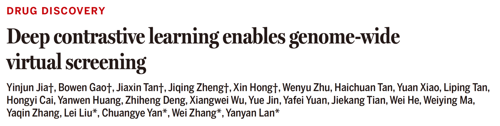
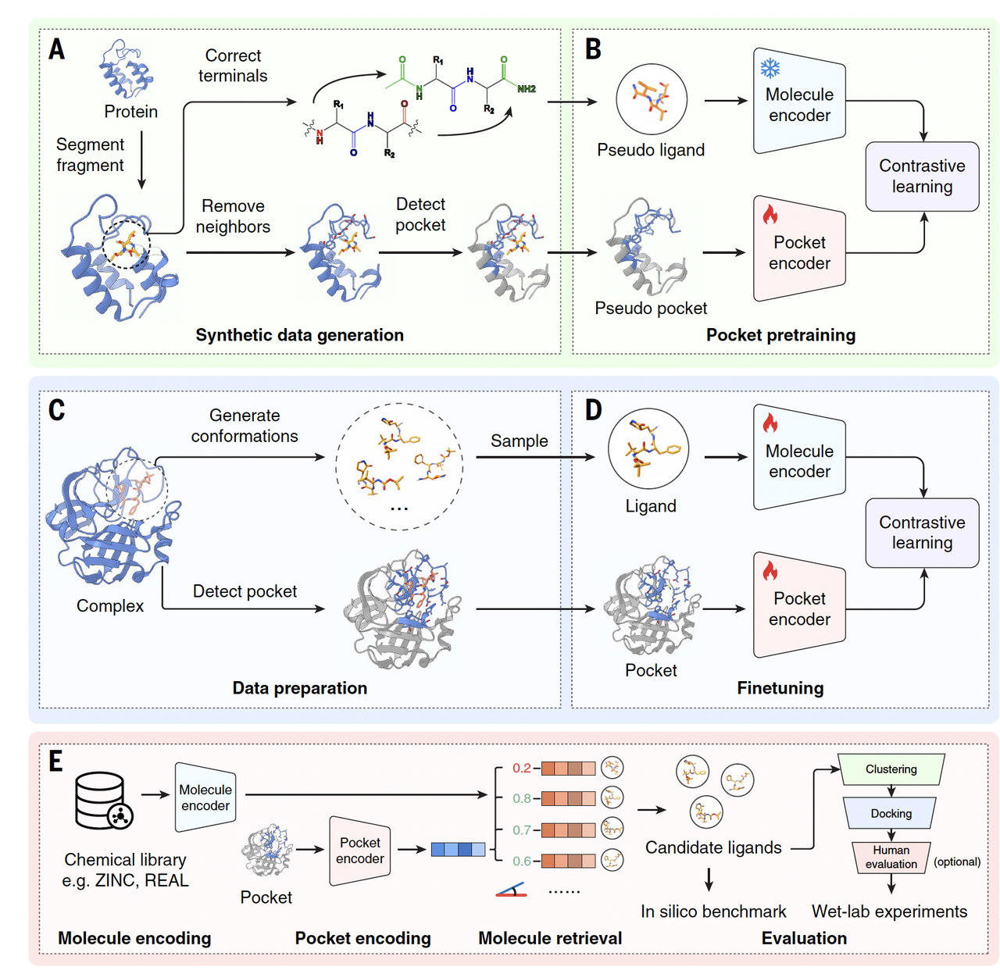

今天给大家介绍一篇清华大学智能产业研究院（AIR）的**兰艳艳老师**组联合清华大学生命学院**闫创业老师**、**张伟老师**和清华大学化学系**刘磊老师**刚发表在《Science》上的文章，他们主要解决的&#x662F;**基因组级别小分子筛选**&#x7684;难题。

这篇文章本质上回答了这样一个问题：**当我们真的想把小分子筛药做到“全基因组尺度”时，现有的方法还够不够用？**

他们给出的答案并不复杂，也不炫技，但解决的是一个长期被“**算力**”和“**规模**”卡住的核心瓶颈。这也是我觉得这篇文章值得单独拿出来讲一讲的原因。

原文链接：https://doi.org/10.1126/science.ads9530

***

### **第一部分｜当“小分子筛药”真的走到基因组尺度**

长期以来，给蛋白找小分子配体这件事，几乎都是“逐靶点”进行的。

选一个蛋白，准备一个化合物库，跑一轮筛选，然后再换下一个靶点。

传统的小分子筛药流程

问题不在于方法，而在于尺度。

一旦把问题放到“全基因组”这个层面——成千上万的蛋白，配上百万、甚至上亿级别的小分子——传统的虚拟筛选流程就很快失去现实可行性。

所以在很长一段时间里，“基因组级别筛药”更多是一种设想：

**我们知道它重要，但很少有人真的把它当成一个能跑起来的工程问题。**

这篇文章做的事情，恰恰是在正面回答这个问题：

**如果不再按“一个靶点一套流程”的思路来做，而是从一开始就以全基因组为目标，筛药这件事能不能被系统地做出来？**

接下来他们给出的，不是一个局部优化方案，而是一整套为“规模”而设计的思路。

***

### **第二部分｜用对比学习重写“筛药”这件事**

为了把小分子筛选推到基因组尺度，这篇文章并没有简单地加速传统流程，而是**从建模方式上换了一种思路**。

他们的核心做法，是引入**对比学习（contrastive learning）**，来学习蛋白口袋和小分子之间的匹配关系。

在这个框架里，问题不再是“这个小分子摆成什么姿势能不能 dock 进去”，

而是被重新表述为：**哪些蛋白–小分子对是应该被拉近的，哪些是应该被区分开的**。

模型通过大量正负样本的对比，学习一个联合表示空间：

匹配的蛋白口袋和小分子在这个空间里距离更近，不匹配的则被推得更远。

*DrugCLIP模型模型架构*

这一步看似只是模型训练方式的变化，但对整个问题的尺度影响非常大。

一旦这种“**是否匹配**”的关系被编码进表示空间，后续筛选就不再依赖复杂的构象搜索和能量计算，而可以**通过高效的向量计算来完成。**

也正是因为这种建模方式，作者才能把问题从“一个靶点一次筛选”，推进&#x5230;**“在全基因组范围内同时考虑成千上万个蛋白”**。

这一步，是整篇文章能够成立的技术基础。

***

### **第三部分｜不仅能跑得动，也筛得出东西**

把筛选做到基因组尺度，速度只是前提。

真正关键的是：**这种方法筛出来的结果，能不能经得起实验验证。**

作者在这里给出了两个层次不同、但互相补充的实验案例。

第一个是 **TRIP12**。

这是一个并不“友好”的靶点：缺乏已解析的复合物结构，也几乎没有已知的小分子配体。作者直接使用 **AlphaFold 预测结构**来定义结合口袋，并在此基础上进行筛选。

最终的实验结果显示，在筛选得到的候选分子中，**命中率达到 17.5%**。

在“没 holo 结构、没先例”的前提下，这个结果本身就说明，这套方法筛出的并不是随机噪声，而是具备真实结合潜力的分子。

第二个案例是 **NET（norepinephrine transporter）**。

与 TRIP12 不同，NET 是一个已有一定研究基础的靶点，对筛选结果的区分能力要求更高，也更接近真实药物发现中的常见场景。

在 NET 上，作者同样使用模型进行大规模筛选，并对候选分子进行了实验测试。结果表明，模型给出的排序在实验上是有信息量的，活性分子能够被稳定地排在前列，而不是随机分布。

这两个例子放在一起，构成了一个很清晰的对照：

TRIP12 证明了方法&#x5728;**“几乎没有先验信息”的靶点上也能找到命中**；

NET 则说明，在**已有研究背景、需要精细区分的体系中**，这套方法同样具备实用价值。

至少从实验层面来看，这并不是一套只在特殊情况下成立的筛选策略。

***

### **第四部分｜把筛选结果变成所有人都能用的资源**

这篇文章并没有止步于“我们证明这种方法能用”。

他们更进一步，把这件事当成一个**基础设施问题**来做。

作者把这套对比学习框架跑在了一个非常激进的尺度上：

覆盖大约 **1 万个人类蛋白**，对应 **5 亿级别的小分子化合物库**。

最终得到的，是一个预先计算好的筛选结果集合，并以 **GenomeScreenDB** 的形式对外提供。

这个决定，其实很重要。

它意味着，很多时候你不需要从零开始搭筛选流程，也不需要先投入大量算力。

如果你关心某一个蛋白，或者某一类靶点，现在可以**先查一查有没有已经被模型“标出来”的小分子线索**。

这项工作把“基因组级别筛药”从一个方法问题，推进成了一个**可直接使用的资源问题**。

***

### **一点整体感受**

这篇文章并不是在宣称虚拟筛选已经被解决，也不是要取代传统 docking。

它更像是在补一块长期缺失的拼图：

当你的目标是**找方向、找线索、做大规模探索**时，现在终于有了一条现实可行的路径。

在这个意义上，它讨论的不是某一个靶点、某一次筛选，而是

**“我们能不能在全基因组范围内系统地做这件事”**。

而这一次，答案至少在工程层面上，是肯定的。

> 来自文章作者的评价：
>
>
> DrugCLIP 这一AI虚拟筛选工具相较传统方法，提升了百万倍的筛选速度，同时保持了高准确性。在日常靶点筛选中，我们已实现接近20%的粗筛阳性率，且基于AlphaFold预测的蛋白质结构，DrugCLIP同样展现了优异的阳性率。
>
> 它有效解决了庞大数据库筛选的效率问题，任何规模的筛选都能在短短半天内完成，极大提升了虚拟筛选效率，开启了药物发现的新机遇。
>
> 欢迎大家试用： https://www.drugclip.com

